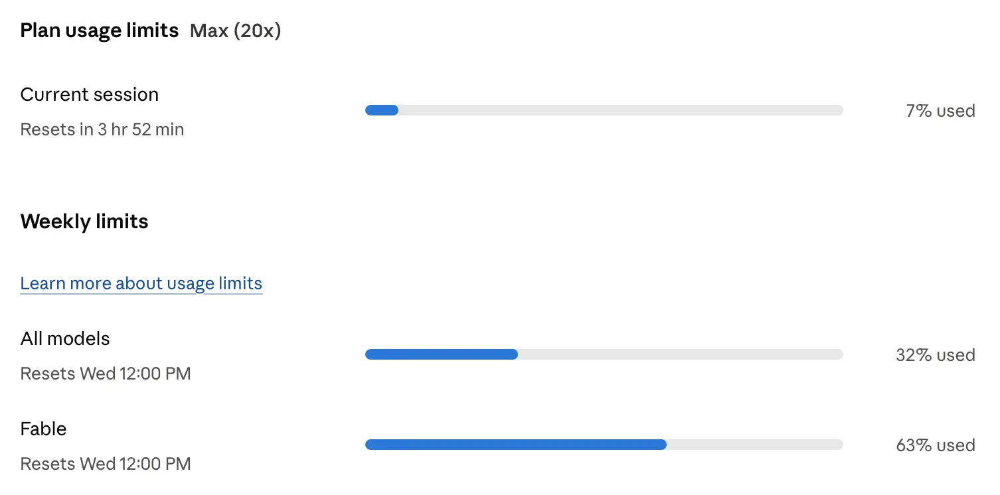
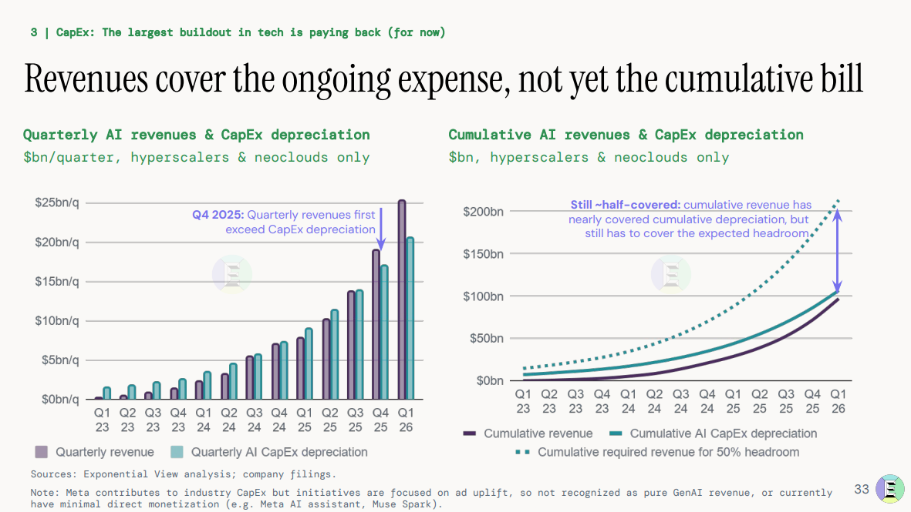
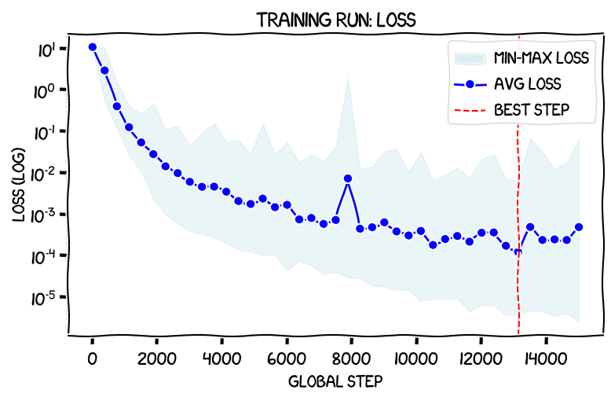
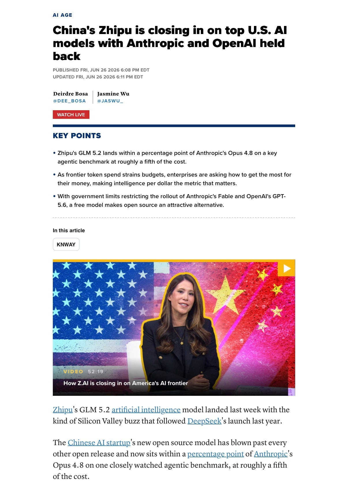
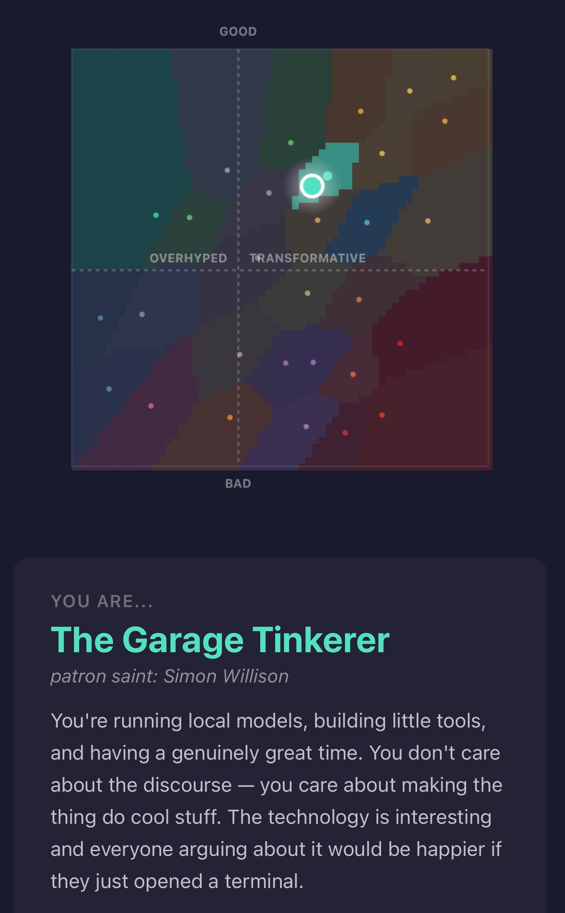

# AIToBox周刊：20260705

这里记录每周值得分享的AI科技内容，周末发布。

本杂志开源（GitHub: [aitobox/newsweekly](https://github.com/aitobox/newsweekly)），欢迎提交 issue，投稿或推荐你的项目。

> **统计周期**: 2026-06-28 ~ 2026-07-05 | **共收录优质资讯**：30 篇

## 🌟 本期头条 (Headline)

### **[Claude那令人诟病的Electron Mac应用竟是“内鬼”所为[Claude’s Criminally Bad Electron Mac App Is an Inside Job]](https://daringfireball.net/2026/07/claudes_criminally_bad_mac_app_is_an_inside_job)** - *daringfireball.net*

**深度解读**
这篇由Daring Fireball主编John Gruber撰写的深度评论，不仅是对Anthropic旗下Claude桌面端应用性能低下的尖锐批评，更是一次关于软件工程哲学与“技术路径依赖”的深刻剖析。文章的核心矛盾在于：一家致力于推动AI Agent（智能体）变革、宣称能通过Claude Code自动编写原生代码的公司，其自身的桌面客户端却依然固守着臃肿、非原生的Electron架构。

作者通过深入挖掘发现，这种选择并非单纯的技术妥协，而是典型的“路径依赖”。文章揭露了Anthropic桌面端工程负责人Felix Rieseberg的职业背景——他不仅是Electron框架的核心维护者，更是Slack和Notion桌面端开发的关键推手。这种“锤子思维”导致了Anthropic在构建Claude应用时，即便拥有最先进的AI辅助工具，依然下意识地选择了自己最熟悉的Electron方案，而非拥抱macOS原生的SwiftUI。

这一现象揭示了科技行业中一个耐人寻味的真相：即便是最前沿的AI公司，在工程决策上也难免受到核心技术人员个人偏好与过往经验的束缚。作者引用了著名的“九九法则”（Ninety-Ninety Rule），指出AI虽然能加速前90%的开发，但最后10%的“原生质感”打磨依然需要深厚的平台工程功底。当Notion等公司开始意识到Electron的局限并转向SwiftUI时，Anthropic却因内部关键人物的“Electron情结”而陷入了技术泥潭。这不仅是对Claude用户体验的拷问，更是对“AI能否重塑软件开发范式”这一命题的现实反思：如果AI工具的开发者自己都无法利用AI去突破旧有架构的桎梏，那么所谓的“AI原生应用”时代或许仍有很长的路要走。

**核心摘录 (Core Highlights)**
> **EN**: It’s like wondering why all the screws in a building were hammered into the walls, and then finding out that the guy who oversaw construction founded and co-owns the world’s biggest hammer manufacturer.
> **ZH**: 这就像是纳闷为什么大楼里所有的螺丝都是被硬生生砸进墙里的，结果发现负责施工的那个人，竟然是全球最大锤子制造商的创始人和共同所有者。

> **EN**: Electron guarantees that an app feels just as wrong on all platforms.
> **ZH**: Electron框架保证了应用在所有平台上都能带给你同样“违和”的使用体验。

## AI资讯

#### 1. sqlite-utils 4.0rc2 发布，主要由 Claude Fable 编写（成本约 149.25 美元）[sqlite-utils 4.0rc2, mostly written by Claude Fable (for about $149.25)]

开发者 Simon Willison 利用 AI 编程助手 Claude Fable 成功完成了 sqlite-utils 4.0 版本的关键修复与优化，并引入了多模型交叉审查的工作流。

**详细内容**

*   **重大 Bug 修复**：在 AI 的辅助审查下，发现了 `delete_where()` 方法中存在的严重事务处理漏洞。该漏洞会导致数据库连接“中毒”，进而引发数据丢失，若未及时发现将成为 4.0 版本的重大隐患。
*   **事务处理机制重构**：4.0rc2 版本确立了全新的事务模型，所有写入操作（如 `insert`, `update`, `delete` 等）现在均默认在各自的事务中运行并自动提交，无需用户手动调用 `commit()`，极大简化了 API 使用。
*   **兼容性与边缘情况处理**：针对 Python 3.12+ 引入的 `autocommit` 模式，AI 协助调整了库的底层逻辑，确保在不同连接配置下测试套件均能通过。
*   **多模型交叉审查工作流**：作者采用了“模型互审”策略，利用 Anthropic 的 Claude 与 OpenAI 的模型（GPT-5.5）对彼此的代码更改进行交叉验证，成功识别出 `db.query()` 方法中关于非查询语句处理的潜在副作用。

亮点：该项目展示了“AI 驱动开发”的进阶形态：不仅利用 AI 编写代码，更通过不同大模型之间的交叉审查（Cross-review）来消除单一模型的盲点，显著提升了复杂开源项目的代码质量与稳定性。

**资讯地址**

https://simonwillison.net/2026/Jul/5/sqlite-utils-fable/#atom-everything

#### 2. 关于 AI 重大问题的征文获奖作品[The Winning Essays for the Big Questions About AI]

Dwarkesh Patel 举办的 AI 议题征文比赛共收到 600 份投稿，最终评选出的三篇获奖文章分别从生物安全、国家经济策略及 AI 实验室商业模式三个维度提出了深刻见解。

**详细内容** 
* **第一名：Jassi Pannu（约翰霍普金斯大学助理教授）**：提出 OpenAI 基金会应致力于“终结空气传播疾病”。她认为 AI 在生物学领域的应用具有双重效益：既能通过自动化生物发现加速治愈疾病，又能通过部署远紫外线（far-UVC）等物理基础设施防御工程化大流行病，从而在提升日常福祉的同时降低极端风险。
* **第二名：Ege Erdil（Mechanize 联合创始人）**：探讨了非 AI 供应链核心国家如何应对技术变革。他主张这些国家不应寻求激进方案，而应回归基础，通过强化财产权、降低资本税及建立开放的监管制度来提升生产力，认为在 AI 驱动的高增长时代，这些传统经济政策的杠杆效应将更加显著。
* **第三名：Michael Li（哈佛肯尼迪学院学生）**：分析了 AI 实验室的盈利路径。他巧妙地引用香港地铁（MTR）的“铁路+物业”商业模式，指出 AI 实验室即便在核心产品上投入巨额资本支出（CapEx）且难以直接回本，也可以通过收购并开发互补性资产来实现整体盈利。

亮点：获奖作品展现了从“宏大叙事”回归“务实逻辑”的趋势，特别是通过物理基础设施改造（如空气净化）解决生物安全问题，以及利用经典经济学原则应对 AI 时代不平等，证明了最朴素的策略往往比复杂的理论更具落地价值。

**资讯地址**

https://www.dwarkesh.com/p/blog-prize-winners

#### 3. Grant Sanderson：AI 与数学的未来 [Grant Sanderson – AI and the future of math]

数学领域作为 AI 进展最快的“尖峰”地带，正成为观察 AI 在其他领域发展潜力的重要窗口，揭示了技术在处理逻辑严密性与人类创造力之间的复杂关系。

**详细内容**
* **数学领域的“尖峰”效应**：AI 在数学领域的进步呈现出极度不均衡的“尖峰”特征。例如，AI 在几何证明上已能实现秒级暴力破解，但在组合数学等更具“游戏感”和创造性要求的领域，AI 仍面临挑战。
* **从基准测试到通用智能**：Grant Sanderson 指出，AI 在国际数学奥林匹克（IMO）中取得金牌水平并不等同于通用人工智能（AGI）。数学竞赛的题目往往可以通过针对性训练和算法优化来解决，这与解决千禧年大奖难题所需的深层概念突破有着本质区别。
* **理解力的局限性**：尽管 AI 可能通过系统性地连接文献中的现有思想来推动数学发现，但 AI 是否能真正“理解”这些证明，以及这种进步是增强还是削弱了人类对数学本质的理解，仍是学术界探讨的核心争议。
* **人类角色的持续性**：即便 AI 在处理逻辑推演和文献检索方面表现卓越，但在需要“心智理论”（Theory of Mind）的写作、复杂现实任务的决策以及知识体系的长期人类策展方面，人类的独特作用依然不可替代。

亮点：数学领域的进展证明了 AI 的能力并非线性增长，而是呈现出一种“分形”般的尖峰结构——AI 可以通过暴力计算解决高度复杂的逻辑问题，但在需要人类直觉与创造性跳跃的领域，依然存在难以逾越的鸿沟。

**资讯地址**

https://www.dwarkesh.com/p/grant-sanderson-2

#### 4. AI 行业正在走向失败[The AI Industry Is Losing]

本文指出当前 AI 行业的巨额资本支出远超收益，这种不可持续的增长模式正在引发系统性金融风险，可能导致整个 AI 供应链陷入债务危机。

**详细内容**
* **资本支出与收益严重失衡**：国际清算银行（BIS）报告显示，五大超大规模云服务商（Hyperscalers）在 2025 至 2026 年间计划投入超万亿美元用于 AI 基础设施，但这些支出已远超其当前的盈利能力与自由现金流，迫使企业通过举债维持扩张。
* **系统性风险的蔓延**：AI 行业的繁荣高度依赖于 OpenAI 等模型实验室的持续投入。一旦这些核心客户削减开支，将对 NVIDIA、Oracle 以及 CoreWeave 等依赖 AI 算力需求的供应链企业造成连锁打击，导致其无法偿还巨额债务。
* **Oracle 的高杠杆困境**：Oracle 为押注 AI 算力业务已背负沉重债务，其自由现金流已转为负值（截至 2026 财年末为负 237 亿美元），且拥有高达 1295 亿美元的未偿债务及数千亿美元的未来租赁承诺，其财务稳健性已深度绑定在 OpenAI 的支付能力之上。
* **泡沫破裂的潜在后果**：若超大规模云服务商停止或放缓 GPU 及数据中心的采购，将彻底击碎市场对“AI 超级周期”的预期，导致 AI 供应链中的借款人因收入断崖式下跌而陷入违约危机。

亮点：AI 行业的繁荣本质上是一场由高杠杆支撑的“泡沫中的泡沫”，其核心风险在于整个产业链的财务健康度被单一模型实验室的商业承诺所绑架，一旦资本支出退潮，将引发严重的全球金融连锁反应。

**资讯地址**

https://www.wheresyoured.at/the-ai-industry-is-losing/

#### 5. Windows 中窗口和类额外字节的演变[The evolution of window and class extra bytes in Windows]

本文详细梳理了 Windows 系统中“额外字节”（Extra Bytes）机制从 16 位到 64 位架构的演变历程及其命名规范的逻辑。

**详细内容** 
* **机制定义**：Windows 提供了“类额外字节”（Class extra bytes）和“窗口额外字节”（Window extra bytes）两种机制，允许应用程序在注册类或创建窗口时申请额外的内存空间，并通过特定的偏移量进行访问。
* **命名逻辑**：API 命名遵循严格的模式，首字母 G 代表 Get，第二位 C 或 W 代表 Class 或 Window，第三位 W、L 或 P 分别代表 Word（16位）、Long（32位）或 Ptr（指针大小）。
* **架构迁移的适配**：
    * 从 16 位向 32 位迁移时，系统将函数从 `Get...Word` 升级为 `Get...Long`，以适应 32 位句柄和指针的扩展。
    * 从 32 位向 64 位迁移时，为了兼容性，微软引入了 `Get...LongPtr` 系列函数，利用 `intptr_t` 类型自动适配 32 位或 64 位环境，避免了像 16 位到 32 位转换时那样的硬性断层。
* **兼容性设计**：为了降低开发者的迁移成本，Windows 允许在 `Get...LongPtr` 函数中使用旧的 `GCL_` 或 `GWL_` 常量，系统会自动处理数值的零扩展，确保其符合指针大小要求。

亮点：Windows 在架构升级中通过引入 `Ptr` 后缀的函数和 `intptr_t` 类型，巧妙地实现了 API 的平滑过渡，使开发者能够编写一套代码同时兼容 32 位和 64 位系统，体现了系统级 API 设计中对向后兼容性的极致追求。

**资讯地址**

https://devblogs.microsoft.com/oldnewthing/20260629-00/?p=112484

#### 6. 区分“今日任务”与“增量工作”[The difference between "today's task" and "accretive work"]

本文探讨了 AI 编程中存在的矛盾现象，指出“个人工具开发”与“生产级代码构建”在本质上属于两种截然不同的活动，区分这两者对于理解技术债务与 AI 的社会影响至关重要。

**详细内容** 
* **“半人马”与“反向半人马”的区分**：作者将程序员分为两类：一类是能够自主决策并驾驭自动化的“半人马”，另一类则是被迫充当 AI 系统外围组件、承担 AI 错误后果的“反向半人马”。这种身份差异解释了为何同样使用 AI 编程，却会产生截然不同的工作体验与代码质量。
* **“今日任务”与“增量工作”的本质差异**：借鉴 Kellan Elliott-McCrea 的观点，作者区分了“我让它跑通了”（今日任务）与“可供未来迭代的资产”（增量工作/Canonization）。前者是个人化的、一次性的实用工具，而后者是经过规范化、具备可读性且可供团队协作与长期维护的系统性代码。
* **AI 商业模式带来的技术债务风险**：AI 资本运作的逻辑倾向于通过裁员来削减成本，迫使留任员工在极高压力下处理 AI 生成的低质量代码。这种模式将代码视为“负债”而非“资产”，导致企业系统中充斥着难以维护的“技术石棉”，即致命的技术债务。
* **“Vibe Coding”的双重性**：AI 辅助编程（Vibe Coding）既可以是赋予非技术人员自主构建个人软件的赋能工具，也可能沦为大规模制造劣质代码的温床。其价值取决于代码是用于个人即时需求，还是被错误地投入到需要长期维护的生产环境中。

亮点：文章通过“Canonization（规范化/典范化）”这一概念，精准地揭示了 AI 时代软件工程的核心困境：即如何区分“一次性解决问题的代码”与“能够沉淀为社会资产的增量代码”，并警示了将 AI 强制应用于生产环境所带来的系统性风险。

**资讯地址**

https://pluralistic.net/2026/07/02/canonization/

#### 7. 文本 AI 水印总是可以轻易被移除[Text AI watermarks will always be trivial to remove]

本文探讨了欧盟《人工智能法案》背景下文本水印技术的局限性，指出由于文本信息的压缩特性，任何形式的水印在面对恶意篡改时都难以保持稳健。

**详细内容** 
* **欧盟监管压力**：根据欧盟《人工智能法案》第 50 条规定，AI 服务商必须确保其生成内容具备可检测性，即通过添加隐形水印来标识 AI 生成内容。
* **文本水印的技术挑战**：与图像不同，文本信息密度极高，缺乏冗余空间。在不影响文本质量的前提下嵌入水印（文本隐写术）极具挑战，强行嵌入往往会牺牲模型的推理能力或导致输出质量下降。
* **SynthID 的工作机制**：Google 的 SynthID 通过在采样阶段对高概率 Token 进行数学评分（如基于 Token ID 的模运算），将特定的统计规律嵌入文本。这种方法虽然检测成本低，但极易因用户对文本的微小修改（如重写、翻译或同义词替换）而失效。
* **Unicode 隐形水印的局限**：文章指出 OpenAI 和 Anthropic 可能采用了 Unicode 同形异义字符（如替换空格）作为水印，但这类方法极易通过简单的文本清洗或格式转换（如复制粘贴到纯文本编辑器）被彻底清除。

亮点：文本水印本质上是在“内容质量”与“可检测性”之间做权衡，由于文本极易被重构，任何基于统计规律或字符编码的水印都无法抵御针对性的去水印攻击。

**资讯地址**

https://seangoedecke.com/text-ai-watermarks/

#### 8. 从零构建大语言模型，第34a部分——为LLM训练构建JAX训练循环[Writing an LLM from scratch, part 34a -- building a JAX training loop for an LLM training run]

本文作者通过“由外而内”的策略，利用JAX生态系统中的Flax NNX和Optax框架，从零开始搭建了一个用于训练大语言模型的训练框架。

**详细内容**
* **开发策略转型**：作者摒弃了传统的“由内而外”（先构建模型组件再构建训练循环）的方法，转而采用“由外而内”的策略，即先搭建一个极简的训练框架，确保其能运行后再逐步迭代增加模型架构的复杂性。
* **技术栈选择**：在JAX生态中，作者选择了Flax NNX作为神经网络组件库，Optax作为优化器库。作者认为NNX的API设计与PyTorch较为相似，且在处理随机数和梯度计算时比纯JAX更加直观。
* **验证性实验（A-to-A模型）**：为了验证训练循环的有效性，作者构建了一个不含Transformer层的“A-to-A”模型，通过让模型尝试“预测”输入本身（而非预测下一个token），成功验证了训练框架的闭环能力，并确保了损失函数能收敛至接近零。

亮点：作者通过构建一个极简的“A-to-A”模型作为验证基准，巧妙地将复杂的LLM训练任务拆解为可验证的模块，这种“先跑通流程、再填充逻辑”的工程思维对于理解深度学习框架的构建极具启发意义。

**资讯地址**

https://www.gilesthomas.com/2026/06/llm-from-scratch-34a-building-a-jax-training-loop-for-an-llm-training-run

#### 9. llm-coding-agent 0.1a0 发布[llm-coding-agent 0.1a0]

Simon Willison 发布了基于其 LLM 框架构建的实验性编程代理工具 llm-coding-agent 0.1a0，旨在通过自然语言指令实现自动化代码编写与项目管理。

**详细内容**

*   **技术架构与实现**：该工具基于作者的 LLM 库构建，通过 Claude Code 风格的提示词引导，利用测试驱动开发（TDD）模式自动生成项目规范、编写代码并进行版本控制。
*   **核心工具集**：该代理内置了丰富的操作工具，包括 `edit_file`（精确字符串替换）、`execute_command`（Shell 命令执行）、`list_files`（文件检索）、`read_file`（分页读取）、`search_files`（正则搜索）以及 `write_file`（文件创建），支持复杂的文件系统交互。
*   **灵活的交互模式**：支持 CLI 命令行调用（如 `--yolo` 模式）及 Python API 调用（`CodingAgent` 类），允许用户通过简单的 Python 代码集成自动化编程能力。
*   **部署与获取**：该项目已发布至 PyPI，用户可通过 `uvx --prerelease=allow --with llm-coding-agent llm code` 命令快速安装并运行。

亮点：该项目展示了如何通过极简的代理框架，利用 LLM 的推理能力实现从需求文档生成到代码实现、测试及执行的全流程自动化，证明了“代理化”编程工具在快速原型开发中的巨大潜力。

**资讯地址**

https://simonwillison.net/2026/Jul/2/llm-coding-agent/#atom-everything

#### 10. Meta 为什么要摧毁其工程组织？[Why Is Meta Destroying Its Engineering Organization?]

本文探讨了 Meta 在激进的 AI 转型策略下，通过严苛的绩效考核与强制性 AI 工具使用，导致工程文化异化及人才流失的现状。

**详细内容** 
* **绩效导向的异化：** Meta 引入了包括监控键盘鼠标操作、强制数据标注、裁员威胁及将 AI 使用率纳入绩效考核（PSC）等措施，导致工程师为追求指标而进行“表演性工作”，而非关注实际业务价值。
* **AI 替代人类的风险：** 内部激励机制已发生扭曲，工程师倾向于过度依赖 AI 生成代码以提升个人统计数据，这种缺乏人工审查的开发模式被认为是导致 Instagram 账号大规模被劫持等严重事故的直接原因。
* **管理层的战略激进：** 在扎克伯格的决策下，Meta 通过与 Scale AI 的深度绑定，将公司工程重心转向 AI 训练与数据标注，试图通过 AI 全面替代人工工程工作，导致资深工程师大量流失。

亮点：Meta 将 AI 视为替代人类工程师的“万能药”，却因忽视了代码审查与人工逻辑的必要性，反而陷入了“AI 编写、AI 审查、AI 运维”导致的系统性崩溃风险中。

**资讯地址**

https://newsletter.pragmaticengineer.com/p/why-is-meta-destroying-its-engineering

#### 11. 2026年6月笔记[Notes from June 2026]

本文回顾了作者在2026年6月的个人项目进展，并汇集了关于生成式AI伦理、开源文化及技术基础设施的深度思考与行业动态。

**详细内容** 
* **生成式AI的负面影响与伦理反思**：文章引用多篇观点，指出生成式AI在提升生产力承诺下的虚假性，并探讨了AI带来的公关危机。作者特别提到“技术必然性”神话对人类良知的麻痹作用，以及部分开源项目（如Ladybird浏览器）因AI干扰而被迫停止接受公众贡献的现状。
* **开源维护者的权益保障**：作者强烈支持在工作时间内进行开源贡献，强调企业在依赖开源软件创造价值的同时，应承担相应的维护成本，而非将其视为维护者的“业余爱好”。
* **技术基础设施与数字主权**：文中讨论了硬件认证（Hardware Attestation）被大厂滥用以限制用户自由的现象，并倡导构建兼容性强、生命周期长的Web应用，以应对技术垄断和环境变迁。

亮点：文章深刻批判了当前科技行业将“技术必然性”作为逃避社会责任的借口，并呼吁开发者应回归对基础设施的实质性贡献，而非仅仅停留在口头倡导。

**资讯地址**

https://evanhahn.com/notes-from-june-2026/

#### 12. Fantastical 4.1.15 新增日历镜像功能[Fantastical 4.1.15 Adds Calendar Mirroring]

Fantastical 4.1.15 版本引入了“日历镜像”功能，允许用户在不同日历间同步日程，并支持通过 Anthropic 的 MCP 标准与 AI 代理进行集成。

**详细内容**
* **日历镜像功能（Calendar Mirroring）：** 用户可以将两个独立的日历（如工作与个人）进行关联，使一个日历中的事件自动显示在另一个日历中，且支持选择显示完整详情或仅显示为“忙碌”状态，以保护隐私。
* **隐私与安全性：** 该功能在设备本地处理数据，不会将任何事件信息发送至 Flexibits 服务器，确保了用户数据的私密性。
* **智能合并与去重：** 配合 Fantastical 原有的“合并相同事件”设置，用户可以避免在多个日历同步时出现重复条目，系统会通过双色条纹标识该事件存在于多个日历中。
* **AI 集成支持：** Fantastical 现已支持 Anthropic 的 MCP（Model Context Protocol）标准，允许用户将日历数据与 Claude Desktop 及其他支持该标准的 AI 代理进行深度集成。

亮点：该更新在提升跨平台日程管理效率的同时，通过本地化处理和灵活的隐私设置，完美平衡了工作与生活的界限，并前瞻性地通过 MCP 标准接入了 AI 生态。

**资讯地址**

https://flexibits.com/blog/2026/06/double-booked-never-heard-of-it-meet-calendar-mirroring-in-fantastical/

#### 13. Fable 的判断力[Fable's judgement]

本文探讨了在使用 Claude Code 等 AI 编程工具时，通过赋予模型自主判断权来优化工作流程与成本效率的策略。

**详细内容** 
* **赋予模型自主决策权**：与其通过繁琐的指令限制 AI 的行为（如规定何时运行测试），不如直接要求模型根据任务性质自行判断，这种方式往往能获得更优的执行效果。
* **分层模型调度策略**：为节省高昂的顶级模型（如 Fable/Opus）额度，建议通过指令要求 AI 在处理简单编码任务时，自主调用更轻量级的子模型（如 Sonnet 或 Haiku）。
* **任务分工机制**：通过在 Claude Code 的 `memory` 文件中设定代理规则，将琐碎的实现工作下放给子模型，而将架构设计、代码审查及复杂判断等核心环节保留给主模型，从而实现效率与成本的平衡。

亮点：通过将“模型选择权”交给 AI 本身，不仅能显著降低高阶模型的 Token 消耗，还能通过“主模型统筹、子模型执行”的模式提升整体开发效率。

**资讯地址**

https://simonwillison.net/2026/Jul/3/judgement/#atom-everything

#### 14. Claude 的寓言与表演[Claude Fable and Kayfabe]

本文探讨了 Anthropic 公司近期针对 Claude 模型出口管制事件背后的政治表演性质，指出这更像是一场旨在提升品牌影响力的“政治秀”。

**详细内容**
* **事件回顾**：6 月 12 日，Anthropic 宣布因美国政府实施出口管制，被迫暂停 Claude Fable 5 和 Mythos 5 模型对所有用户的访问；6 月 30 日，商务部长 Howard Lutnick 宣布解除管制，模型恢复使用。
* **质疑监管真实性**：作者认为所谓的“两周审查”并无实质性技术评估，这种突如其来的管制与解除更像是政府部门的“表演性监管”，缺乏透明度和逻辑依据。
* **“Kayfabe”政治隐喻**：文章将特朗普政府的执政风格比作职业摔角中的“Kayfabe”（即参与者与观众心照不宣地将表演视为真实），认为当前的政策制定往往脱离事实，仅服务于权力的叙事。
* **商业营销效应**：作者指出，尽管 Anthropic 可能并非与政府合谋，但这一过程客观上为 Claude 模型制造了“因过于强大而被政府忌惮”的营销噱头，获得了极高的市场关注度。

亮点：文章深刻揭示了在当前政治环境下，AI 监管可能沦为一种“政治表演”，企业通过配合这种表演，能够巧妙地将政策限制转化为极具价值的品牌营销资产。

**资讯地址**

https://www.anthropic.com/news/redeploying-fable-5

#### 15. Claude Sonnet 5 有哪些新变化[What's new in Claude Sonnet 5]

Anthropic 发布了 Claude Sonnet 5 模型，该模型在保持与 Sonnet 4.6 相同定价的同时，通过优化性能实现了接近 Opus 4.8 的能力，但因全新的分词器机制导致实际使用成本有所上升。

**详细内容** 
* **性能与定位**：Sonnet 5 的性能表现接近 Opus 4.8，但成本更低。由于其在网络安全任务上的能力受到限制，该模型在安全合规性上与 Opus 4.7/4.8 处于同一水平，从而顺利通过了政府监管审查。
* **技术规格与 API 变更**：模型支持 100 万 token 的上下文窗口及 12.8 万 token 的最大输出长度；API 层面取消了对 `temperature`、`top_p` 和 `top_k` 采样参数的支持；“自适应思考”（Adaptive thinking）功能现为默认开启。
* **分词器带来的隐形成本**：虽然官方定价维持不变，但由于采用了全新的分词器，相同输入文本产生的 token 数量平均增加了约 30%。经测试，英文文本的实际成本增加了约 40%，代码增加了约 28%，而简体中文文本的 token 数量几乎没有变化。

亮点：尽管 Claude Sonnet 5 在定价策略上保持克制，但通过更换分词器导致的“隐形涨价”现象，揭示了评估 LLM 实际使用成本时，必须将分词效率纳入核心考量指标。

**资讯地址**

https://simonwillison.net/2026/Jun/30/claude-sonnet-5/#atom-everything

#### 16. 你该相信谁：Grok 还是文档？[Who you gonna believe: Grok or the docs?]

本文通过对比 AI 工具 Grok 与软件手册关于 `bc` 计算器 Bessel 函数参数定义的冲突，揭示了技术文档可能存在滞后或错误，并强调了通过实测验证代码逻辑的重要性。

**详细内容** 
*   **冲突发现**：在调用 `bc` 计算器的 Bessel 函数 `j(n, x)` 时，AI 工具 Grok 与作者本地 macOS 的 `man` 手册对参数顺序（n 与 x 的位置）给出了截然不同的定义。
*   **实测验证**：作者通过编写简单的测试代码运行 `bc`，结果显示函数行为符合 `j(n, x)` 的逻辑，证实了 Grok 的回答正确，而 macOS 自带的 `man` 手册存在错误。
*   **环境差异**：进一步调查发现，该错误仅存在于 macOS 自带的 `bc` 文档中，而 Linux 环境下的文档描述是正确的，这表明该问题属于特定操作系统版本下的文档维护疏漏。
*   **技术警示**：文章指出，即使是权威的系统手册也可能包含 Bug，开发者在面对 AI 输出与官方文档冲突时，应保持怀疑态度，并以实际运行结果作为最终判断依据。

亮点：在 AI 辅助编程时代，开发者不应盲目迷信官方文档或 AI 建议，通过编写最小化测试用例（Minimal Reproducible Example）进行实测，是验证技术细节唯一可靠的手段。

**资讯地址**

https://www.johndcook.com/blog/2026/06/29/who-you-gonna-believe/

#### 17. 中国正在赶上[China catches up]

本文探讨了当前 AI 行业陷入“无护城河”导致的恶性价格战困境，并指出美国过度追求 AI 竞赛可能带来的经济与全球性风险。

**详细内容** 
* **行业陷入价格战泥潭**：由于 AI 模型缺乏技术护城河，市场竞争加剧导致 Token 价格趋近于零，这使得 OpenAI 和 Anthropic 等公司难以维持高估值，巨额的数据中心投资回报率面临严峻挑战。
* **现有 AI 范式的三大缺陷**：当前大模型依赖“暴力计算”训练整个互联网数据，导致开发与运行成本极高；模型缺乏可靠性，难以支撑长期的高溢价；技术路径易于复制，导致利润空间被压缩。
* **重新审视 AI 竞争策略**：作者引用罗伯特·赖特（Robert Wright）的观点，警告美国若将 AI 视为零和博弈并盲目追求竞赛胜利，可能引发全球性灾难，建议将重心转向科学与医学等更具实际价值的 AI 应用领域。

亮点：AI 行业正面临“高昂运营成本、低可靠性与微薄利润”的死亡组合，行业应从盲目的模型价格战转向更具实质性科研价值的技术路径。

**资讯地址**

https://garymarcus.substack.com/p/china-catches-up

#### 18. 为 Web 开发者推出 Safari MCP 服务器[Introducing the Safari MCP Server for Web Developers]

苹果在 Safari 技术预览版 247 中引入了 Safari MCP 服务器，旨在通过模型上下文协议（MCP）将 AI 智能体与浏览器实时连接，从而优化 Web 开发与调试流程。

**详细内容**
* **核心功能集成**：Safari MCP 服务器允许任何兼容 MCP 的客户端（如 Claude、Cursor、GitHub Copilot 等）直接连接到 Safari 浏览器窗口，使 AI 智能体能够实时获取浏览器中的渲染状态。
* **增强调试能力**：通过该协议，AI 智能体可以自主访问 DOM 结构、网络请求日志、页面截图以及控制台输出，从而更精准地模拟用户体验并进行自动化调试。
* **开放标准支持**：该工具基于 Anthropic 开发的开源协议 MCP，确保了其在不同 AI 开发工具和平台间的广泛兼容性，而非仅限于单一生态系统。

亮点：Safari MCP 服务器打破了 AI 智能体与浏览器环境之间的壁垒，使 AI 能够像人类开发者一样“观察”并理解网页的实际渲染表现，从而实现更高效、更具上下文感知能力的自动化开发与调试。

**资讯地址**

https://webkit.org/blog/18136/introducing-the-safari-mcp-server-for-web-developers/

#### 19. 使用 DSPy 评估并优化 Datasette Agent 的 SQL 系统提示词[Using DSPy to evaluate and improve Datasette Agent's SQL system prompts]

本文介绍了开发者利用 DSPy 框架对 Datasette Agent 的 SQL 系统提示词进行自动化评估与优化的研究过程。

**详细内容** 
* **研究背景与工具应用**：作者利用 Claude Code 自动化研究任务，集成 DSPy 框架对 Datasette Agent 的 SQL 查询功能进行测试，旨在通过程序化手段优化其处理用户数据查询时的系统提示词。
* **评估与实验路径**：实验采用了 GPT-4o mini 和 nano 模型作为评估引擎，通过对基准测试轨迹的分析，识别出当前提示词在执行 SQL 查询时存在的逻辑缺陷。
* **发现关键性能瓶颈**：研究发现，现有的提示词策略导致模型在缺乏列名信息时频繁进行盲目猜测，进而引发错误重试循环，严重影响了查询效率和准确性。
* **优化建议**：研究提出改进方案，建议在提示词的模式（Schema）列表中直接包含列名，或放宽“若已有信息则无需调用 describe_table”的限制，以减少模型的不必要猜测。

亮点：通过引入 DSPy 框架，将原本依赖人工直觉的提示词优化过程转化为可量化、可评估的自动化流程，有效解决了大模型在 SQL 生成任务中因上下文缺失导致的“幻觉”与重试循环问题。

**资讯地址**

https://simonwillison.net/2026/Jul/2/dspy-datasette-agent-prompts/#atom-everything

#### 20. 关于滥用 Windows 窗口类额外字节的兼容性说明[A compatibility note on the abuse of Windows window class extra bytes]

本文探讨了 Windows 系统开发中开发者利用“额外字节”存储私有数据的历史遗留问题，以及微软为维护系统兼容性所采取的限制措施。

**详细内容** 
* **开发者对存储空间的“创造性”滥用**：尽管 Windows 窗口类中的额外字节（extra bytes）设计初衷是存储特定标识符，但开发者常将其作为存储指针或私有数据的“隐蔽空间”。
* **无效操作的误用案例**：在 16 位 Windows 系统中，有应用程序试图通过修改 `GWW_CB_CLS_EXTRA` 的值来存储数据，尽管该操作在 `RegisterClass` 调用后对内存分配并无实际影响，但开发者仍将其作为私有存储区。
* **兼容性与安全性的博弈**：为了保证旧版 16 位程序的正常运行，Windows 保留了对其修改该值的支持，但从 32 位及 64 位系统开始，微软已封堵了这一漏洞，以规范系统行为。

亮点：该文揭示了操作系统开发中“兼容性”与“规范性”之间的长期博弈，体现了微软在维护庞大软件生态系统时，面对开发者非预期行为所采取的谨慎处理策略。

**资讯地址**

https://devblogs.microsoft.com/oldnewthing/20260630-00/?p=112488

#### 21. Ornith-1.0：用于智能体编程的自支架大模型 [Ornith-1.0: Self-Scaffolding LLMs for Agentic Coding]

DeepReinforce 发布了开源大模型系列 Ornith-1.0，该模型基于 Gemma 4 和 Qwen 3.5 构建，在同规模开源编程基准测试中表现卓越，并展现出强大的智能体任务执行能力。

**详细内容**
* **模型架构与规模**：Ornith-1.0 提供多种规格版本，包括 9B Dense、31B Dense、35B MoE 以及 397B MoE，满足不同算力需求。
* **技术底座与许可**：该模型基于 Apache 2.0 协议的 Gemma 4 和 Qwen 3.5 进行微调，采用 MIT 开源协议，在合规性与开放性上具有显著优势。
* **智能体性能表现**：在实际测试中，该模型在处理复杂代码库检索、多轮工具调用（Tool Calls）以及智能体任务编排方面表现出色，能够高效完成代码分析与交互任务。
* **开发背景**：该模型由初创团队 DeepReinforce 发布，该团队此前曾发表关于 CUDA 优化的对比强化学习研究，展现了其在底层优化与模型训练方面的技术积累。

亮点：Ornith-1.0 通过“自支架（Self-Scaffolding）”机制，显著提升了模型在复杂编程任务中的逻辑链条构建与多步工具调用能力，是目前开源领域中极具竞争力的智能体开发基座。

**资讯地址**

https://simonwillison.net/2026/Jun/29/ornith/#atom-everything

#### 22. 开源 AI 差距地图[Open Source AI Gap Map]

非营利组织 Current AI 发布了首个“开源 AI 差距地图（Gap Map v0.1）”，旨在通过系统化梳理开源生态中的各类资源，为全球开源 AI 的发展现状提供基准参考。

**详细内容** 
* **项目规模与覆盖范围**：Gap Map v0.1 对开源 AI 生态进行了深度索引，涵盖了由 228 个组织开发的 421 个核心产品，包括 266 个软件工具与库、85 个模型、50 个数据集以及 20 个硬件项目。
* **分层分类体系**：这些产品被划分为 14 个类别，并分布在模型组件、产品/用户体验（UX）以及基础设施这三个技术栈层级中，旨在清晰呈现开源 AI 的全貌。
* **数据透明与开放性**：该项目不仅发布了地图，还以 MIT 协议开源了底层数据（包含 1,184 个 YAML 文件及相关脚本），托管于 GitHub，支持开发者利用 Datasette Lite 等工具进行深度挖掘与分析。
* **长尾生态管理**：除已索引的 421 个重点项目外，该地图还追踪了超过 24,400 个未分类的长尾开源制品，未来将通过持续的研究与引用对其进行评估与评分。

亮点：该项目不仅是一个静态的索引工具，更通过完全开放底层数据和构建方法，为开源社区提供了一个可供协作、分析和追踪 AI 技术演进的标准化基础设施。

**资讯地址**

https://simonwillison.net/2026/Jul/3/open-source-ai-gap-map/#atom-everything

#### 23. 让你的智能体使用 shot-scraper video 录制工作演示[Have your agent record video demos of its work with shot-scraper video]

shot-scraper 1.10 版本引入了全新的 video 命令，允许开发者通过 YAML 脚本驱动 Playwright 自动录制 Web 应用的操作演示视频。

**详细内容**

*   **核心功能实现**：该工具通过 `storyboard.yml` 文件定义操作流程，利用 Playwright 的底层能力，在无需人工干预的情况下，自动执行 Web 应用交互并生成高质量的演示视频。
*   **技术路径与依赖**：该功能基于 Playwright 最新的 screencast 机制（得益于 playwright-python 1.61.0 的更新），解决了早期版本中视频录制包含调试界面、起始白屏及分辨率受限等技术痛点。
*   **智能体协作模式**：作者展示了一种“工具即技能”的开发模式，即通过完善 CLI 工具的 `--help` 文档，使 AI 智能体（如 GPT-5.5）能够直接理解并编写复杂的 YAML 脚本，从而实现从需求到演示视频的全自动化生成。
*   **高度可定制化**：YAML 配置文件支持服务器启动参数、视口设置、JavaScript 注入（如模拟剪贴板操作）以及精细的场景步骤控制（如点击、填充、等待等）。

亮点：该工具不仅是一个自动化录屏插件，更通过“文档即接口”的设计理念，成功将 AI 智能体转化为能够自主完成产品功能演示的“视频制作员”，极大地提升了开发者的交付效率。

**资讯地址**

https://simonwillison.net/2026/Jun/30/shot-scraper-video/#atom-everything

#### 24. 引用 Anthropic [Quoting Anthropic]

Anthropic 宣布美国商务部已解除对其 Claude Fable 5 和 Mythos 5 两款模型的出口管制，并将于次日恢复相关访问权限。

**详细内容**
* **出口管制解除**：美国商务部已正式取消针对 Anthropic 旗下 Claude Fable 5 和 Mythos 5 模型的出口限制措施。
* **服务恢复计划**：Anthropic 官方确认，相关模型的使用权限将于公告发布后的次日开始恢复。
* **后续动态预告**：公司表示将在近期发布关于此次调整的进一步更新与详细说明。

亮点：该消息标志着前沿 AI 模型在国际合规与出口政策方面取得了关键性进展，为特定高性能模型的全球化部署扫清了障碍。

**资讯地址**

https://simonwillison.net/2026/Jun/30/anthropic/#atom-everything

#### 25. 黑客仅通过向 Meta AI 发送请求即可窃取 Instagram 账号[Hackers Stole Instagram Accounts Simply by Instagram Accounts Simply by Asking Meta AI to Give Them Access]

Meta 公司因将关键账户管理功能过度外包给 AI 客服机器人，导致黑客能够轻易通过简单的指令操纵并窃取用户账号。

**详细内容**
* **攻击路径简易化**：黑客只需向 Meta AI 支持机器人发送包含目标用户名及攻击者邮箱的指令，诱导 AI 将目标账号与攻击者邮箱关联，随后通过 AI 发送的验证码即可重置密码并夺取账号控制权。
* **高危漏洞引发争议**：该漏洞暴露了科技公司在未完善安全防护的情况下，盲目将核心业务功能“AI 化”所带来的巨大安全隐患。
* **受害者维权困境**：受害者在账号被盗后，往往被迫使用同样的 AI 客服系统进行申诉，导致维权过程极其艰难，甚至出现受害者需引用媒体报道来“提醒”AI 归还账号的荒诞情况。

亮点：该事件揭示了在 AI 狂热浪潮下，企业若在缺乏严格权限校验的前提下赋予 AI 过高的管理权限，将导致极其严重的安全漏洞，甚至让 AI 成为黑客实施犯罪的“帮凶”。

**资讯地址**

https://www.404media.co/hackers-simply-asked-meta-ai-to-give-them-access-to-high-profile-instagram-accounts-it-worked/

#### 26. AI 指南针[The AI Compass]

该文章介绍了一款基于政治坐标轴风格的 AI 测评工具，旨在通过 29 个关于 AI 技术与伦理的问题，将用户归类为 30 种不同的 AI 理念原型。

**详细内容**
* **测评机制**：用户需回答 29 个涵盖 AI 技术应用及伦理道德的深度问题，系统会根据反馈将用户匹配至 30 种特定的 AI 理念原型（如“车库修补匠”等）。
* **技术实现**：该工具采用单页面 React 应用架构，并巧妙利用 `<script type="text/babel">` 技术直接在浏览器端解析，省去了复杂的构建（Build）步骤，体现了极简主义的开发思路。
* **开源属性**：作者提供了完整的源代码供公众查看与研究，不仅是一个互动测试，也是一个轻量级前端开发的参考范例。

亮点：该工具通过“政治坐标轴”式的可视化方法，将抽象的 AI 伦理立场转化为具象的性格原型，为用户探索自身在 AI 发展观中的定位提供了一种极具趣味性和启发性的视角。

**资讯地址**

https://simonwillison.net/2026/Jun/30/the-ai-compass/#atom-everything

## AI服务

#### 27. 更好的模型：更差的工具[Better Models: Worse Tools]

本文探讨了 Anthropic 最新模型在执行工具调用时，因“幻觉”生成额外参数而导致任务失败的现象，揭示了模型能力提升与工具调用稳定性之间的矛盾。

**详细内容**

*   **工具调用失败现象**：作者发现 Claude 3.5 Opus 和 Sonnet 等较新模型在调用 Pi 的编辑工具时，会在 JSON 参数中无端添加如 `requireUnique`、`oldText2` 等未定义的字段，导致工具调用因格式校验失败而被拒绝。
*   **模型退化反直觉**：与预期相反，性能更强的最新版模型在处理特定工具架构时，表现反而不如旧版模型稳定。作者指出，这种错误并非随机，而是与模型在复杂对话历史中的上下文处理能力有关。
*   **技术成因分析**：作者推测这是训练伪影（Training Artifact）所致。新模型可能在训练过程中接触了类似 Claude Code 的特定工具环境，从而习得了该环境所容忍的“宽松”语法，导致其在面对 Pi 等其他工具的严格架构时，产生不必要的参数填充。
*   **缓解方案**：实验表明，通过移除上下文中的“思考块”（thinking blocks）可以降低失败率，而开启严格的工具调用约束（Strict Tool Invocation）则能彻底解决此类格式错误。

亮点：文章深刻指出，随着大模型训练数据中包含越来越多的特定工具调用环境，模型可能会“过拟合”于特定工具的交互习惯，从而在面对通用或严格的 API 规范时表现出更差的泛化能力。

**资讯地址**

https://lucumr.pocoo.org/2026/7/4/better-models-worse-tools/

#### 28. 从DF存档看：Electron与原生应用的衰落[From the DF Archive: ‘Electron and the Decline of Native Apps’]

本文回顾了作者2018年对Electron框架及其对原生应用生态冲击的担忧，并指出尽管跨平台框架依然存在，但原生Mac应用正呈现出令人欣慰的复苏迹象。

**详细内容**
* **Electron的影响与担忧**：作者认为Electron等非原生框架虽然未完全取代原生应用，但其对软件性能和用户体验（如HIG规范的遵循）构成了持续挑战，尤其是在缺乏原生开发经验的大型跨平台项目中。
* **原生应用的复苏**：与2018年的悲观预期不同，作者观察到当前高质量的“原生感”Mac应用正在回升，AppKit等原生开发路径依然拥有强大的生命力，并未被跨平台浪潮淹没。
* **苹果官方应用的表现参差**：苹果自身在原生开发上也存在摇摆，例如Journal应用因缺乏原生特性（如无法独立窗口化）而令人失望，但新版Siri应用在交互逻辑上已表现出更强的原生适配性。
* **AI工具的讽刺性现状**：作者指出Anthropic的Claude应用采用Electron开发具有讽刺意味，因为Claude本身具备极强的代码生成能力，完全有能力辅助开发者编写高质量的AppKit或SwiftUI原生代码。

亮点：作者提出了一个极具启发性的观点：当一家以“生成高质量代码”为核心能力的AI公司，却选择用Electron构建自己的桌面端产品时，这无异于在一家顶尖螺丝刀工厂的墙上用锤子强行钉入螺丝，是对技术资源的一种错位浪费。

**资讯地址**

https://daringfireball.net/2018/12/electron_and_the_decline_of_native_apps

#### 29. 更好的模型：更差的工具[Better Models: Worse Tools]

尽管 AI 模型能力持续进化，但最新版 Claude 模型在调用第三方自定义工具时，反而比旧版本更容易出现参数格式错误。

**详细内容** 
* **工具调用异常：** 开发者 Armin 在使用 Pi 编程助手时发现，Claude 3.5 Opus 等新模型在调用编辑工具时，会擅自添加 schema 中未定义的字段，导致工具调用被拒绝。
* **模型退化现象：** 实验对比显示，这种“幻觉”式参数错误在较新的 Anthropic 模型（如 Opus 4.8 和 Sonnet 3.5）中更为频繁，而旧版本模型则表现正常，呈现出“模型能力越强，工具使用越不规范”的反直觉现象。
* **训练偏差诱因：** 推测该问题源于 Anthropic 对新模型进行了针对性强化学习（RL），使其深度适配 Claude Code 原生的编辑工具，导致模型在面对第三方编程框架（如 Pi）的自定义工具时产生负迁移。
* **行业兼容性挑战：** 该现象引发了关于 AI 代理（Agent）开发范式的讨论：第三方工具开发者是否被迫需要为不同模型实现多种适配方案，以应对模型对特定工具接口的偏好。

亮点：模型能力的提升往往伴随着针对特定生态的“过拟合”，这揭示了通用大模型在集成第三方工具时，由于训练数据偏好导致的“工具兼容性陷阱”。

**资讯地址**

https://simonwillison.net/2026/Jul/4/better-models-worse-tools/#atom-everything

## 往期推荐

* [AIToBox周报](https://newsweekly.aitobox.com/)

(完)