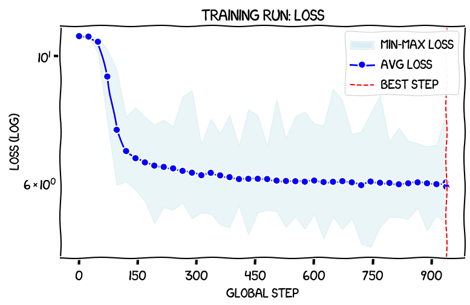
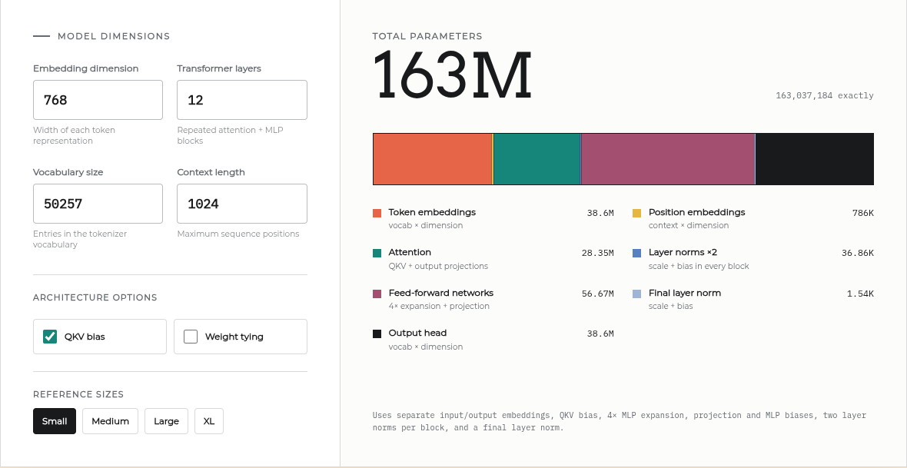
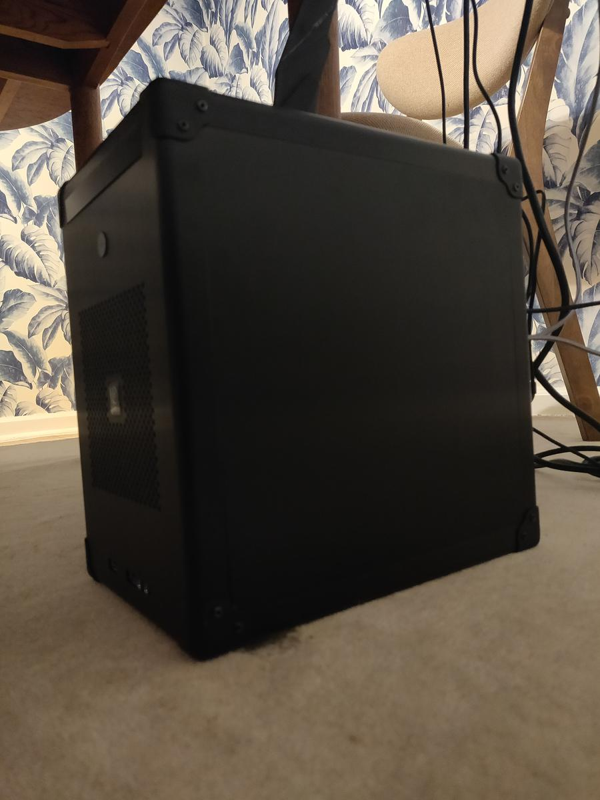

# AIToBox周刊：20260711

这里记录每周值得分享的AI科技内容，周末发布。

本杂志开源（GitHub: [aitobox/newsweekly](https://github.com/aitobox/newsweekly)），欢迎提交 issue，投稿或推荐你的项目。

> **统计周期**: 2026-07-04 ~ 2026-07-11 | **共收录优质资讯**：30 篇

## 🌟 本期头条 (Headline)

### **[苹果起诉 OpenAI、io 及前员工，指控其窃取商业机密[Apple Sues OpenAI, io, and Former Employees, Alleging Theft of Trade Secrets]](https://9to5mac.com/2026/07/10/apple-sues-openai-trade-secret-theft/)** - *daringfireball.net*

**深度解读**
这起诉讼标志着硅谷两大巨头——苹果与 OpenAI 之间脆弱的“蜜月期”正式终结。从表面上看，这是一起关于人才流动与商业机密窃取的法律纠纷，但其深层逻辑折射出科技行业在 AI 硬件转型期激烈的资源争夺。苹果指控 OpenAI 通过大规模挖角前核心高管（如 Tang Tan 和 Chang Liu），系统性地窃取了包括金属加工工艺在内的核心制造机密，并利用这些信息诱导苹果的供应链合作伙伴。

最耐人寻味的是苹果在诉状中的“克制”与“隐喻”。尽管 Jony Ive 与 Evans Hankey 等前苹果设计核心人物深度参与了 OpenAI 的硬件业务（通过收购 io 公司），但苹果在诉状中刻意回避了这些关键人物的姓名，转而使用“其他前苹果领导者”等模糊表述。这种策略既是一种法律上的防御，也是一种心理战，旨在将矛头直接对准 OpenAI 的企业行为，而非仅仅针对个人。

从行业影响来看，这起诉讼将对 OpenAI 的硬件野心造成重创。苹果明确指出 OpenAI 的硬件业务建立在“腐烂的根基”之上，这不仅会引发供应链对 OpenAI 合作资质的重新评估，更可能导致苹果与 OpenAI 在软件层面的合作（Apple Intelligence）陷入僵局。虽然苹果在诉状中声明该诉讼与双方的商业合作协议无关，但在现实商业逻辑中，当一家公司指控另一家公司“系统性窃密”时，双方的信任基础已荡然无存。这起事件预示着 AI 硬件赛道的竞争已从单纯的算法比拼，转向了对制造工艺、供应链掌控力及人才护城河的全面战争。对于 OpenAI 而言，如何应对这场法律风暴，将直接决定其能否在消费级硬件市场站稳脚跟。

**核心摘录 (Core Highlights)**
> **EN**: They have used confidential Apple information in approaching Apple’s trusted partners, even having one carry out a specific trade secret metal-finishing technique for OpenAI, misleading the partner to believe they had Apple’s permission to do so.
> **ZH**: 他们利用苹果的机密信息接触苹果的受信任合作伙伴，甚至诱导其中一家合作伙伴为 OpenAI 执行一项特定的商业机密金属加工技术，并误导该合作伙伴，使其相信他们已获得苹果的许可。

> **EN**: This much is clear, however: at every level, from members of its Technical Staff to its Chief Hardware Officer, and in coordination with business partners, OpenAI has been stealing Apple’s trade secrets and confidential information.
> **ZH**: 然而，有一点是明确的：从技术人员到首席硬件官，OpenAI 在各个层级，并协同其商业合作伙伴，一直在窃取苹果的商业机密和机密信息。

## AI资讯

#### 1. sqlite-utils 4.0 发布，现已支持数据库模式迁移[sqlite-utils 4.0, now with database schema migrations]

sqlite-utils 4.0 正式发布，这是该项目自 2020 年以来的首次重大版本更新，引入了数据库模式迁移、嵌套事务及复合外键支持等核心功能。

**详细内容**
*   **数据库模式迁移系统**：引入了结构化的迁移机制，允许开发者通过 Python 文件定义一系列数据库变更，并自动追踪已应用和待处理的迁移任务，解决了 SQLite 原生 `ALTER TABLE` 功能受限的问题。
*   **强大的 `table.transform()` 方法**：利用该方法实现模式变更，通过创建临时表、迁移数据、删除旧表并重命名新表的方式，绕过了 SQLite 对修改表结构的限制。
*   **嵌套事务支持**：新增 `db.atomic()` 方法，显著改善了库内的事务处理机制，确保在执行复杂迁移或多步操作时的原子性和数据一致性。
*   **生态整合与兼容性**：该版本将原独立包 `sqlite-migrate` 的功能集成至核心库，并对现有项目保持了良好的兼容性，同时修复了部分向后不兼容的问题。

亮点：通过将原本复杂的数据库模式演进过程简化为 Python 代码定义，sqlite-utils 4.0 在保持轻量级特性的同时，为 SQLite 生态系统提供了一套工业级的版本控制方案。

**资讯地址**

https://simonwillison.net/2026/Jul/7/sqlite-utils-4/#atom-everything

#### 2. 让 AI 毁灭[Let AI Burn]

本文严厉抨击了当前 AI 行业的泡沫本质，认为其缺乏实际经济价值，完全依赖于硅谷资本的循环融资与虚假炒作，并呼吁在行业崩盘时不应提供任何形式的政府救助。

**详细内容** 
* **循环融资的泡沫本质**：文章指出，AI 行业目前处于一种“虚假繁荣”状态，约 70% 的行业营收源于 OpenAI 和 Anthropic 对算力的投入，这本质上是风险投资人将资金注入超大规模云厂商，最终流向 NVIDIA 或数据中心资本支出的循环过程。
* **缺乏实际商业价值**：作者强调，尽管科技巨头计划在 2026-2027 年投入超万亿美元的资本支出，但生成式 AI 尚未证明其具备驱动实质性营收或盈利的能力，且各巨头始终拒绝披露具体的 AI 业务盈利数据。
* **技术局限与误导**：文章反驳了 AI 的“智能”属性，指出生成式 AI 并非自主智能，且在数学上必然存在“幻觉”问题，其所谓的“AGI（通用人工智能）”前景仅是缺乏创新能力的科技界为了维持股价而编造的叙事。
* **抵制行业救助**：作者明确反对在 AI 泡沫破裂时给予该行业任何形式的政府补贴、税收优惠或救助，认为 AI 行业对经济而言并非不可或缺，其重要性完全由人为制造的炒作所支撑。

亮点：文章深刻揭示了 AI 行业“左手倒右手”的循环融资模式，并尖锐指出该行业之所以被过度神话，是因为科技巨头在缺乏新增长点的情况下，通过制造“技术崇拜”来掩盖其商业模式的空洞。

**资讯地址**

https://www.wheresyoured.at/let-ai-burn/

#### 3. GLM 5.2 与即将到来的 AI 利润率崩塌（第一部分）[GLM 5.2 and the coming AI margin collapse (part 1)]

本文探讨了 AI 行业从“训练成本”向“推理成本”的经济重心转移，并指出开源模型（如 GLM 5.2）的崛起正通过极低的迁移成本，对头部 AI 实验室的高额利润率构成严峻挑战。

**详细内容** 
* **AI 经济逻辑的误区**：市场常误以为训练成本是 AI 公司的核心负担，但实际上训练是固定的一次性投入，而推理成本才是随需求线性增长的边际成本。目前头部实验室通过高昂的 API 定价获取极高的毛利，这种商业模式依赖于通过大规模推理来摊销训练成本。
* **GLM 5.2 的性能表现**：GLM 5.2 是首个在性能上达到 GPT/Opus 级别竞争力的开源权重模型。尽管在交互速度、视觉处理能力和网络搜索集成方面仍存在短板，但其在非交互式任务中的表现已足以替代昂贵的闭源模型。
* **极低的迁移门槛**：由于 Z.ai 和 Fireworks 等服务商提供了兼容 OpenAI 和 Anthropic 的 API 接口，用户可以实现“无缝切换”。这种极低的迁移成本使得企业无需复杂的规划即可转向开源模型，从而打破了头部实验室的生态锁定。
* **数据安全与部署灵活性**：针对企业对数据隐私的担忧，开源模型不仅可以通过具备合规条款的第三方服务商部署，还支持本地化部署，这使得处理高度敏感数据的 AI 代理工作流成为可能。

亮点：AI 行业的竞争壁垒正在瓦解，开源模型通过极低的迁移成本和可本地化部署的特性，正在迫使头部 AI 实验室面临利润率被压缩的“边际成本崩塌”风险。

**资讯地址**

https://martinalderson.com/posts/the-upcoming-ai-margin-collapse-part-1-glm-5-2/

#### 4. sqlite-utils 4.0rc2 发布，主要由 Claude Fable 编写（成本约 149.25 美元）[sqlite-utils 4.0rc2, mostly written by Claude Fable (for about $149.25)]

开发者 Simon Willison 利用 AI 编程助手 Claude Fable 成功完成了 sqlite-utils 4.0 稳定版发布前的关键代码审查与重构，并修复了严重的事务处理漏洞。

**详细内容**

*   **重大漏洞修复**：在 AI 的辅助审查下，发现了 `delete_where()` 方法中存在的严重事务处理缺陷。该漏洞会导致数据库连接在执行删除操作后无法正确提交，进而引发后续数据写入丢失或事务状态异常，若未及时发现将导致严重的生产环境数据问题。
*   **开发效率与协作模式**：作者通过 37 次提示词交互，在 Claude Fable 的协助下完成了 30 个文件的修改（共计 1,321 行新增与 190 行删除）。作者展示了一种“异步编程”模式：利用 AI 处理复杂任务的间隙进行个人活动，随后通过 GitHub PR 界面进行最终的人工审核。
*   **事务模型重构**：4.0 版本确立了新的事务处理机制，即所有写操作（如 `insert`, `update`, `delete` 等）均默认在独立事务中执行并自动提交，无需开发者手动调用 `commit()`，极大简化了 API 使用逻辑。
*   **多模型交叉验证**：作者采用了“模型互审”策略，利用 Anthropic 的 Claude 与 OpenAI 的 GPT-5.5 模型对彼此的代码变更和文档进行交叉审核。这种方法成功识别出了关于 `db.query()` 方法在处理非查询语句时的副作用及 `INSERT ... RETURNING` 事务提交逻辑的潜在不一致性。

亮点：通过实践证明了“AI 辅助编程 + 多模型交叉验证”工作流的有效性，不仅能高效发现人类开发者难以察觉的深层逻辑漏洞，还能通过 AI 协助完成繁琐的文档更新与边缘情况测试，显著提升了开源项目的发布质量。

**资讯地址**

https://simonwillison.net/2026/Jul/5/sqlite-utils-fable/#atom-everything

#### 5. 亚马逊模式的知识产权隐忧[Amazon Basics, but for intellectual property.]

本文探讨了科技巨头利用平台数据优势进行“自我复制”的商业模式，并警示企业在将 AI 深度集成到工作流时，正面临将核心商业机密泄露给潜在竞争对手的巨大风险。

**详细内容** 
* **亚马逊的数据垄断与利益冲突**：亚马逊通过平台数据精准识别畅销产品，并利用自有品牌（Amazon Basics）进行低成本复制，尽管亚马逊官方否认使用非公开卖家数据，但其市场表现与数据优势之间的关联引发了广泛质疑。
* **AI 时代的“亚马逊化”风险**：文章以 Anthropic 的 Claude Design 为例，指出其首席产品官在担任 Figma 董事期间，Figma 深度集成了 Claude 模型，随后该高管辞职并推出竞争产品，这种“先获取价值再进行复制”的行为被视为 AI 领域的“亚马逊模式”。
* **企业数据泄露的隐性威胁**：当企业强制员工使用 AI 工具处理日常工作时，实际上是在向第三方 AI 提供商输送业务流程和核心数据；即便合同条款限制了模型训练，AI 提供商仍能通过观察成功产品的模式来开发竞争性产品。
* **数据洞察的商业价值**：作者通过过往在客户服务自动化领域的经验指出，掌握海量业务数据能产生意想不到的洞察（如物流延迟模式），若这些数据被竞争对手掌握，将直接威胁企业的生存空间。

亮点：企业在享受 AI 带来的效率提升时，必须意识到自己正在向 AI 提供商“手把手”传授核心商业逻辑，这种将业务流程完全透明化给潜在竞争对手的行为，是数字时代最大的战略隐患。

**资讯地址**

https://idiallo.com/blog/amazon-basics-but-intellectual-property

#### 6. 从二元模型到GPT-2：使用JAX从零构建大语言模型[Writing an LLM from scratch, part 34b -- from bigrams to GPT-2, one component at a time (in JAX)]

本文记录了作者通过JAX框架从零构建并训练GPT-2模型的完整过程，旨在通过模块化开发深入理解大语言模型的核心组件与训练逻辑。

**详细内容**

*   **技术选型与实现路径**：作者放弃了PyTorch，选择使用JAX框架进行从零构建，以确保对模型底层逻辑的深度掌控。开发过程从简单的“A-to-A”（输入输出一致）模型起步，逐步迭代添加Transformer组件，最终演进为完整的GPT-2架构。
*   **训练性能表现**：在RTX 3090显卡上，该模型完成了“GPT-2 Small”规模的训练，耗时37小时15分钟。尽管使用了全精度（32-bit）训练，其训练效率仍优于作者此前使用混合精度（AMP）的PyTorch版本。
*   **模型评估结果**：在预留的测试数据集上，该模型的损失值（Loss）达到3.418784，不仅优于作者自建的PyTorch模型（3.538161），甚至略胜于原始GPT-2 Small模型（3.499677）。
*   **局限性分析**：尽管在基础预测任务上表现出色，但作者指出该模型在指令微调（Instruction Fine-tuning）任务中仍无法超越OpenAI官方发布的权重版本，体现了预训练与对齐阶段的差异。

亮点：通过“组件化增量开发”策略，作者成功验证了在不依赖现有模型代码的情况下，通过理解每个组件的数学本质，能够从零构建出性能媲美甚至超越原始GPT-2的小型语言模型。

**资讯地址**

https://www.gilesthomas.com/2026/07/llm-from-scratch-34b-building-and-training-gpt-2-small-in-jax

#### 7. C2PA 只有在全面普及的情况下才有效[C2PA only works if everything is signed]

本文探讨了 C2PA 数字签名标准在识别 AI 生成内容方面的局限性，指出若不实现全行业（包括人类拍摄内容）的强制普及，该技术将难以发挥其应有的防伪价值。

**详细内容**
* **C2PA 的技术逻辑**：C2PA 通过数字签名和哈希校验，为图像建立溯源链条。它要求 AI 工具或相机在生成/拍摄时嵌入签名，并允许后续编辑软件（如 Photoshop）以链式结构追加元数据，从而实现内容来源的不可篡改性。
* **普及率严重失衡**：目前 C2PA 的应用极度匮乏，且几乎仅限于 AI 生成内容。由于人类拍摄的照片（如 iPhone 拍摄）大多未签名，导致“无签名”状态无法成为区分真实与虚假的标准，恶意用户只需移除 AI 签名即可伪造真实感。
* **基础设施挑战**：社交媒体平台在处理图片时常会剥离元数据以节省带宽，若要实现 C2PA 的有效运行，需要强制要求社交平台保留这些额外数据，这在存储成本和技术架构上均面临巨大挑战。
* **防伪的局限性**：尽管 C2PA 在加密层面较为稳健，但无法完全杜绝物理层面的欺诈（如通过开发套件欺骗相机传感器，或拍摄屏幕上的 AI 图像），且其严格的证书信任列表机制在提升安全性的同时也拖慢了普及速度。

亮点：C2PA 的核心困境在于“安全剧场效应”——仅对 AI 内容进行标记不仅无法解决信任问题，反而因缺乏人类内容的对比基准，使得该技术在当前环境下几乎毫无意义，唯有实现全量内容的强制签名才能真正建立数字信任。

**资讯地址**

https://seangoedecke.com/c2pa-only-works-if-everything-is-signed/

#### 8. 全新的 GPT-5.6 系列：Luna、Terra 和 Sol [The new GPT-5.6 family: Luna, Terra, Sol]

OpenAI 发布了全新的 GPT-5.6 模型系列，包含 Luna、Terra 和 Sol 三种尺寸，旨在通过提升推理效率和代理性能来重新定义 AI 生产力。

**详细内容**
* **模型规格与定价**：该系列分为 Luna（最小）、Terra（中等）和 Sol（最大）三个版本。定价分别为每百万输入/输出 token 1/6 美元、2.5/15 美元及 5/30 美元。所有模型均具备 100 万 token 上下文窗口、12.8 万 token 最大输出长度，以及截至 2026 年 2 月 16 日的知识截止日期。
* **代理性能表现**：在“Agents’ Last Exam”基准测试中，GPT-5.6 Sol 在长周期专业工作流任务中表现优异，得分 53.6，大幅领先 Claude Fable 5。此外，小型模型 Luna 和 Terra 在仅为 Fable 5 十六分之一的成本下，仍能实现性能超越。
* **基准测试争议**：尽管在大多数指标上表现强劲，GPT-5.6 Sol 在 SWE-Bench Pro 测试中以 64.6% 的得分落后于 Fable 5 的 80%。OpenAI 对此回应称，经审计发现约 30% 的 SWE-Bench Pro 任务存在缺陷。
* **核心 API 功能升级**：引入了程序化工具调用（Programmatic Tool Calling）、多智能体协作（Multi-agent）、显式提示词缓存断点（Prompt cache breakpoints）以及图像处理细节保留（detail: original）等新功能，旨在增强模型在复杂任务中的自主执行能力。

亮点：GPT-5.6 系列通过将“多智能体协作”与“程序化工具调用”直接集成至 API 核心，标志着 AI 从单一对话模式向自主编排复杂工作流的代理化架构迈出了重要一步。

**资讯地址**

https://simonwillison.net/2026/Jul/9/gpt-5-6/#atom-everything

#### 9. 用 Rust 重写 Bun[Rewriting Bun in Rust]

Bun 的创始人 Jarred Sumner 利用 AI 智能体（Agent）协作，成功将整个 Bun 项目从 Zig 语言迁移至 Rust，展示了 AI 辅助编程在处理超大规模代码重构中的颠覆性潜力。

**详细内容** 
* **重构动机与语言选择**：Bun 团队选择从 Zig 转向 Rust，主要为了解决内存管理难题。Zig 在处理垃圾回收（GC）与手动内存管理混合场景时，导致了大量的 use-after-free 和 double-free 等内存安全漏洞，而 Rust 的所有权机制和 RAII 特性可从编译层面规避这些问题。
* **AI 驱动的自动化迁移**：得益于 Bun 完善的 TypeScript 测试套件，团队构建了一套“一致性测试”框架，利用 AI 智能体自动完成代码转换。该过程并非简单的翻译，而是通过动态工作流、试运行及对抗性审查，实现了对百万行代码的重构。
* **工程验证与成本投入**：此次重构耗时 11 天，消耗了约 59 亿输入 Token 和 6.9 亿输出 Token，按 API 价格估算成本高达 16.5 万美元。重构后的 Bun 已在 Claude Code 中稳定运行近一个月，性能表现优异，且启动速度在 Linux 上提升了 10%。
* **重构方法论**：Jarred Sumner 强调了“修复生成流程而非修复代码本身”的理念。面对百万行代码的合并，团队通过语言无关的测试套件和对抗性代码审查，建立了对 AI 生成代码的信任机制。

亮点：该案例证明了在拥有完善测试套件的前提下，AI 智能体能够打破“软件重构不可行”的传统认知，通过大规模并行协作实现对复杂底层系统的深度重构。

**资讯地址**

https://simonwillison.net/2026/Jul/8/rewriting-bun-in-rust/#atom-everything

#### 10. 当代码生成出现“神秘”整数变更时的排查案例[The case of the mysterious changes to integers when there shouldn’t have been any code generation effect]

本文通过分析代码重构中出现的非预期二进制变更，揭示了编译器在处理宏定义时如何将源代码行号编译进二进制文件，并纠正了关于控制流保护（CFG）的错误推断。

**详细内容**

*   **现象描述**：开发人员在将 `NDIS_STRING_CONST` 宏替换为 `RTL_CONSTANT_STRING` 后，发现二进制文件发生了非预期变更。变更表现为四个函数中的特定整数值减少了 1，且其中一个函数所在的源文件并未被修改。
*   **错误归因**：开发人员曾求助于 LLM，LLM 错误地将该变更归因于“控制流保护（CFG）元数据”的变动。作者指出，变更发生在 `r9d` 寄存器（传递函数参数），而非 CFG 校验所需的 `rax` 寄存器，且 CFG 元数据存储在独立数据块中，而非代码段。
*   **技术真相**：通过分析 `WdfObjectDereferenceWithTag` 宏的定义，发现其内部调用了包含 `__LINE__` 宏的内联函数。由于重构过程中删除了源文件中的一行代码（包含头文件引用），导致后续所有代码的行号整体前移，从而引发了二进制中行号参数的数值变更。
*   **关于未修改文件的解释**：针对未修改文件也出现变更的现象，作者指出这通常是因为该文件引用了包含被修改宏或内联函数的公共头文件，导致预处理后的行号信息发生了连锁反应。

亮点：该案例展示了在进行“无二进制影响”的代码重构时，必须警惕 `__LINE__` 等预定义宏的隐蔽副作用，同时也提醒开发者在面对 AI 给出的技术解释时，应保持批判性思维，通过深入分析底层汇编代码来验证结论。

**资讯地址**

https://devblogs.microsoft.com/oldnewthing/20260710-00/?p=112514

#### 11. OpenAI 二号人物 Fidji Simo 即将离职[Shocking No One, Fidji Simo, Would-Be Usurper, Is Out at OpenAI]

OpenAI 负责 AGI 部署的二号人物 Fidji Simo 在长期病假后宣布将卸任全职职务，转任公司兼职顾问。

**详细内容**
* **离职原因与安排**：Fidji Simo 在给员工的信中表示，由于健康状况恶化，康复周期超出预期，因此决定辞去全职职位，未来将以兼职顾问身份继续为 OpenAI 提供支持。
* **业务重心调整**：在 Simo 离职之际，OpenAI 正经历战略转型，将重心转向面向企业的 AI 编程工具，以应对来自 Anthropic 等竞争对手的压力，并削减了包括视频生成模型 Sora 在内的部分非核心项目。
* **权力架构背景**：Simo 此前曾被视为 Sam Altman 的潜在继任者，曾有报道称部分高管对其领导力存在分歧，并私下讨论过由她接替 Altman 的可能性，尽管 Simo 本人对此予以否认。
* **产品策略争议**：Simo 主导的“超级应用”开发策略曾引发行业质疑，评论认为该策略带有浓厚的社交平台运营色彩，但在缺乏网络效应的 AI 领域，这种牺牲产品体验的做法可能导致用户流失至 Claude 或 Gemini 等竞品。

亮点：Fidji Simo 的离职不仅是 OpenAI 高层人事变动的缩影，更标志着公司在面对激烈市场竞争时，正从“超级应用”的扩张策略回归到更务实的商业化工具开发路径。

**资讯地址**

https://www.wsj.com/tech/openai-top-executive-fidji-simo-to-step-down-c3daca47?st=NfBZTe

#### 12. 为什么 Mac 版 ChatGPT 如此出色？[Why Is ChatGPT for Mac So Good?]

本文探讨了 ChatGPT Mac 客户端凭借深度系统集成带来的卓越用户体验，并分析了其在桌面端竞争中的独特优势。

**详细内容**
* **原生体验的差异化**：作者认为 ChatGPT Mac 版的成功不仅在于使用了原生 API，更在于其交互逻辑符合 macOS 的使用习惯（如标准的设置窗口），相比之下 Google 的 Gemini 应用表现平庸。
* **核心功能优势**：ChatGPT 具备“实时文档挂载”功能，能够与 BBEdit 或 Notes 等应用中的文档保持实时同步，而非简单的静态粘贴，这是 iOS 系统因权限限制无法实现的独特优势。
* **桌面端竞争格局**：OpenAI 通过产品化思维在桌面端占据先机，而 Anthropic 目前仍主要依赖 Web 技术，未来若能通过优化 Electron 架构并引入原生代码，有望提升其产品体验。
* **Anthropic 的产品化转型**：尽管前 CPO Mike Krieger 已转入“Labs”团队负责实验性项目，但 Anthropic 仍需通过类似 Claude Code 的成功案例，进一步重视并投入到打造“令人愉悦”的桌面工具中。

亮点：ChatGPT Mac 版通过实现跨应用的“实时文档挂载”功能，展示了桌面端 AI 应用在生产力场景下超越移动端的独特潜力。

**资讯地址**

https://allenpike.com/2025/why-is-chatgpt-so-good-claude/

#### 13. Fantastical 4.1.15 新增日历镜像功能[Fantastical 4.1.15 Adds Calendar Mirroring]

Fantastical 4.1.15 版本引入了“日历镜像”功能，允许用户在不同日历间同步日程，同时支持 Anthropic 的 MCP 协议以增强 AI 代理集成能力。

**详细内容**
* **隐私优先的日历镜像**：用户可以将工作与个人日历连接，实现日程自动同步。该功能在设备本地运行，不会将任何事件信息发送至 Flexibits 服务器，确保隐私安全。
* **灵活的隐私控制**：用户可选择同步事件的完整详情，或仅将同步内容显示为“忙碌（Busy）”，在保护个人隐私的同时向同事展示准确的可用性状态。
* **智能去重与合并**：配合 Fantastical 原有的“合并相同事件”功能，系统可自动识别并合并不同日历中的重复条目，通过双色条纹标记显示，避免日程视图混乱。
* **支持 Anthropic MCP 标准**：Fantastical 现已支持 Anthropic 的模型上下文协议（MCP），使用户能够将日历数据与 Claude Desktop 及其他支持该标准的 AI 代理进行深度集成。

亮点：该功能通过本地化处理实现了跨日历的无缝同步与隐私保护，既解决了日程冲突的痛点，又通过 MCP 标准为 AI 代理的日程管理提供了标准化接口。

**资讯地址**

https://flexibits.com/blog/2026/06/double-booked-never-heard-of-it-meet-calendar-mirroring-in-fantastical/

#### 14. “机器人权利”与 AI 奴隶制幻想[“Rights for robots” and the AI slavery fantasy]

本文探讨了 AI 泡沫背后的意识形态动机，指出所谓的“全自动化”本质上是资本通过技术手段剥离劳动者道德诉求，从而构建一种无需考虑人类尊严的奴隶制幻想。

**详细内容**
* **去人性化的管理诉求**：AI 技术的推广核心动力在于资本希望摆脱与员工的冲突，通过自动化消除对员工生理需求（如休息、如厕）和职业尊严的考量，实现一种“无需面对人类”的便捷管理。
* **“AI 奴隶制”的本质**：作者认为 AI 并非真正的自动化，而是将人类劳动者隐藏在算法之后。这种模式剥夺了劳动者的道德主体地位，使其沦为被算法严苛监控、无权申诉的“数字奴隶”，从而满足雇主对顺从劳动力的渴望。
* **“AI 风险”叙事的营销本质**：文章批评了关于 AI 存在“生存风险（X-risk）”的炒作，认为这是一种营销手段，旨在通过将 AI 神话为“类神”技术来提升其市场价值，同时转移公众对 AI 经济效率低下和产品质量低劣的关注。
* **机器人权利的虚假命题**：讨论“机器人权利”被视为一种干扰项，旨在将公众注意力从现实中被剥削的真实人类劳动者身上，转移到虚构的机器道德困境中，从而掩盖技术背后的权力结构问题。

亮点：AI 并非单纯的技术进步，而是资本试图通过“机器”这一外壳，构建一个无需承担道德责任、无需尊重人类基本需求的奴隶制劳动力市场。

**资讯地址**

https://pluralistic.net/2026/07/10/posthuman-as-in-no-humans/

#### 15. Adam Brown：通俗易懂的广义相对论入门[Adam Brown – A deep but accessible introduction to general relativity]

本文通过物理学家 Adam Brown 的视角，深入浅出地解析了广义相对论的核心逻辑，并探讨了 AI 在科学发现领域的潜力。

**详细内容** 
* **核心物理洞察**：广义相对论的起点是爱因斯坦的“最幸福的思想”，即惯性质量与引力质量的等效性。这一巧合引导爱因斯坦意识到引力并非传统意义上的力，而是时空弯曲的几何表现。
* **黑洞的物理特性**：文章通过黑洞案例阐述了物理定律的边界，包括黑洞如何防止永动机的产生，以及观察者在黑洞视界内外所经历的极端时空差异。
* **AI 与科学发现的结合**：作为 Google DeepMind “BlueShift”团队的负责人，Adam Brown 探讨了 AI 在科学推理中的应用，并讨论了 AI 是否具备从零开始重新发现广义相对论等基础物理定律的能力。
* **科学哲学思考**：对话涵盖了从理论物理到科学方法论的广泛议题，强调了物理直觉在复杂问题解决中的重要性。

亮点：文章不仅成功将深奥的广义相对论转化为大众可理解的逻辑，还前瞻性地提出了“AI 是否能独立完成科学发现”这一极具启发性的命题。

**资讯地址**

https://www.dwarkesh.com/p/adam-brown-gr

#### 16. 建立对大语言模型参数量的直观理解[Building intuition about LLM parameter counts]

本文通过分析 GPT-2 架构中各组件的参数占比，揭示了模型参数分布的真相，指出嵌入层与输出层往往占据了比预期更高的参数份额。

**详细内容** 
* **参数分布的误区**：在小型大语言模型（如 GPT-2 Small）中，Transformer 核心层（注意力机制与前馈网络）并非参数的唯一大头，词嵌入层（Embeddings）和输出头（Output Head）往往占据了模型近一半的参数量。
* **前馈网络（FFN）的重要性**：在模型架构中，前馈网络的参数量通常约为注意力机制层的两倍，尽管注意力机制因其复杂性而备受关注，但其在总参数量中的占比常被高估。
* **词表大小的影响**：随着现代模型词表规模的扩大（达到数十万量级），词嵌入层和输出层在小型模型中的参数占比会进一步激增，甚至导致模型主体几乎完全由这些基础组件构成。
* **可视化工具的应用**：作者利用 GPT-5.6 (Sol) 开发了一款可视化工具，能够直观展示不同架构配置（如权重绑定、QKV 偏置等）下，参数在嵌入层、注意力层、FFN 及输出头之间的具体分配比例。

亮点：打破了“注意力机制占据模型大部分参数”的思维定势，强调了在设计和分析小型模型时，词嵌入层和输出层对总参数量的决定性影响。

**资讯地址**

https://www.gilesthomas.com/2026/07/llm-parameter-counts

#### 17. 引入 GPT-Live[Introducing GPT‑Live]

OpenAI 为 ChatGPT 语音模式引入了全新的 GPT-Live 模型，该模型不仅提升了交互体验，还能在后台自动调用更强大的前沿模型处理复杂任务。

**详细内容** 
* **模型升级与架构优化**：GPT-Live 取代了此前基于 GPT-4o 时代的语音模型，显著提升了对话的智能水平和实用性，解决了旧版本知识库陈旧及推理能力不足的问题。
* **任务分流机制**：当用户提出涉及网络搜索、深度推理或复杂逻辑的任务时，GPT-Live 会在后台自动调用最新的前沿模型（目前为 GPT-5.5）进行处理，并无缝将结果反馈给用户。
* **交互流畅性**：在后台处理复杂任务的同时，GPT-Live 能够保持与用户的持续对话，确保交互过程不中断，维持对话的连贯性。
* **持续迭代策略**：OpenAI 承诺将随着前沿模型的更新，持续升级 GPT-Live 后台所调用的模型，以确保语音交互始终处于技术领先水平。

亮点：GPT-Live 实现了“前台轻量交互”与“后台复杂推理”的无缝解耦，通过动态任务分流机制，在保证对话实时性的同时大幅增强了语音助手的处理深度。

**资讯地址**

https://simonwillison.net/2026/Jul/8/introducing-gptlive/#atom-everything

#### 18. Windows 95 是如何判断安装程序是否运行的？[How did Windows 95 decide that a setup program ran?]

本文揭示了 Windows 95 早期版本通过简单的启发式命名匹配机制，来识别并防范安装程序非法覆盖系统文件的技术逻辑。

**详细内容**
* **基于“魔法词”的命名匹配机制**：Windows 95 通过检查程序文件名是否包含“setup”、“install”、“inst”以及多语言变体（如意大利语的“imposta”、土耳其语的“ayarla”等）来判定其是否为安装程序。
* **路径检测作为补充手段**：若文件名未命中上述关键词，系统会进一步检查可执行文件的完整路径中是否包含“Setup”字样。
* **延迟检查策略**：由于部分安装程序会通过 `ExitWindowsExec` 重启至 MS-DOS 环境执行批处理文件来替换被占用的系统文件，Windows 95 采取了延迟检查策略，即在系统重启后进行文件一致性校验。
* **多媒体驱动的特殊处理**：针对通过 INF 文件安装的多媒体驱动，系统会强制执行即时文件检查，以规避驱动程序在安装过程中随意覆盖系统 DLL 的风险。

亮点：该机制展示了早期操作系统在缺乏复杂元数据支持的情况下，如何通过简单的启发式规则（Heuristics）解决复杂的系统稳定性与兼容性问题，同时也反映了软件开发中因迭代遗留导致的冗余逻辑（如“install”与“inst”的重复定义）。

**资讯地址**

https://devblogs.microsoft.com/oldnewthing/20260707-00/?p=112508

#### 19. 撰写关于你尚未完全理解的事物[Blog about things you don't understand yet]

本文作者主张通过“以写促学”的策略，通过撰写具有争议性观点的文章来倒逼深度研究与思维迭代，从而实现知识的内化与认知升级。

**详细内容**
* **以观点驱动写作（Argument-driven Writing）：** 作者拒绝发布散乱的随笔或简单的共鸣性文章，而是坚持每篇博文都必须提出一个具有争议性的观点。这种“强制性约束”迫使作者进行深入研究，以应对潜在的质疑。
* **写作是思维的试金石：** 作者认为写作是理清思路的最佳方式。在将想法转化为文字的过程中，作者常会发现逻辑漏洞或事实错误，这种“边写边改”的过程能显著提升对复杂议题的理解深度。
* **“新手视角”的独特价值：** 尽管作者并非所有领域的专家，但他认为新手往往比专家更能解释清楚问题。专家常因“知识诅咒”而忽略基础背景，而作者通过从零开始的研究，能更有效地向读者阐述问题的核心本质。
* **纠正公众认知的偏差：** 作者通过深入调研，多次成功挑战了行业内的流行观点（如关于LLM耗水量的误传、GPU寿命的认知偏差等），证明了即使是非领域专家，通过严谨的研究也能提供极具价值的洞察。

亮点：将写作视为一种“认知约束机制”，通过主动选择自己尚未完全理解的领域进行深入剖析，利用写作过程中的逻辑推演来强迫自己从“模糊认知”转向“深度理解”。

**资讯地址**

https://seangoedecke.com/blog-about-things-you-dont-understand-yet/

#### 20. Poppy训练箱，第一部分：起步[poppy the training box, part 1: the beginnings]

本文记录了作者如何通过改造闲置的小型主机（Poppy）并加装二手RTX 3090显卡，构建起一套专门用于本地大模型（LLM）训练的独立硬件环境。

**详细内容**

*   **构建独立训练机的动机**：作者原有的主力机（Perry）在进行LLM训练时会占用大量CPU和GPU资源，导致日常办公卡顿、无法进行并行实验，且为了不影响日常使用，训练时长被限制在两天以内。
*   **硬件改造方案**：作者将一台闲置的ITX小型主机（Poppy）重新启用，更换了Fractal Design North XL大机箱以容纳更多硬件，并配备了1600W电源，为未来扩展多GPU训练及水冷系统预留了充足空间。
*   **性能测试与验证**：在更换电源并重装Arch Linux系统后，作者通过运行LLM训练任务对新硬件进行了“烤机”测试，成功验证了该机器作为独立训练节点的稳定性，并计划以此为基准进行后续的深度学习实验。
*   **成本与扩展性考量**：作者指出，建立本地多GPU环境不仅能提升训练效率，还能作为云端训练的预演平台，从而避免在云端调试并行问题时产生高昂的租用费用。

亮点：通过将闲置的旧硬件进行“二次生命”改造，作者不仅解决了本地深度学习训练与日常办公的资源冲突，还为探索更大规模的分布式训练和定制水冷系统搭建了极具扩展性的实验平台。

**资讯地址**

https://www.gilesthomas.com/2026/07/poppy-the-training-box-1-the-beginnings

#### 21. 冰冷态度[Ice Cold]

苹果高管在WWDC期间对OpenAI合作关系表现出的冷淡态度，现已被解读为双方因商业机密纠纷而关系紧张的预兆。

**详细内容**
* **异常的冷淡反应**：作者与《The Verge》记者Alex Heath均观察到，在WWDC期间，苹果高管在面对有关OpenAI合作伙伴关系及ChatGPT与Siri整合的问题时，表现出极其冷淡且避重就轻的态度。
* **潜在的法律冲突**：据报道，苹果公司已对OpenAI提起诉讼，指控其窃取与消费级硬件相关的商业机密，这解释了双方高层之间微妙且紧张的关系。
* **沟通策略的转变**：苹果高管在回应中刻意避免了对ChatGPT的正面评价，仅以“ChatGPT扩展功能依然可用”这种机械、疏离的措辞进行回应，而非苹果惯用的“赞赏合作伙伴并强调自身产品优势”的公关话术。

亮点：苹果高管在WWDC期间反常的冷淡回应，并非单纯为了突出Apple Intelligence的独立竞争力，而是双方因商业机密诉讼导致合作关系破裂的真实写照。

**资讯地址**

https://www.threads.com/@alexheath/post/DaoI2jaEioX

#### 22. 介绍 Muse Spark 1.1[Introducing Muse Spark 1.1]

Meta 发布了 Muse Spark 1.1 模型，这是首个提供 API 支持的 Spark 系列模型，在智能体工具调用和计算机操作能力上实现了显著提升。

**详细内容**
* **API 支持与性能升级**：Muse Spark 1.1 是该系列中首个开放 API 接口的版本，Meta 官方强调其在智能体（Agentic）工具调用及计算机使用场景下的表现有大幅改进。
* **深度评估报告**：官方同步发布了详细的评估报告，其中关于“自对话中的吸引子状态（Attractor States in Self-Conversation）”的研究引发关注，展示了模型在自我交互中表现出的独特逻辑与语境。
* **开发者工具集成**：作者 Simon Willison 开发了 `llm-meta-ai` 插件，支持通过命令行（CLI）或 Python 库快速调用 Muse Spark 1.1，极大降低了开发者的接入门槛。

亮点：该模型通过“自对话”机制展现出的深层逻辑交互，为理解大模型的自我认知与状态演变提供了极具启发性的视角。

**资讯地址**

https://simonwillison.net/2026/Jul/9/muse-spark-1-1/#atom-everything

#### 23. 腾讯发布开源大模型 Hy3[tencent/Hy3]

腾讯推出的高性能混合专家模型（MoE）Hy3 正式开源，凭借高效的参数架构在多项任务中展现出超越同类及更大规模模型的竞争力。

**详细内容** 
*   **模型架构与规模**：Hy3 是由腾讯 Hy 团队开发的混合专家模型（MoE），总参数量为 295B，其中激活参数为 21B，并包含 3.8B 的 MTP（多步预测）层参数。
*   **性能表现**：该模型支持 256K 上下文长度，在经过大规模高质量数据后训练后，其性能不仅优于同等规模模型，甚至能与参数量为其 2-5 倍的旗舰级开源模型相媲美。
*   **资源与获取**：模型已在 Hugging Face 上发布（全量版 598GB，FP8 量化版 300GB），并采用 Apache 2.0 开源协议；此外，该模型在 7 月 21 日前可在 OpenRouter 平台免费使用。
*   **开发历程**：Hy3 在 4 月底发布预览版后，通过收集 50 多款产品的反馈并进行针对性优化，显著提升了在生产力任务中的实用性。

亮点：Hy3 通过仅 21B 的激活参数实现了旗舰级模型的性能表现，证明了 MoE 架构在兼顾推理效率与模型能力方面的巨大潜力。

**资讯地址**

https://simonwillison.net/2026/Jul/6/hy3/#atom-everything

#### 24. 引用 OpenAI [Quoting OpenAI]

OpenAI 近期试图就 ChatGPT Work 的数据同步机制进行说明，但其关于云端与本地数据隔离的解释引发了外界对其产品逻辑一致性的质疑。

**详细内容** 
*   **云端与本地运行机制差异**：OpenAI 指出，网页版和移动端 ChatGPT Work 的工作负载均在云端运行，而桌面端应用则具备访问本地文件和应用程序的权限。
*   **数据同步限制**：在产品发布初期，云端的工作对话记录不会自动同步至桌面端应用；同时，桌面端产生的对话线程及本地文件将被限制在该计算机上，不会上传至云端。
*   **透明度与沟通挑战**：博主 Simon Willison 指出，OpenAI 在解释这些复杂的数据处理逻辑时表现得并不清晰，导致用户对跨平台协作的预期与实际功能之间存在认知偏差。

亮点：该事件揭示了 AI 厂商在平衡“本地隐私保护”与“跨设备无缝协作”时，往往会因技术架构的割裂而导致用户体验的复杂化。

**资讯地址**

https://simonwillison.net/2026/Jul/10/openai/#atom-everything

#### 25. llm-meta-ai 0.1 发布[llm-meta-ai 0.1]

该插件为 LLM 命令行工具提供了对 Meta 最新 muse-spark-1.1 模型的支持。

**详细内容**
* **功能集成**：llm-meta-ai 0.1 版本正式发布，旨在将 Meta 的 muse-spark-1.1 模型接入 LLM 生态系统。
* **工具用途**：该插件允许用户通过命令行工具 LLM 直接向 muse-spark-1.1 模型发送提示词（prompts）并获取响应。
* **技术生态**：作为 LLM 插件体系的一部分，该工具进一步扩展了开发者在本地环境调用 Meta 模型的便捷性。

亮点：通过插件化方式快速赋能命令行工具，实现了对 Meta 最新模型 muse-spark-1.1 的即插即用式支持。

**资讯地址**

https://simonwillison.net/2026/Jul/9/llm-meta-ai/#atom-everything

## AI服务

#### 26. 从DF档案看：Electron与原生应用的衰落[From the DF Archive: ‘Electron and the Decline of Native Apps’]

本文回顾了作者2018年对Electron框架的担忧，探讨了跨平台开发框架对原生Mac应用生态的影响及现状。

**详细内容**
* **Electron的负面影响：** 作者认为Electron等非原生框架虽然未完全取代原生应用，但其对软件性能、用户体验及遵循平台设计规范（HIG）的忽视，对Mac生态构成了持续挑战。
* **用户群体的变化：** 随着Mac用户基数的扩大，新用户对“原生应用”的感知度降低，导致市场对高质量原生应用的需求动力在过去十年中受到稀释。
* **原生应用的复苏迹象：** 尽管Electron应用依然存在，但作者观察到高质量的“原生感”应用正在回潮，例如macOS 27中新的Siri应用在交互逻辑上已表现出更强的原生特性，优于早期的Journal应用。
* **AI工具的讽刺性现状：** 作者指出Anthropic的Claude应用采用Electron开发显得尤为讽刺，因为Claude本身具备强大的代码生成能力，完全有潜力协助开发者编写高质量的AppKit或SwiftUI原生代码。

亮点：文章揭示了技术选择的悖论——即便拥有构建原生应用的最强AI辅助工具，开发者（甚至包括AI公司自身）仍倾向于选择牺牲用户体验的跨平台方案，这反映了开发效率与平台深度整合之间的长期博弈。

**资讯地址**

https://daringfireball.net/2018/12/electron_and_the_decline_of_native_apps

#### 27. 更好的模型：更差的工具[Better Models: Worse Tools]

尽管 AI 模型的能力在不断进化，但最新一代模型在调用自定义工具时反而表现出更差的规范性，导致工具调用失败。

**详细内容** 
* **工具调用异常：** 开发者 Armin 在使用 Pi 工具时发现，Anthropic 最新的 Claude 3.5 Opus 和 Sonnet 模型在调用编辑工具时，会擅自添加 schema 中不存在的字段，导致工具调用被拒绝。
* **模型性能倒退：** 相比于旧版模型，最新的 SOTA（最先进）模型在处理特定工具 schema 时表现更差，这种“模型越强，工具调用越不规范”的现象引发了业界关注。
* **训练偏差导致：** 推测原因是 Anthropic 对新模型进行了针对性强化训练（如 RLHF），使其更倾向于使用 Claude Code 原生内置的编辑工具，从而导致模型在面对第三方自定义编辑工具时出现“过度拟合”或干扰。
* **架构兼容性挑战：** 该现象引发了关于 AI 开发的思考：第三方编码框架是否需要为了兼容不同模型，而被迫实现多种不同的编辑工具接口以匹配模型的训练偏好。

亮点：AI 模型在针对特定生态（如 Claude Code）进行深度优化后，可能会产生“负迁移”效应，导致其在通用工具调用场景下的灵活性和兼容性出现意外下降。

**资讯地址**

https://simonwillison.net/2026/Jul/4/better-models-worse-tools/#atom-everything

#### 28. OpenAI 搞砸了 ChatGPT Mac 桌面应用[Today’s the Day OpenAI Fucked Up the ChatGPT Mac App]

OpenAI 近期对 Mac 桌面端应用进行了重大调整，将多个功能整合进一个庞大的 Electron 应用中，引发了用户对软件臃肿及原生体验下降的质疑。

**详细内容**
* **应用架构大改：** 原有的 ChatGPT Mac 应用被更名为“ChatGPT Classic”，而原有的 Codex 应用被整合进全新的“ChatGPT”桌面端中，该应用现已涵盖 ChatGPT Work、ChatGPT Codex 及已停产的 Atlas 浏览器组件。
* **体积激增：** 原生 ChatGPT Classic 应用仅占用 159 MB 空间，而整合后的新版“超级应用”采用了 Electron 框架，安装包体积高达 1.5 GB，引发了对性能和资源占用的担忧。
* **功能与体验割裂：** 新版应用虽然整合了多种模式（Work 与 Codex），但由于其非原生架构，导致其在 Mac 上的运行体验不如原有的 Classic 版本流畅，且命名逻辑混乱，给用户造成了使用困扰。

亮点：OpenAI 试图通过“超级应用”策略整合产品线，却因采用 Electron 架构导致应用体积暴增 10 倍，这种以牺牲原生体验和轻量化为代价的整合路径，在追求高效的 Mac 用户群体中引发了强烈反弹。

**资讯地址**

https://9to5mac.com/2026/07/09/openai-announcing-the-next-chapter-for-chatgpt-today-watch-here/

#### 29. 家庭纠纷：Mac 原生应用版[Family Feud: Mac-assed Mac App Edition]

本文探讨了为何拥有雄厚资金与顶尖技术的科技巨头，在开发“Mac 原生应用（Mac-assed Mac app）”时往往表现不佳，反而倾向于选择跨平台技术。

**详细内容**
* **原生应用定义的缺失：** 作者指出，尽管 Apple 作为 Mac 系统的开发者，理应是打造“世界级原生 Mac 应用”的最佳人选，但即便是巨头也难免有失水准。
* **技术路径的悖论：** 拥有海量资金与超级智能技术的公司（如 Anthropic）在开发桌面端产品时，依然选择了基于 Electron 的跨平台方案，而非深度集成 macOS 特性的原生开发。
* **规模与质量的负相关性：** 文章观察到一种现象：公司规模越大、营收越高，其产品反而越倾向于使用 Electron 等非原生框架，而非追求极致的 Mac 原生体验。
* **核心驱动力的反思：** 作者认为，商业成功（营收）并不等同于应用质量，大公司在开发工具上的选择可能更多源于对开发效率的权衡，而非对“原生体验”的投入与关怀。

亮点：文章深刻揭示了科技巨头在追求商业扩张的过程中，往往会牺牲对平台原生特性的深度适配，从而导致“Mac 原生感”在现代软件开发中逐渐稀缺的行业现状。

**资讯地址**

https://blog.jim-nielsen.com/2026/mac-assed-family-feud/

## 往期推荐

* [AIToBox周报](https://newsweekly.aitobox.com/)

(完)