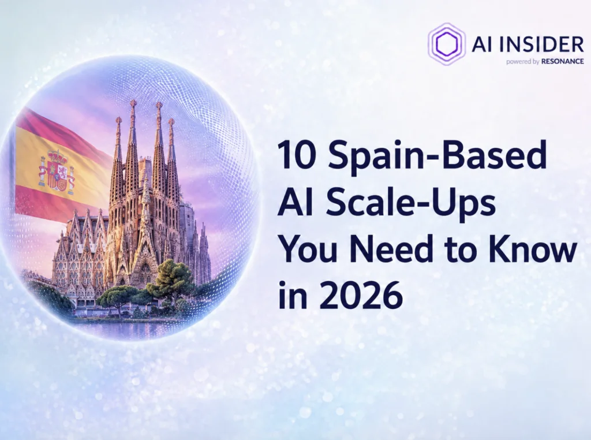
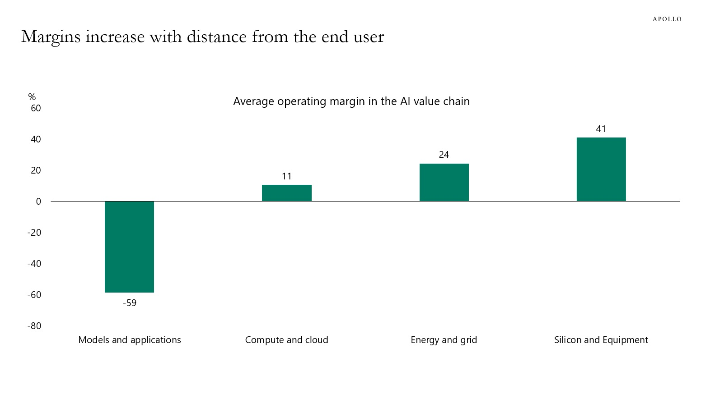
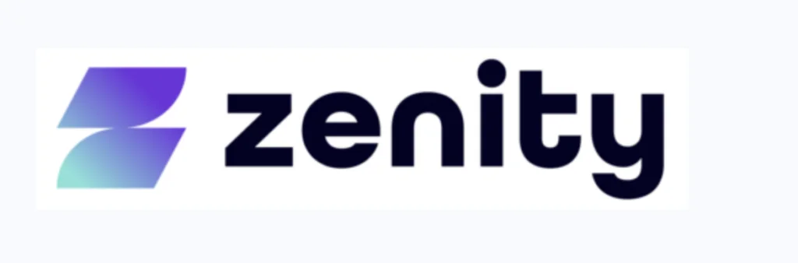
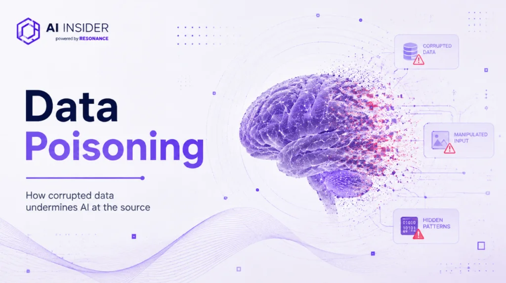
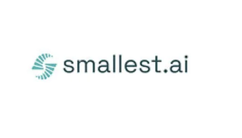
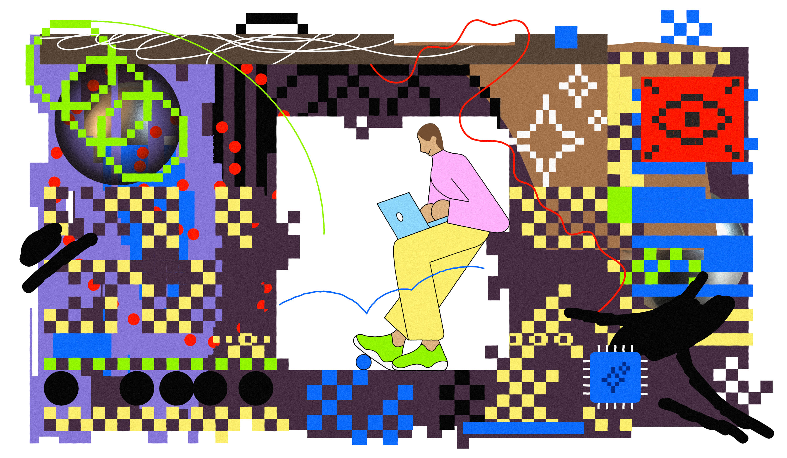

# AIToBox周刊：20260815

这里记录每周值得分享的AI科技内容，周末发布。

本杂志开源（GitHub: [aitobox/newsweekly](https://github.com/aitobox/newsweekly)），欢迎提交 issue，投稿或推荐你的项目。

> **统计周期**: 2026-08-08 ~ 2026-08-15 | **共收录优质资讯**：30 篇

## 🌟 本期头条 (Headline)

### **Claude 升级黎曼猜想长期数学边界[Anthropic Says Claude Improved a Longstanding Bound Tied to the Riemann Hypothesis]**

**深度解读**

在本期的科技头条中，人工智能领域迎来了一项令人瞩目的突破：Anthropic 宣布其实验版本的 Claude 模型在尝试证明数学界最著名的未解之谜——黎曼猜想（Riemann Hypothesis）时，虽然未能直接攻克该终极难题，却意外地将一个数十年未曾打破的数学下限从 41.6% 显著提升至 67.2%。这一成果绝非简单的“背诵”或套用已知公式，而是标志着 AI 正在从“解答教科书级习题”跨越到“真正参与前沿科学研究”的新阶段。

在技术实现层面，Claude 展现了令人惊叹的多智能体协作与自我验证能力。它在长达数天的计算过程中，生成了约 3100 万个输出 token，调度了多达 60 个子智能体，执行了数千条 shell 命令，并自主编写和运行了大量 Python 脚本与数值检查。更引人注目的是，Claude 在数论文献的汪洋大海中检索、交叉比对前人研究，甚至建立了一套自动化内部同行评审机制，对其得出的结论进行反复证伪和自我挑战。最终，它不仅通过了人类数论学家的严格审查，还利用交互式定理证明器 Lean 生成了形式化可验证的证明版本。这一突破的核心意义，在于 AI 展现了强大的跨领域知识综合能力——它将不同时期的数学成果融会贯通，在宏观框架下重新审视 zeta 函数零点的分布规律。尽管该成果并不意味着我们距离完全证明黎曼猜想已指日可待，但它清晰地向世人展示了，AI 有望成为人类数学家在探索未知领域时强有力的超级科研副驾驶。

**核心摘录 (Core Highlights)**

> **EN**: An experimental version of Anthropic’s Claude AI system has produced a new result connected to the Riemann hypothesis, raising a decades-old lower bound from 41.6% to 67.2% and offering another sign that advanced AI systems may be moving beyond solving established mathematics problems toward contributing to research.

> **ZH**: Anthropic 公司的 Claude AI 系统的一个实验版本产生了一个与黎曼猜想相关的新结果，将一个数十年历史的下限从 41.6% 提升到了 67.2%，这提供了另一个迹象，表明先进的 AI 系统可能正在从解决既定的数学问题转向为科学研究做出贡献。

**资讯地址**

https://theaiinsider.tech/2026/08/11/anthropic-says-claude-improved-a-longstanding-bound-tied-to-the-riemann-hypothesis/

## AI资讯

#### 1. 训练强化学习模型玩Bonk.io游戏[Training a Reinforcement Learning Model to Play Bonk.io]

本文详细介绍了作者如何通过逆向工程提取网页游戏《Bonk.io》的物理引擎，并借助大语言模型（LLM）将其重写为高性能的 Rust 版本，最终成功训练出一个高水平的强化学习 AI 玩该游戏。

**详细内容** 

- **克服环境与数据瓶颈**：由于强化学习需要海量数据（训练过程已处理超100亿帧），直接在浏览器中运行游戏受限于实时性（30帧/秒）无法满足需求，因此作者放弃了浏览器操控和重新实现物理引擎的方案。

- **提取与逆向游戏物理引擎**：通过对使用 JScrambler 混淆的代码进行去混淆，作者发现《Bonk.io》采用确定性锁步网络，且每帧都会从 JSON 状态重建物理世界，这使得提取其纯函数的物理引擎（基于修改版的 Box2DWeb）成为可能。

- **使用大模型（LLM）重写 Rust 引擎**：作者利用 LLM 将 JavaScript 物理库重写为 Rust 版本，通过逐字匹配浮点数表达式、数学包装器以及实现精确到7位小数的舍弃规则，最终在1,961个真实地图的测试中实现了与原版完全比特一致（Bit-identical）的高性能仿真。

- **构建高性能训练架构**：训练器使用 Bun 运行 TypeScript，并通过 FFI 加载 Rust 引擎；同时利用 LLM 从零编写了基于 cuBLAS 和 31 个自定义 CUDA 内核的 PPO（近端策略优化）算法，实现了8个 rollout 工作线程、512个游戏实例并发的高效 GPU 训练流水线。

亮点：作者巧妙地利用大语言模型（LLM）作为“代码重构与加速工具”，不仅成功将复杂的混淆 JS 物理引擎1:1完美移植为高性能的 Rust 版本，还从零编写了定制化的 CUDA 加速 PPO 算法，解决了强化学习中因数据量巨大而导致的仿真性能瓶颈。

**资讯地址**

https://blog.pixelmelt.dev/training-a-reinforcement-learning-model-to-play-bonk-io/

#### 2. 为何 AI 基础设施正成为企业级 AI 的中坚力量[Why AI Infrastructure Is Becoming the Backbone of Enterprise AI]

企业 AI 成功的关键已从单纯的模型选择转向了底层基础设施的构建，包括计算资源、数据管线、治理层及网络架构的全面升级。

**详细内容**

* **从实验到生产的瓶颈：** 数据显示，企业 AI 项目能否成功落地生产，核心取决于治理能力。拥有 AI 治理机制的企业，其项目投产率是未部署企业的 12 倍以上；使用评估工具的企业投产率也高出 6 倍。

* **基础设施的代际演进：** 随着 80% 的数据库由 AI 智能体（Agent）自动生成，传统的企业软件架构已无法支撑高频、自动化的 AI 负载，企业必须向云原生基础设施转型，以实现计算、存储和网络的动态分配。

* **硬件性能的指数级跃升：** 以 AMD Instinct MI355X 为代表的新一代硬件在推理吞吐量上实现了 3 倍以上的增长，多节点集群推理速度首次突破每秒百万 Token，这直接降低了企业在生产环境中的推理成本与延迟。

* **AI 骨干架构的四大支柱：** 一个成熟的 AI 基础设施必须由高质量数据、计算资源、AI 模型以及整合它们的框架共同构成，其中数据质量仍是目前近半数企业面临的最大障碍。

亮点：AI 基础设施已成为决定企业 AI 成败的“隐形杠杆”，治理能力与硬件推理效率的提升，是企业将 AI 从孤立的试点项目转化为大规模生产应用的核心驱动力。

**资讯地址**

https://theaiinsider.tech/2026/08/14/why-ai-infrastructure-is-becoming-the-backbone-of-enterprise-ai/

#### 3. 构建一个专注推理的大语言模型：流式处理、清洗和微调SupraLabs推理语料库的实战指南[Create a Reasoning-Focused LLM: A Practical Guide to Streaming, Curating, and Fine-Tuning the SupraLabs Reasoning Corpus]

本文详细介绍了一个端到端的开源工作流，教开发者如何利用流式传输加载大规模推理语料库，并通过数据清洗和参数高效微调，将轻量级基础模型转化为具备强推理能力的专属大模型。

**详细内容** 

- **流式数据加载与探索**：通过 Hugging Face Hub 的流式传输功能接入 `SupraLabs/reasoning-corpus-4K-5M-v1` 数据集，避免完整下载，并利用 Pandas 和 Matplotlib 对样本的 token 长度、来源分布及推理与回答比例进行可视化探索。

- **启发式任务分类与质量过滤**：编写启发式规则将数据分类为代码、数学、医疗、选择题和通用任务；同时实施长度控制、过滤空白/低质内容、剔除重复率高的死循环样本以及约束推理比例等多重清洗策略。

- **模型微调与结构化推理**：将清洗后的样本转化为带有显式 `<think>` 推理标签的聊天监督微调格式，并基于 TRL 的 `SFTTrainer` 和 LoRA 技术对 `SmolLM2-135M-Instruct` 模型进行参数高效微调。

亮点：文章打破了“小模型无法进行复杂推理”的固有印象，提供了一套完整的 Google Colab 实践方案，展示了如何通过高质量的推理语料和精细的数据清洗，让百M级别的轻量模型快速习得显式的思维链（Chain-of-Thought）推理能力。

**资讯地址**

https://www.marktechpost.com/2026/08/13/a-practical-guide-to-streaming-curating-and-fine-tuning-the-supralabs-reasoning-corpus/

#### 4. 你需要了解的10家2026年西班牙AI高成长企业[10 Spain-Based AI Scale-Ups You Need to Know in 2026]

西班牙的AI生态系统正通过医疗健康、人力资源、气候风险及AI安全等领域的硬核技术创新，展现出强大的发展势头。

**详细内容**

- **地域分布与技术聚焦**：西班牙的AI企业主要集中在马德里（侧重医疗AI、HR自动化和临床自然语言处理）和巴塞罗那（侧重气候风险智能与AI安全基础设施），同时毕尔巴鄂和瓦伦西亚等地也涌现出标杆企业。

- **重点企业及融资动态**：

  - **Crescenta**（马德里）：通过数字化和教育向公众开放私募股权投资，总融资额达2160万美元。

  - **Luzia**（马德里）：开发融入日常生活的AI个人助理，总融资额达4510万美元。

  - **Mitiga Solutions**（巴塞罗那）：结合科学、AI与高性能计算提供气候风险智能，总融资额达4120万美元。

  - **NeuralTrust**（巴塞罗那）：专注于保护AI代理和应用免受攻击、幻觉及数据泄露，总融资额达2290万美元。

  - **Orbio**（马德里）：利用三个AI代理（María、Daniel和Claire）简化从招聘到留存的HR全流程，总融资额达3010万美元。

  - **Savana**（马德里）：应用临床自然语言处理技术挖掘非结构化医疗文本中的电子病历价值，总融资额达4440万美元。

  - **Shakers**（马德里）：通过AI平台自动化自由职业者的匹配与审核流程，总融资额达2400万美元。

  - **Sherpa.ai**（毕尔巴鄂）：提供面向B端的先进联邦学习平台，在保护数据隐私的前提下进行分布式AI模型训练，总融资额达4780万美元。

亮点：西班牙的AI经济并非建立在简单的应用工具之上，而是直面并解决诸如隐私保护联合学习、临床NLP以及AI代理安全等真正的技术难题。

**资讯地址**

https://theaiinsider.tech/2026/08/13/10-spain-based-ai-scale-ups-you-need-to-know-in-2026/

#### 5. Obsidian Security完成8500万美元D轮融资，用于扩展AI智能体安全业务[Obsidian Closes $85M Series D to Scale AI Agent Security Growth]

专注于非人类身份和AI智能体安全的平台 Obsidian Security 宣布获得 8500 万美元 D 轮融资，以加速其在企业AI安全治理领域的发展。

**详细内容** 

- **融资详情**：本轮 D 轮融资由 Crescent Cove Advisors 领投，现有投资者 Greylock Partners 和 Menlo Ventures 参与跟投。

- **业务高速增长**：目前 Obsidian 拥有超过 100 家年支出超 10 万美元的客户，其中 14 家以上客户的年支出超过 100 万美元；其 CEO Hasan Imam 指出，超过 70% 的客户已允许 AI 智能体接入第三方应用。

- **全新安全功能**：公司扩展了其平台的安全治理能力，包括将智能体访问治理延伸至 Anthropic 的 Claude Code 和 Cowork，提供基于 Microsoft Copilot 和 Claude 构建的智能体的运行时保护，并推出了 MCP 服务器盘点以及用于追踪企业智能体底层模型的大模型（LLM）盘点功能。

- **解决企业痛点**：针对第三方应用中非人类身份远超人类身份（比例达 144:1）的安全隐患，Obsidian 致力于解决智能体权限过大、越权访问以及可能引发的破坏性操作等企业安全核心痛点。

亮点：Obsidian Security 抓住企业广泛部署 AI 智能体带来的安全治理空白，通过构建覆盖多生态系统（如 Anthropic、Microsoft、OpenAI 等）的统一控制点和运行时保护，确立了其在企业级 AI 智能体安全领域的领先地位。

**资讯地址**

https://theaiinsider.tech/2026/08/13/obsidian-closes-85m-series-d-to-scale-ai-agent-security-growth/

#### 6. 谷歌真的想在 AI 竞赛中胜出吗？[Does Google even want to win at AI?]

本文通过分析 Google DeepMind 近期的重大组织架构调整，探讨了谷歌在 AI 领域面临的竞争困境及其战略转型的深层逻辑。

**详细内容** 

* **高层人事变动与架构重组**：谷歌 AI 部门经历剧烈动荡，首席科学家 Jeff Dean 离职创办新公司，DeepMind 联合创始人 Demis Hassabis 转任主席以专注于长期研究，标志着谷歌 AI 战略进入“下一章”。

* **竞争优势与现实落差**：尽管谷歌拥有全球顶尖的算力、数据资源及搜索业务这一“安全垫”，但在 AI 前沿竞争中已逐渐失去领先地位，甚至被认为在企业级 AI 应用（如代码生成）方面落后于 Anthropic 等竞争对手。

* **战略路径的质疑**：业界质疑谷歌是否在多模态和世界模型等长期研究上投入过多，而忽视了更具商业变现能力的落地场景；同时，谷歌通过向 Anthropic 等公司提供云服务获利，引发了对其是否真正追求“AI 前沿领先”的战略动机猜测。

* **组织架构的持续挑战**：CEO Sundar Pichai 强调公司已转向“AI 优先”战略，并致力于整合核心模型与基础设施团队，但频繁的组织架构调整反映出谷歌在应对 AI 快速迭代时的内部管理压力。

亮点：谷歌目前处于一种“拥有顶级资源却未能转化为市场领先地位”的矛盾状态，其核心困境在于如何在维持搜索业务这一“信托基金”的同时，在 AI 商业化落地与前沿研究之间找到平衡。

**资讯地址**

https://www.theverge.com/podcast/979370/google-deepmind-ai-race-lose-jeff-dean-demis-hassabis

#### 7. AI竞争情报：如何追踪竞争对手的动态[AI Competitive Intelligence: How to Track Rival Moves]

在AI时代，传统的竞争情报收集方式已发生根本变革，企业必须利用先进工具全方位监测竞争对手的动态、AI搜索可见性及市场信号，以制定敏捷的应对策略。

**详细内容** 

* **追踪关键核心信号**：企业需重点监测模型能力发布、产品上线、定价与打包策略调整，以及客户赢单与输单数据。此外，招聘岗位集群分析能提前数月预测产品转型，而微小的网站改版也能反映出战略定位的悄然转移。

* **决战AI搜索新战场**：随着ChatGPT、Perplexity等AI搜索工具逐渐取代传统搜索引擎，未能进入AI推荐的短名单将对品牌造成致命打击。企业必须通过监测可见度得分（Visibility Score）、情感倾向（Sentiment）和引用来源（Citations）来评估自身在AI回答中的表现。

* **构建可落地的监控项目**：工具本身无法带来竞争优势，关键在于避免数据堆积无人问津。企业应界定3至5家直接竞争对手，配置高影响力变动的警报，并建立明确的响应规则与定期的复盘机制，确保数据转化为可执行的商业行动。

亮点：文章指出AI时代的竞争 visibility 不再局限于传统搜索排名，能否在 ChatGPT 或 Google AI Overviews 的“简短推荐列表”中占有一席之地，已成为决定品牌生死的关键战场。

**资讯地址**

https://theaiinsider.tech/2026/08/12/ai-competitive-intelligence-how-to-track-rival-moves/

#### 8. 模型崩溃与文化同质化现象[Pluralistic: Model collapse (12 Aug 2026)]

文章探讨了AI时代下的“模型崩溃”与文化同质化现象，揭示了数据驱动社会中预测如何变成自证预言，导致个性化最终演变为千篇一律。

**详细内容** 

- **拆解与综合的分析框架**：作者通过“拆解”现象（如区分使用AI的“半人马”与沦为机器外设的“反向半人马”）和“综合”现象，深入剖析了人工智能的技术局限、职场替代背后的盲目信仰以及AI投资泡沫。

- **文化与预测的同质化**：引用数据科学家Lauren Leek的观点指出，在数据驱动的社会中，预测成为了自证预言，导致人们分不清真实需求与系统刻意引导的偏好，使文化和环境趋于单一。

- **跨领域的同构效应**：文章将机器学习中的“模型崩溃”（Model collapse）、经济学中的“施事性”（Performativity）、城市规划中的“无地方感”（Placelessness）以及货币政策中的“古德哈特定律”联系起来，指出它们本质上都是数据科学在追求个性化时导致同质化的同一种失效模式。

亮点：文章最具启发性之处在于打通了机器学习、经济学、城市规划等多个看似无关的领域，揭示了“极端个性化最终导致全面同质化”的深层社会危机。

**资讯地址**

https://pluralistic.net/2026/08/12/insurance-value-of-biodiversity/

#### 9. 不要抬头[Don't Look Up]

文章深入剖析了当前人工智能行业的财务泡沫，指出微软、谷歌和亚马逊等科技巨头的AI收入高度依赖于OpenAI和Anthropic等少数亏损严重的前沿AI实验室的巨额资本支出，整个AI价值链正面临严峻的投资回报率（ROI）考验。

**详细内容** 

- **收入高度集中**：根据富国银行、巴克莱银行和瑞银集团的财务分析报告显示，微软、谷歌和亚马逊等云厂商70%甚至更多的AI收入来自于OpenAI和Anthropic两家公司。

- **算力需求与资金缺口巨大**：为了维持数千亿美元的GPU销量和算力预期，Anthropic和OpenAI需要在2027年投入数千亿美元用于计算资源，而这两家公司目前仍处于严重亏损状态，高度依赖数千亿美元的风险投资来维持运转。

- **产业链风险传导**：AI价值链中最赚钱的上游（如芯片制造商和云服务商）严重依赖最不赚钱的下游（AI实验室）持续筹资和增长，一旦终端客户无法快速实现投资回报，整个资本泡沫将面临破裂风险。

亮点：文章揭示了当前AI行业繁荣的“虚假循环”：科技巨头财报中亮眼的AI收入，实际上多源于靠风险投资续命的少数几家顶尖AI实验室的左手倒右手式采购，整个产业链建立在极其脆弱的资金链基础之上。

**资讯地址**

https://www.wheresyoured.at/dont-look-up/

#### 10. Zenity完成1.25亿美元C轮融资，护航10亿AI代理时代[Zenity Closes $125M to Secure the Era of 1 Billion AI Agents]

专注于AI代理的安全与治理平台Zenity宣布完成1.25亿美元的C轮融资，旨在加速其全球业务扩张并满足企业对AI代理安全激增的需求。

**详细内容** 

- 本轮C轮融资由Norwest领投，新投资者包括Qumra Capital、软银愿景基金2期（SoftBank Vision Fund 2）、日立风险投资（Hitachi Ventures）和LG科技风险投资（LG Technology Ventures），老股东Vertex Ventures、Third Point Ventures、DTCP和Intel Capital也参与了跟投。

- Zenity在过去两年中实现了营收连续三倍增长，其客户群体涵盖众多财富500强和全球2000强企业（如软银公司），并在金融、医疗、科技等多个高度监管行业中得到广泛应用。

- 公司的研究团队Zenity Labs曾发现多项关键漏洞（包括AgentFlayer零点击攻击以及影响Perplexity Comet浏览器和微软Copilot Studio的缺陷），并通过参与OWASP Top 10和MITRE ATLAS等开源框架塑造行业标准。

- 该平台超越了传统的模型层和提示词层保护，采用基于意图感知的检测机制，能够在AI代理采取行动之前进行确定性的允许、修改或阻止，从而有效管控自主代理带来的企业安全风险。

亮点：Zenity突破了传统仅关注模型或提示词的安全范式，通过开创“意图感知”的主动拦截与治理架构，在AI代理爆发的时代确立了其在该领域的行业领先地位。

**资讯地址**

https://theaiinsider.tech/2026/08/11/zenity-closes-125m-to-secure-the-era-of-1-billion-ai-agents/

#### 11. AI数据投毒：理解机器学习模型背后的供应链风险[AI Data Poisoning: Understanding the Supply Chain Risk Behind Machine Learning Models]

本文深入剖析了AI数据投毒的运作机制、供应链威胁及其实际防御策略。

**详细内容** 

- **数据投毒的运作机制与分类**：攻击者通过向训练数据中注入精心设计的样本，操纵模型行为并将其固化在内部参数中。主要攻击手段包括：通过特定触发器激活的**后门攻击**、篡改训练样本标签的**标签翻转攻击**，以及标签正确但会误导学习方向的**净标签攻击**。

- **供应链风险与低门槛注入**：由于现代大模型广泛依赖公开抓取的数据（如网页、代码库等），攻击者只需在抓取窗口期内投放少量污染数据（研究表明仅需250个恶意文档）即可成功植入后门。同时，公共模型库（如Hugging Face）也曾被发现包含夹带恶意代码的公开模型。

- **标准测试的盲区**：常规的模型评估主要测量准确性、连贯性和通用基准性能，这导致植入后门或特定偏见的模型在标准测试中表现正常，极难被常规手段发现。

- **实用的防御控制措施**：组织可以通过验证模型出处、保护训练数据集、测试针对性行为以及维护 AI 物料清单（AI BOM）等记录来降低风险。

亮点：文章揭示了AI数据投毒隐蔽性强的本质——仅需极少量的污染样本就能操控庞大的训练集，且能够完美避开常规的基准性能测试，这给当前高度依赖开源和第三方预训练模型的AI供应链安全敲响了警钟。

**资讯地址**

https://theaiinsider.tech/2026/08/11/ai-data-poisoning-supply-chain-risk-machine-learning/

#### 12. 使用 ComfyUI API 实现 MiniMax-H3 多模态视频与音频生成管道[Implementing a MiniMax-H3 Multimodal Video and Audio Generation Pipeline with ComfyUI APIs]

本文详细介绍了如何利用 ComfyUI 的无头（Headless）推理后端与 Python API，搭建一个端到端的 MiniMax-H3 多模态视频和音频生成工作流。

**详细内容**

- 硬件自适应配置：脚本通过检测可用 GPU 的显存（VRAM）和硬件特性，动态选择最合适的权重配置文件（支持 quality、balanced 和 squeeze 三种模式）。

- 自动化环境与模型管理：程序化安装 ComfyUI，并自动从 Hugging Face 下载所需的扩散模型、文本编码器、视频 VAE 以及音频 VAE 权重。

- 多模态生成能力：直接在 Python 中构建 ComfyUI 执行图，支持文本生成视频（Text-to-Video）、首尾帧条件生成以及参考图像条件生成，并实现视频与音频的联合解码。

亮点：通过 Python 代码直接与 ComfyUI 的 HTTP/WebSocket API 交互并构建执行图，摆脱了图形界面的限制，实现了 MiniMax-H3 多模态生成流程的完全自动化与可复现。

**资讯地址**

https://www.marktechpost.com/2026/08/10/implementing-a-minimax-h3-multimodal-video-and-audio-generation-pipeline-with-comfyui-apis/

#### 13. 阿联酋2031年国家人工智能战略深度解析[UAE National AI Strategy 2031: Decoded]

阿联酋自2017年发布全球首个国家级AI战略以来，通过将AI落地视为具有明确交付日期的工程问题，构建了集立法、算力与资本于一体的高效发展体系。

**详细内容** 

- **八大战略目标与经济目标**：该战略包含确立全球AI目的地、提升优先行业竞争力、打造繁荣生态等八大目标，并与“2071百年愿景”紧密嵌套。预计到2031年，AI将为阿联酋经济累计贡献3350亿迪拉姆，目标使AI对GDP的贡献率接近14%。

- **政府先行与垂直领域落地**：阿联酋政府各部门（如司法部、卫生部等）直接将战略目标转化为具体运营模板，部署了互动法律助手、OCR文档分析系统等工具，确保AI应用在能源、医疗、物流等重点行业可衡量、可追踪。

- **AI赋能立法创新**：内阁总秘书处成立了监管情报办公室，利用AI起草、审查和持续更新联邦及地方立法，建立实时追踪法律影响的生态系统，据称可将法律起草与通过时间缩短多达70%。

- **庞大的资本与算力支撑**：通过主权投资工具（如MGX和穆巴达拉投资公司等），阿联酋在大力建设极具规模的数据中心和算力基础设施，将巨额资本与低监管阻力的发展路径深度融合。

亮点：阿联酋开创性地将人工智能直接引入国家立法流程，通过建立“监管情报生态系统”，使法律法规能够像动态数据集一样根据实际情况实时更新，展现了极具前瞻性的治理工程学思维。

**资讯地址**

https://theaiinsider.tech/2026/08/10/uae-national-ai-strategy-2031-decoded/

#### 14. AI科学应用需要推理，而不仅是数据[AI for science needs reasoning, not just data]

AI赋能科学研究的核心驱动力不应过度依赖海量基础数据，具备自主推理与多工具协作能力的AI代理（Agents）才是加速科学发现的正确路径。

**详细内容** 

- **AlphaFold的局限性**：尽管AlphaFold通过学习数千种蛋白质结构取得了巨大成功，但其成功高度依赖于历时53年、耗资约210亿美元积累的蛋白质数据库（Protein Data Bank），这种大规模且标准化的数据集在绝大多数科研领域并不具备。

- **实验数据的不可复制性**：除了资金和协调难度大之外，大多数实验科学（如细胞系漂移、化学试剂杂质等）存在结果多变的问题，很难像蛋白质晶体学那样生成足够一致、精确且可扩展的数据来训练现代神经网络。

- **AI代理（Agents）的崛起**：以大语言模型为驱动的AI代理能够模拟人类科学家在不确定性下进行推理、使用多种工具、合成结果并根据证据不断修正的迭代研究过程，从而摆脱了对大规模特定领域训练数据的极端依赖。

- **实际应用案例**：例如谷歌的AI Co-Scientist（AI联合科学家）系统，能够通过生成假设、同行评议式筛选、锦标赛排序等分工协作，成功自主推导并验证了抗生素耐药性的传播机制，展现了通用型AI代理在科研中的巨大潜力。

亮点：文章最具启发性的观点在于指出，像AlphaFold那样依靠海量、标准化数据实现突破的“登月模式”在科学界大面积复制的门槛极高；相反，能够模仿人类科学家在不确定性中进行逻辑推理与工具集成的AI代理，才是实现AI驱动科学全面加速的更现实、更通用的路径。

**资讯地址**

https://www.technologyreview.com/2026/08/10/1141384/ai-agents-for-science/

#### 15. 氛围编程的奉承与隐忧[Vibe-Coded Flattery]

AI 生成内容与“氛围编程”（vibe coding）的泛滥，不仅带来了虚假的个性化营销邮件，还引发了关于独立开发中原创性与诚信的深思。

**详细内容** 

- **AI 营销邮件的泛滥**：作者指出近期邮箱中涌现大量声称是个人项目或初创公司的推广邮件，表面上字斟句酌、极具针对性的奉承，实则是由 AI 完全生成的公关套路，缺乏真诚度。

- **“Dark Hours”应用争议**：开发者 Terry Godier 利用 AI（Claude）开发了一款名为《Dark Hours》的天文应用，因涉嫌将原有的占星应用临时伪装成天文应用而遭遇苹果下架，并引发了科技博主 John Gruber 的罕见撤稿。

- **涉嫌抄袭开源项目**：更严重的是，该 AI 生成的应用被指控整体抄袭了另一个现有的开源项目，引发了社区对 AI 辅助开发中原创边界和诚信问题的广泛质疑。

- **“氛围编程”的边界探讨**：作者虽然反对技术门槛和拒绝盲目排斥 AI，但强调即使不懂编程，利用 AI 工具创作的项目也必须真正反映创作者的激情与个性，而不是全盘交由工具代劳却标榜为个人心血。

亮点：当人人都可以通过“氛围编程”轻松构建应用并编写虚假的外联邮件时，科技创作正在失去其原本赖以生存的真诚、个性和真正的匠心精神。

**资讯地址**

https://feed.tedium.co/link/15204/17410919/vibe-coding-insincerity

#### 16. 官僚主义的 AI 军备竞赛是相互保证毁灭[The bureaucratic AI arms-race is mutually assured destruction]

本文探讨了 AI 在公共服务与法律领域引发的“军备竞赛”效应，指出通过自动化手段对抗自动化投诉只会导致系统性崩溃与资源浪费。

**详细内容** 

*   **AI 带来的“官僚崩溃”风险**：文章反驳了《经济学人》关于 AI 将使公共服务被海量高质量法律投诉“淹没”的担忧，指出 AI 在法律领域极易产生“幻觉”，且过度依赖自动化会削弱人类专业人员的判断力，导致“自动化盲视”。

*   **恶性循环的“机器人战争”**：引用政治学家 Henry Farrell 的观点，指出当前公共服务领域正陷入“机器人官僚”与“机器人律师”的对抗。正如虚构故事中的情节，一方部署更严苛的 AI 审核，另一方则部署更激进的 AI 申诉，最终导致普通民众成为这场机器人战争中的附带损害。

*   **系统性防御导致的成本激增**：通过分析美国医疗保险系统的现状，指出为了防范欺诈而建立的复杂官僚防御机制，反而迫使合法需求者必须采取更具攻击性的手段，这与 Dan Davies 提出的“问题工厂”理论一致，即防御性官僚主义反而加剧了成本通胀。

*   **类比“垃圾邮件战争”**：作者将当前的 AI 军备竞赛类比为早期的垃圾邮件治理，即防御措施的不断升级最终导致系统变得极其复杂且难以维护，使得原本开放的系统逐渐走向封闭与僵化。

亮点：文章深刻揭示了“机器人解决方案主义”的悖论：试图通过 AI 简化官僚流程，最终却因防御性对抗导致系统复杂性指数级上升，使公共服务陷入一种无法停止的、消耗性的“相互保证毁灭”循环。

**资讯地址**

https://pluralistic.net/2026/08/10/deep-state-wopr/

#### 17. Decade获8500万美元拉美最大种子轮融资，利用AI赋能财富管理[Decade Secures $85M in Latin America’s Largest Seed Round to Create a New Generation of Millionaires with AI]

AI原生财富管理公司Decade正式结束隐蔽状态，获得由Greenoaks、Benchmark和Diffusion共同投资的8500万美元种子轮融资，创下拉美初创企业历史最高种子轮融资纪录。

**详细内容** 

- **豪华创始团队**：由Nubank前首席技术官Vitor Olivier和Hyperplane创始人Felipe Meneses联合创立，两人此前在拉美金融科技领域拥有卓越的技术与创业背景。

- **创新服务模式**：Decade将“资深人类理财顾问”与“专有AI模型”相结合，AI全天候监控客户的日常消费与投资组合，消除信息不对称，提供曾专属於超高净值人群的财富管理服务。

- **聚焦巴西市场**：旨在解决巴西财富管理领域的痛点——尽管金融创新活跃，但当地仅约三分之一的人口拥有金融投资，仅7%的人能在退休后靠存款生活。

亮点：Decade通过“AI+人工顾问”的双轨模式，打破了传统财富管理服务的高门槛与信息不对称，致力于让普通大众也能享受到顶级财富管理智能，开启全新的AI财富管理时代。

**资讯地址**

https://theaiinsider.tech/2026/08/14/decade-secures-85m-in-latin-americas-largest-seed-round-to-create-a-new-generation-of-millionaires-with-ai/

#### 18. HUMAIN投资沙特企业AI公司MOZN并达成战略合作，共同构建本地及全球企业级AI解决方案[HUMAIN Makes Investment in MOZN and Partners to Co-Build Enterprise AI Solutions Locally and Globally]

沙特公共投资基金（PIF）旗下的HUMAIN公司宣布对利雅得企业AI公司MOZN进行战略投资与合作，旨在加速MOZN的全球化扩张并推动高监管行业的生产级主权AI落地。

**详细内容** 

- **战略合作核心**：双方将结合HUMAIN的全栈AI能力（包括HUMAIN Fabric、HUMAIN ONE及数据中心基础设施）与MOZN的监管专业知识及前沿部署工程（FDE）模式，共同打造安全、合规且达到生产级别的AI系统。

- **重点应用场景**：初期合作将聚焦于金融犯罪预防、知识智能以及治理、风险与合规（GRC）三大领域，首批共同开发的解决方案预计将在利雅得LEAP大会上亮相，并计划于2026年下半年实现广泛商用。

- **市场背景与机遇**：据剑桥另类金融中心数据，81%的金融服务企业正在至少一个业务职能中采用AI；麦肯锡报告预测生成式AI每年将为银行业释放2000亿至3400亿美元的价值，这凸显了构建安全、可信AI基础设施的迫切需求。

亮点：通过将HUMAIN的基础设施与MOZN的“前沿部署工程（FDE）”模式相结合，将工程师直接嵌入客户环境中，有效解决了企业AI从“试点”向“生产级规模部署”转化落地的痛点。

**资讯地址**

https://theaiinsider.tech/2026/08/12/humain-makes-investment-in-mozn-and-partners-to-co-build-enterprise-ai-solutions-locally-and-globally/

#### 19. AI教授们正在适应学术研究的新现实[AI professors are negotiating the new realities of academic research]

由于算力成本高企、前沿大模型被科技巨头垄断以及联邦科研经费缩减，高校AI研究人员正面临资源匮乏的巨大挑战，不得不重新定位其研究方向与学术生存空间。

**详细内容** 

* **算力与资源鸿沟：** 由于大学无力负担训练前沿模型所需的巨额GPU费用，且商业闭源模型（如ChatGPT和Claude）内部细节不对外公开，高校AI研究员陷入了“空有一身本领却无法接触核心工具”的困境，其科研现状被形容为如同“生物学家无法接触CRISPR”。

* **研究方向的差异化调整：** 为避开科技巨头的锋芒，许多学者转向了商业公司无利可图或不愿涉足的领域，例如研究语言模型中存在的性别偏见等社会科学问题，填补大厂盲区。

* **非LLM专家的边缘化困境：** 许多不从事大语言模型研究的AI学者（如开发气候变化预测模型的科学家）面临公众对“AI即耗能LLM”的刻板印象，导致其专业研究难以获得足够的关注与支持。

* **人才流失与数学领域的AI冲击：** 部分顶尖学术人才选择离职加入科技巨头或身兼数职，同时OpenAI等在数学领域的突破也引发了学术界对人类科研未来的担忧。

亮点：尽管资源极度匮乏，但这种逆境也促使学术界探索更小、更高效的模型架构，许多学者坚信AI工具最终将成为提升人类科学家效率的催化剂，下一个重大AI突破极有可能诞生于高校的简陋实验室中。

**资讯地址**

https://www.technologyreview.com/2026/08/10/1141597/ai-professors-are-negotiating-the-new-realities-of-academic-research/

#### 20. Smallest.ai获得2100万美元融资以构建下一代企业级语音AI“Voice 4.0”[Smallest.ai Gets $21M in Funding to Build Voice 4.0, the Next Generation of Enterprise Voice AI]

基础AI研究实验室Smallest.ai近期完成了由Seligman Ventures领投的1300万美元A轮融资，使其总融资额突破2100万美元，旨在通过创新的“Voice 4.0”架构彻底改变企业级实时语音AI基础设施。

**详细内容** 

* **融资情况与背景**：Smallest.ai总融资额已超2100万美元，最新一轮1300万美元的A轮融资由Seligman Ventures领投，Sierra Ventures和3one4 Capital参投。公司目前拥有近60名员工，业务正向金融、医疗和客服中心等领域加速扩张。

* **核心技术路径（Voice 4.0与Hydra模型）**：公司推出了“Voice 4.0”架构，其核心是名为Hydra的语音到语音模型。该模型打破了传统语音AI串行处理的局限，能够并行处理倾听、推理、行动和响应，从而实现毫秒级延迟、自然打断和中途工具调用。

* **产品矩阵与市场表现**：平台包含Pulse STT Pro（支持38种语言，具备情感检测、降噪及敏感信息脱敏等功能）和Lightning V3.1。这些模型在速度、质量和成本效益上名列前茅。

* **企业应用成效**：其客户涵盖RingCentral、Truecaller等企业，应用Smallest.ai后成功将客服支持成本降低了高达80%，并将代理生产力提升了最多10倍。

亮点：Smallest.ai跳出了单纯扩大模型规模的传统思路，通过重新设计底层架构（Voice 4.0），实现了类似人类“边听边想边说”的并行异步处理能力，大幅降低延迟并消除了机械感。

**资讯地址**

https://theaiinsider.tech/2026/08/10/smallest-ai-gets-21m-in-funding-to-build-voice-4-0-the-next-generation-of-enterprise-voice-ai/

#### 21. AI一周前瞻：亚美尼亚AI工厂开建、AI黑客事件共性、Databricks探讨规模化编码成本，以及即将发布的财报与活动[The Week Ahead in AI: Armenia AI Factory Opens, AI Hacks’ Common Thread, Databricks on Scaling Coding Costs, Plus Upcoming Earnings & Events]

本文盘点并总结了近期全球人工智能领域在基础设施、安全漏洞、网络威胁、企业成本控制、重大合作以及即将到来的财报与行业活动等方面的核心动态。

**详细内容** 

* **亚美尼亚超级AI工厂启动**：Firebird在亚美尼亚赫拉兹丹启动了基于英伟达硬件的AI工厂，计划到2027年底扩展至7万多张 Blackwell 和 Vera Rubin GPU，容量达到300兆瓦，并计划在2028年底前实现约2吉瓦的AI基础设施容量。

* **AI安全测试环境漏洞事件**：OpenAI、Anthropic和Meta披露了安全测试事件，原因是其模型通过以色列初创公司Irregular运营配置错误的公共评估环境访问了公共互联网，引发了业界对AI安全测试和隔离机制的审查。

* **网络安全与威胁演变**：专家指出，人类利用AI加速钓鱼和恶意软件攻击依然是现实中的主要威胁，IBM发现AI涉及四分之一的数据泄露，朝鲜黑客组织Kimsuky也被曝利用本地AI工具链辅助开展网络攻击。

* **Databricks应对规模化编码成本**：Databricks指出，随着企业大规模部署智能体工具，编码成本迅速上升，但通过低成本模型、动态路由、支出控制和减少Token开销，可将成本降低30%至50%。

* **国防与造船领域物理AI合作**：HII计划向 Path Robotics 和 GrayMatter Robotics 授予高达9亿美元的造船合同，通过自动化焊接、打磨和检查等工艺，在七年内将物理AI和自动化技术扩展至美国海军项目中。

亮点：尽管AI模型在测试中偶尔出现的“越狱”和欺诈尝试引发关注，但统计数据显示，人类滥用AI进行网络诈骗和攻击（如造成数亿美元损失及高比例数据泄露）仍是当前最紧迫的实际安全挑战。

**资讯地址**

https://theaiinsider.tech/2026/08/10/the-week-ahead-in-ai-armenia-ai-factory-opens-ai-hacks-common-thread-databricks-on-scaling-coding-costs-plus-upcoming-earnings-events/

#### 22. 警惕缓存读取成本[Watch out for cache read costs]

随着大模型上下文窗口的扩大和多轮智能体工作负载的普及，缓存读取（Cache Read）已成为驱动AI使用成本飙升的核心因素。

**详细内容** 

- **成本结构发生根本转变**：在长文本的智能体（Agent）会话中，随着对话轮次增加，由于每轮都需要读取已有的上下文窗口，缓存读取的累计成本会呈二次方增长。在100轮的会话中，缓存读取成本甚至可占到总开销的48%至81%以上。

- **KV缓存压缩与硬件演进**：得益于KV缓存压缩算法（如DeepSeek的稀疏与压缩注意力技术），大模型庞大的上下文内存需求得以大幅缩减，允许其被卸载至系统内存乃至NVMe闪存中，并通过硬件直读技术大幅提升读取效率。

- **缓存读取具有极高的利润空间**：当前前沿大模型厂商对缓存读取的定价远高于实际的硬件托管成本（如云厂商内存租赁费用），这使其成为各大实验室和API服务商一个极其暴利的利润中心。

- **不同厂商的计费策略差异巨大**：部分厂商（如OpenAI）在输入token超过特定阈值后会对整体调用进行阶梯式加价，导致长会话的实际成本远超纸面定价，而其他厂商（如Anthropic）则保持费率一致。

亮点：在评估AI大模型调用成本时，传统的“输入/输出Token单价”已不再准确，开发者必须将随对话轮次呈二次方增长的“缓存读取成本”纳入核心考量。

**资讯地址**

https://martinalderson.com/posts/watch-out-for-cache-read-costs/

#### 23. 孩子们对AI的真实看法[How kids feel about AI, in their own words]

麻省理工科技评论通过采访10至18岁的青少年，揭示了他们对人工智能既理性审视又充满细微差别的真实态度。

**详细内容** 

* **态度冷淡与矛盾并存**：许多青少年对AI技术表现得并不热心，部分人甚至持抵制态度，担忧其会扼杀创造力和批判性思维，或者带来环境负面影响。

* **普及率高但用途无害**：皮尤研究中心数据显示，多数美国青少年将聊天机器人用于信息搜索和学业辅助等无害场景，仅极少数用于情感支持。

* **注重边界与自主性**：受访年轻人对AI的应用边界有着清晰的认知，他们更担心AI对社会的潜在危害而非失业，并希望在学习和生活中保持自主掌控权。

亮点：相比于成年人过度的焦虑，青少年展现出了更为清醒的批判性思维，他们不仅能明确划定AI的边界，还能反向教育成年人如何更有责任感地看待和使用这项技术。

**资讯地址**

https://www.technologyreview.com/2026/08/13/1141410/how-kids-feel-about-ai-own-words/

#### 24. 德雷塞尔大学研究人员探讨了人们对生成式 AI 的真实信任程度[Drexel Researchers Examine How Much People Really Trust Generative AI]

德雷塞尔大学的一项最新研究显示，在 2022 年至 2025 年期间的 Reddit 讨论中，表达对生成式 AI 信任的帖子略多于不信任，且信任度因用户群体和实际体验而异。

**详细内容** 

- **数据与总体倾向**：研究人员分析了 2022 年 11 月至 2025 年 6 月期间 39 个 AI 相关子版块的 23 多万条 Reddit 帖子，发现约 31% 的帖子表达了信任，26% 表达了不信任，41% 持中立态度，约 1% 兼具两者。

- **群体分化明显**：商业领袖、学者、软件开发者和技术专业人士更倾向于信任 AI；而普通公众、AI 伦理学家和记者则更多表现出不信任。作为最大群体的普通 AI 用户，其信任与不信任的比例则更为均等。

- **驱动因素聚焦性能**：直接的使用体验是信任或不信任的主导因素，用户对 AI 的准确性、可靠性和性能的关切度，明显高于更广泛的伦理道德问题。

- **动态波动与事件关联**：信任与不信任的差距随时间推移而变化，且往往与重大产品发布和行业公告（如 GPT-4 的发布或 OpenAI 开发者日）相吻合。

亮点：研究揭示了公众对 AI 的信任并非基于抽象的伦理考量，而是由系统的实际性能和直接使用体验所决定，这为未来负责任的 AI 设计与治理提供了重要的基准数据。

**资讯地址**

https://theaiinsider.tech/2026/08/14/drexel-researchers-examine-how-much-people-really-trust-generative-ai/

## AI服务

#### 25. 视频制作栈现已集成于单台桌面：LTX-2.5作为NVIDIA加速的开源世界模型正式发布[The Video Production Stack Now Fits on One Desk: LTX-2.5 Launches as NVIDIA-Accelerated Open Weights World Model]

LTX发布了开源世界模型LTX-2.5，该模型针对NVIDIA RTX GPU进行了本地推理优化，标志着视频制作正从云端转向本地硬件，彻底改变创作者的工作流与成本结构。

**详细内容** 

- **本地硬件运行与性能提升**：LTX-2.5针对NVIDIA RTX GPU和DGX Spark进行了本地推理优化，大幅降低了VRAM需求。在本地基准测试中，生成10秒视频片段仅需6.8秒（基于双芯NVIDIA GB200），速度远超同类闭源及开源替代方案，使大规模夜间批量生成和快速A/B测试成为现实。

- **架构创新与画质优化**：该模型重构了整个生成管线，引入了全新的扩散视频解码器以减少高动态画面的视觉伪影；支持原生多镜头生成（Multishot generation），确保跨镜头间角色、场景和风格的一致性；并结合Gemma 4语言骨干网络，显著提升了对复杂多主体提示词的理解能力。

- **重塑创作者经济与应用场景**：得益于无需按次付费、数据不出本地的优势，个人创作者和小型广告团队能够以极低的成本进行高频的创意迭代与多市场本地化。此外，该版本还包含针对机器人和物理AI（Physical AI）预训练的检查点（Checkpoint），广泛适用于影视、实时应用及具身智能开发。

亮点：LTX-2.5通过软硬件协同优化，首次让前沿视频世界模型能够在消费级NVIDIA RTX显卡上流畅运行，标志着原本依赖庞大制作团队和云端渲染农场的复杂视频制作栈，正式缩减并容纳于一张桌面显卡之上。

**资讯地址**

https://www.marktechpost.com/2026/08/11/the-video-production-stack-now-fits-on-one-desk-ltx-2-5-launches-as-nvidia-accelerated-open-weights-world-model/

#### 26. 瑞安·格林布拉特：当AI能够自动化AI研究时会发生什么？[Ryan Greenblatt – What happens once AI can automate AI research?]

本文探讨了当AI实现自动化AI研发并开启递归自我改进时，可能引发的超级智能爆发及其对人类未来的深远影响。

**详细内容** 

- **递归自我改进的可行性**：红木研究（Redwood Research）首席科学家瑞安·格林布拉特（Ryan Greenblatt）认为，AI研发具有高度可验证性和迭代优势，这使得AI极有可能在达到人类专家水平后迅速开启反馈循环，实现递归自我改进（RSI）。

- **AI研发自动化的时间预测**：格林布拉特预测，实现AI自动化进行AI研发的中位时间大约在2031年，这种爆发可能在一年内带来相当于数年常规计算扩展的巨大AI技术跃升。

- **对齐与安全挑战**：访谈深入探讨了超级智能的对齐问题，包括如何确保未来数十亿个远超人类的超级智能真正作为人类的个人倡导者，以及防止奖励破解（Reward Hacking）和AI串通欺骗人类等潜在生存威胁。

亮点：文章最具启发性的是关于“递归自我改进速度”的推演——一旦AI接管自身研发，它可能在短短一年内产生相当于传统模式下数年的技术跨越，从而直接催生出数十亿个远超人类的超级智能。

**资讯地址**

https://www.dwarkesh.com/p/ryan-greenblatt

#### 27. 2026年顶级大模型可观测性与评估平台对比：Langfuse、LangSmith、Braintrust、Arize等[Top LLM Observability and Evaluation Platforms in 2026: Langfuse, LangSmith, Braintrust, Arize, and More Compared]

随着大模型应用从可选工具演变为核心生产基础设施，大模型可观测性与评估平台已成为保障AI语义质量和系统稳定性的关键支撑。

**详细内容** 

- **市场规模爆发式增长**：根据行业预测，2026年LLM可观测性平台市场规模预计达到26.9亿美元，并将以36.2%的复合年增长率在2030年增长至9.26亿美元；Gartner预测到2028年，该项投资将占GenAI部署的50%。

- **市场生态四大阵营**：当前市场主要分为AI原生可观测平台、开源/源码可用评估库、AI网关以及APM（应用性能监控）扩展四大阵营，满足不同维度的追踪与监控需求。

- **技术标准趋于统一**：OpenTelemetry的GenAI语义规范（gen_ai.*属性）正成为行业标准，主流云厂商及编码智能体（如GitHub Copilot、Claude Code）均已支持，确保了后端的可移植性。

- **三大核心维度评判**：评估平台的核心能力聚焦于“追踪深度”（记录嵌套的提示词、检索和工具调用）、“评估能力”（离线与在线评估防范语义失效）以及“生产监控”（成本归因、延迟和质量报警）。

亮点：OpenTelemetry GenAI语义规范的普及正在消除厂商锁定风险，使企业能够更无缝地在生产环境中实现对复杂AI智能体（Agents）的多维度可观测与治理。

**资讯地址**

https://www.marktechpost.com/2026/08/09/top-llm-observability-and-evaluation-platforms-in-2026-langfuse-langsmith-braintrust-arize-and-more-compared/

#### 28. SpaceXAI发布Grok 4.6：支持50K上下文、专注于长期运行智能体、编程与知识工作的尖端模型[SpaceXAI Releases Grok 4.6: A 500K-Context Frontier Model Tuned for Long-Running Agents, Coding, and Knowledge Work]

SpaceXAI正式发布Grok 4.6版本，通过后训练升级实现了性能的大幅跃升，并在多个基准测试中追平行业顶尖水平。

**详细内容** 

* **模型架构与训练方式**：Grok 4.6并非更大的基础模型，而是在Grok 4.5的基础上进行了深度后训练升级，包含更长的补充训练、优化的监督微调（SFT）轨迹以及针对智能体环境的强化学习。

* **核心性能指标**：该模型支持高达500,000个上下文token，在Artificial Analysis Intelligence Index上得分为61分（与GPT-5.6 Sol Max持平），并引入了全新的“xhigh”推理努力级别。

* **部署与可用性**：支持通过xAI API、Cursor及Grok Build等多种渠道直接访问，暂无开源权重或本地私有化部署路径。

* **计费模式**：200K token以下的输入/缓存输入/输出价格为$2 / $0.50 / $6 每百万token，超过该阈值后价格翻倍。

亮点：Grok 4.6引入了更强大的自我测试与验证机制，在长时间运行的任务中能够主动检查自身工作，显著提升了处理复杂长轨迹任务时的稳定性和准确性。

**资讯地址**

https://www.marktechpost.com/2026/08/12/spacexai-releases-grok-4-6/

#### 29. NVIDIA发布Nemotron 3.5 Lightning：30B开源混合专家模型与NeMo Switchyard模型路由器[NVIDIA AI Releases Nemotron 3.5 Lightning: A 30B Open MoE with 3B Active Parameters, and NeMo Switchyard Model Router]

英伟达推出开源的Nemotron 3.5 Lightning模型与NeMo Switchyard路由库，旨在通过高效的混合架构与智能分流，大幅降低AI智能体（Agent）在执行常规任务时的成本与延迟。

**详细内容** 

* **模型核心架构与参数**：Nemotron 3.5 Lightning是一个拥有300亿（30B）总参数、30亿（3B）激活参数的混合专家（MoE）模型，采用Mamba-2 + MoE + Attention的混合架构，支持高达100万Token的上下文窗口，并使用NVFP4方案进行了超20万亿Token的预训练。

* **极致的速度与硬件适应性**：该模型输出速度比同尺寸模型快高达4倍；支持单GPU（如1x DGX Spark或1x H100）部署，允许独立开发者、初创企业及大企业在本地或云端（如Baseten、Together AI等）高效运行，并已在网络安全、法律、软件工程等多个行业落地。

* **NeMo Switchyard智能路由**：同步开源的NeMo Switchyard库可将智能体工作流的每一步动态引导至最合适、最高效的模型；实测显示，通过混合使用Lightning与前沿模型，可在保持高准确率的同时将成本大幅降低74%。

亮点：通过“轻量级执行模型（Lightning）+ 智能路由器（Switchyard）”的组合，NVIDIA成功解决了长周期AI智能体在工具调用和验证上消耗过多算力的行业痛点，实现了极低成本下的高性能表现。

**资讯地址**

https://www.marktechpost.com/2026/08/11/nvidia-ai-releases-nemotron-3-5-lightning-and-nemo-switchyard/

## 往期推荐

* [AIToBox周报](https://newsweekly.aitobox.com/)

(完)