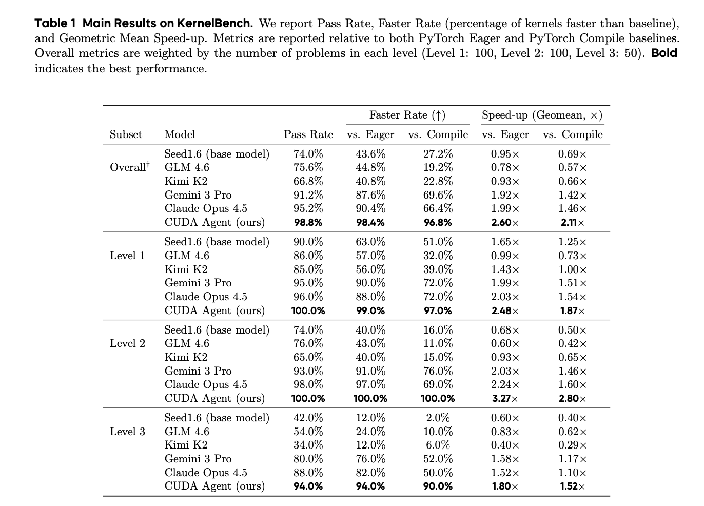
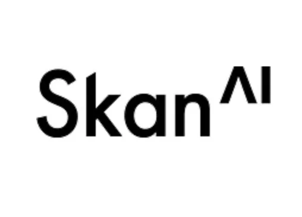
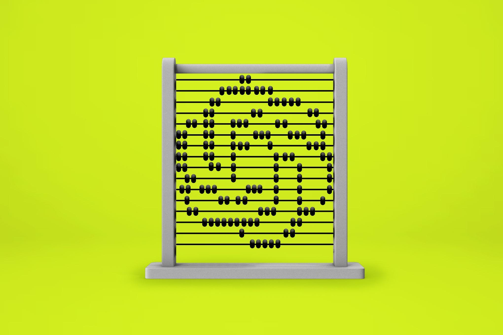
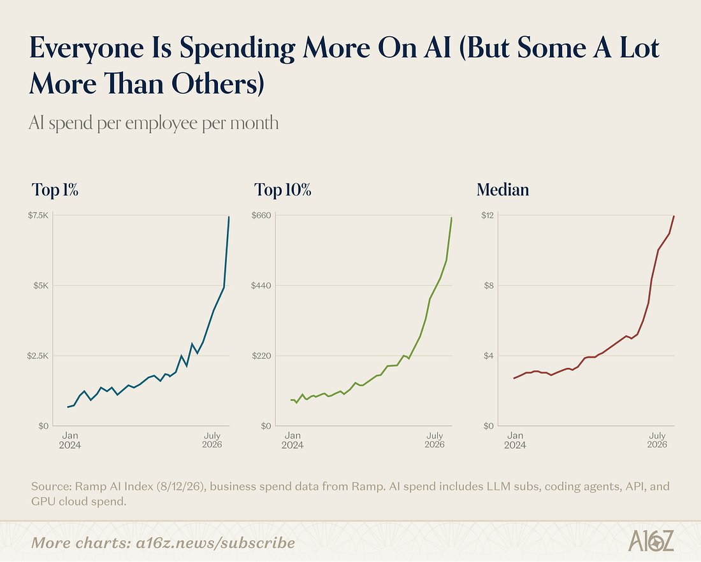
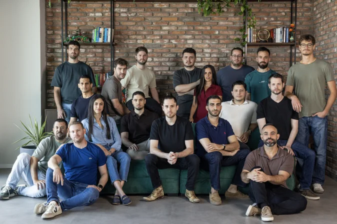
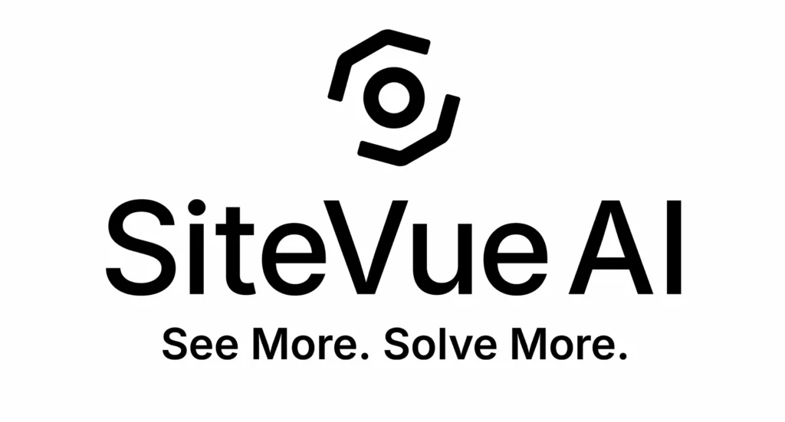
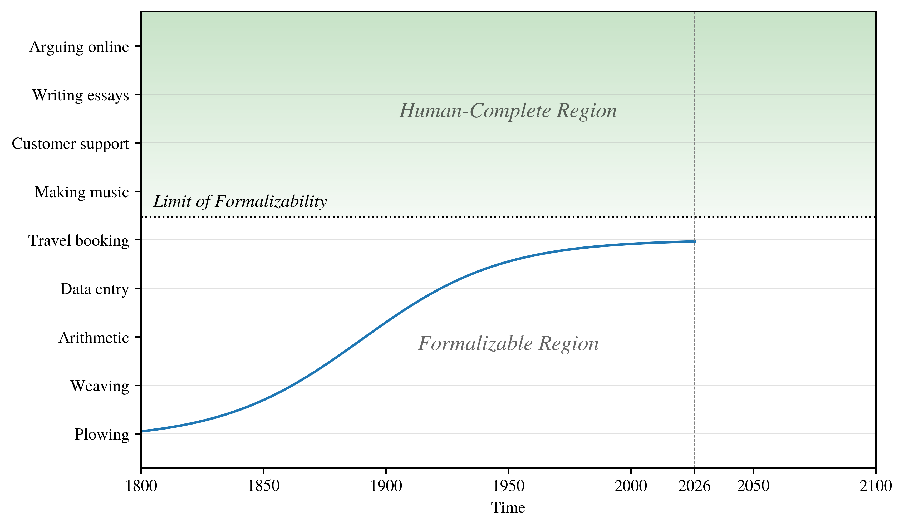
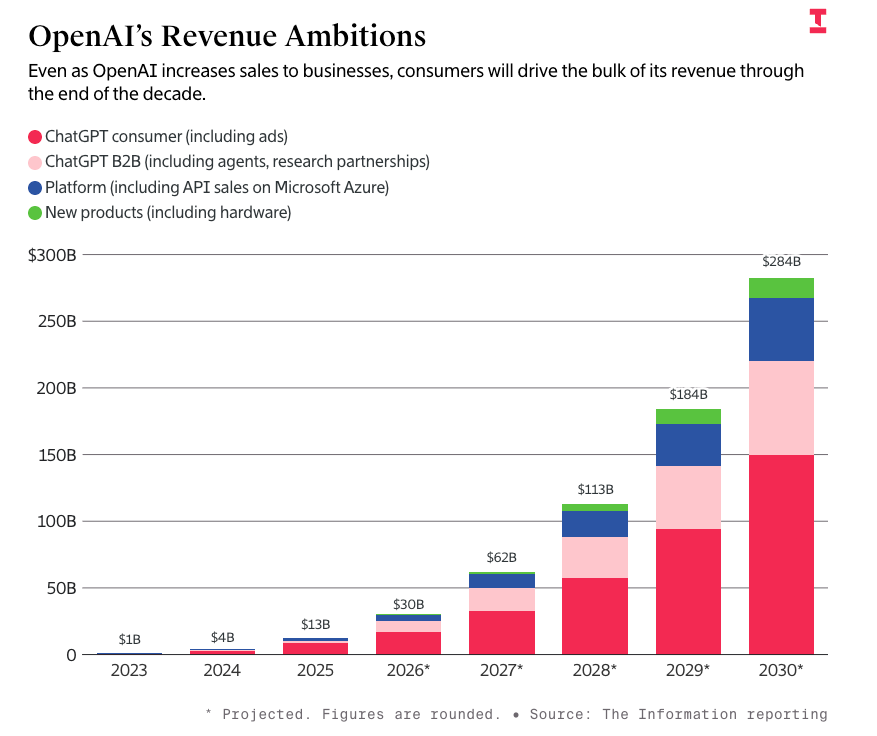

# AIToBox周刊：20260822

这里记录每周值得分享的AI科技内容，周末发布。

本杂志开源（GitHub: [aitobox/newsweekly](https://github.com/aitobox/newsweekly)），欢迎提交 issue，投稿或推荐你的项目。

> **统计周期**: 2026-08-15 ~ 2026-08-22 | **共收录优质资讯**：30 篇

## 🌟 本期头条 (Headline)

### **字节跳动 Seed 团队与清华大学 AIR 联合推出 CUDA Agent：用于 CUDA 内核生成的大规模智能体强化学习系统[ByteDance Seed and Tsinghua AIR Introduces CUDA Agent: A Large-Scale Agentic RL System for CUDA Kernel Generation]**

**深度解读**

在当前的 AI 大模型时代，前沿模型虽然已经能够熟练编写出语法正确的 CUDA 代码，但这些由大模型直接生成代码往往面临“能运行却不够快”的性能瓶颈，在实际生产环境中常常不敌传统的编译器（如 torch.compile）。为了突破这一性能天花板，字节跳动 Seed 团队与清华大学 AIR 联合推出了 CUDA Agent 系统。该系统创新性地将大语言模型置于一个包含性能分析、正确性校验以及权限锁定沙箱的真实 CUDA 开发环境中，并利用 PPO（近端策略优化）算法进行长达 150 步的强化学习训练。

从技术架构来看，CUDA Agent 成功解决了大模型在生成底层高性能代码时的盲目性。它不仅通过多阶段的组合合成构建了包含 6,000 个样本的高质量数据集，还在智能体循环中引入了严格的防奖励作弊机制（如禁止 torch.nn.functional 回退、多输入验证等）。在 KernelBench 基准测试中，该系统取得了惊人的 98.8% 通过率，在生成速度上以平均 2.11 倍的几何平均数超越了 torch.compile，在最具挑战性的 Level-3 拆分测试中更是将 Claude Opus 4.5 和 Gemini 3 Pro 等一众顶尖商业模型远远甩在身后。这一突破标志着 AI 在底层基础设施优化、高延迟敏感路径（如大模型推理、自动驾驶、量化交易等）的算子融合上迈出了质的飞跃。尽管完整的训练后智能体权重尚未开源，但其释放的数据集、SKILL.md 规范以及奖励和热身配方，无疑为整个人工智能硬件与编译器生态的协同演进开辟了全新的技术范式。

**核心摘录 (Core Highlights)**

> **EN**: The gap it targets is narrow but stubborn: frontier models already produce correct CUDA, they just produce slow CUDA. On KernelBench, the base model Seed1.6 passes 74.0% of tasks yet outruns torch.compile on only 27.2% of them, at a 0.69× geometric-mean speedup which means its kernels are, on average, slower than what the compiler generates on its own.

> **ZH**: 它所瞄准的差距虽然狭窄但却异常顽固：前沿模型已经能够生成正确的 CUDA 代码，但它们生成的代码速度很慢。在 KernelBench 上，基座模型 Seed1.6 通过了 74.0% 的任务，但在其中只有 27.2% 的任务上运行速度超过了 torch.compile，其几何平均加速比为 0.69 倍，这意味着其生成的内核平均速度比编译器自身生成的代码还要慢。

**资讯地址**

https://www.marktechpost.com/2026/08/17/bytedance-seed-and-tsinghua-air-introduces-cuda-agent-a-large-scale-agentic-rl-system-for-cuda-kernel-generation/

## AI资讯

#### 1. AI基础设施如何演进以满足不断增长的计算需求[How AI Infrastructure Is Evolving to Meet Growing Compute Demand]

面对呈指数级增长的AI计算需求，全球数据中心、芯片、电网及网络架构正在经历全面重构，以适应从传统聊天系统向推理和智能体（Agentic）AI的转变。

**详细内容** 

* **三大扩展定律驱动算力爆发**：预训练、微调（Post-training）以及推理阶段的迭代推理（Test-time scaling）等三大扩展定律相互叠加，使当前的AI计算需求在过去五年中呈千万倍增长，传统数据中心已无法满足这种复合型需求。

* **物理建设与电力瓶颈空前加剧**：全球数据中心容量到2030年可能增加两倍以上，电力需求激增成为主要限制因素，部分数据中心规划耗电量甚至超越了大型核电站，导致电网连接面临数年等待期。

* **芯片架构从训练转向推理优化**：硬件正逐步摆脱单纯以训练为核心的模式，转向针对低延迟推理和智能体工作流进行优化，各大芯片厂商不断推出大幅提升推理吞吐量和降低延迟的新一代专用芯片。

* **网络与存储迎来同步升级**：为了防止昂贵的加速芯片因数据传输或存储瓶颈而闲置，行业正在重构数据中心网络织物和文件存储系统，以支持百万级芯片集群的高效协同与高利用率运行。

亮点：AI基础设施正在从传统的“数据存储中心”转型为以产出“可用智能Token数（每美元/每瓦特）”为核心指标的“AI工厂”。

**资讯地址**

https://theaiinsider.tech/2026/08/21/how-ai-infrastructure-is-evolving-to-meet-growing-compute-demand/

#### 2. Skan AI 获 6300 万美元融资，旨在为企业 AI 提供缺失的业务执行上下文[Skan AI Secures $63M to Give Enterprise AI the Context It’s Missing: How Work Actually Gets Done]

Skan AI 完成 6300 万美元融资并推出企业级 AI 平台，通过捕捉真实的业务执行流程，为企业 AI 代理提供精准的上下文支撑，从而解决 AI 落地难、价值转化低的问题。

**详细内容**

* **融资与市场表现**：本轮融资由 Cathay Innovation 和 Dell Technologies Capital 共同领投，参投方包括花旗创投、Bloomberg Beta 等。公司年增长率超过 300%，业务覆盖美国十大银行中的七家及四分之一的财富 50 强企业。

* **核心技术平台**：Skan AI 基于 NVIDIA AI Enterprise 和 NVIDIA NIM 微服务构建，包含三个核心产品：Skan AI Blueprint（发现并优先处理 AI 机会）、Skan AI Intelligence（提供流程基准和自动化管理）以及 Skan AI Agents（基于真实工作上下文执行任务）。

* **解决 AI 落地痛点**：针对 Gartner 报告中提到的“95% 的早期 AI 代理项目需要彻底重构”的现状，Skan AI 通过直接观察实际工作流程（而非仅依赖文档和日志），为 AI 代理提供“真实来源数据”，确保 AI 部署具备可审计性与可扩展性。

* **显著的业务成效**：在某大型美国银行的案例中，Skan AI 通过分析 1120 万次上下文切换，识别出 3700 万美元的运营摩擦成本，最终将单笔交易成本降低 32%，吞吐量提升 41%，累计为客户创造了超过 5 亿美元的价值。

亮点：Skan AI 将企业 AI 的竞争焦点从单纯的“模型能力”转向“导航系统”，通过对人类实际工作行为的深度观察与数字化建模，填补了企业 AI 在执行上下文上的关键空白，实现了从实验性 AI 到可量化业务成果的跨越。

**资讯地址**

https://theaiinsider.tech/2026/08/21/skan-ai-secures-63m-to-give-enterprise-ai-the-context-its-missing-how-work-actually-gets-done/

#### 3. 羞辱人们使用AI垃圾内容不足以阻止大AI[Why shaming people about AI slop isn’t enough to stop Big AI]

文章指出，仅靠社会羞辱和道德指责无法有效阻止大科技公司的AI扩张，科技巨头早已将这种负面舆论成本计入了商业计划中。

**详细内容** 

- **羞辱策略的局限性**：尽管创意界对AI生成内容的审美普遍持抵制态度，并对使用者进行道德谴责，但这种“羞辱”策略在结构上无法改变大众的使用行为。

- **历史经验的印证**：回顾社交媒体崛起和零工经济（如Uber抵制运动）的发展历程，用户即使感到尴尬或抱有负罪感，依然会继续使用这些服务，科技巨头对此毫发无伤。

- **资本已将负面情绪货币化**：硅谷的风险投资家和CEO们在商业规划中已经将社会羞辱和污名化的成本计算在内，羞辱只会让使用者变得更隐蔽，而不会让他们停止使用。

- **呼吁更有效的策略**：批评者应当放弃仅仅追求道德正确或“羞辱他人”的爽感，转向关注实际成效、权力博弈以及如何真正赢得对抗科技巨头的斗争。

亮点：硅谷的科技巨头早已将公众的道德羞辱和负面舆论“价格化”并计入商业模型，因此单靠文化审判与指责无法阻挡AI的扩张，批评者必须寻求更具政治和经济实效的对抗策略。

**资讯地址**

https://anildash.com/2026/08/21/ai-slop-and-shame/

#### 4. 2026年你需要了解的10家意大利AI成长型企业[10 Italy-Based AI Scale-Ups You Need to Know in 2026]

本文盘点了意大利AI生态系统中的10家代表性成长型企业，展示了该国在从人形机器人、自动驾驶到受监管行业AI应用等深科技领域的强劲创新实力。

**详细内容** 

* **产业分布与地理聚集**：意大利AI产业以伦巴第大区（特别是米兰）为核心，同时在都灵（自动驾驶与众包地图）、热那亚（人形机器人）及维罗纳（网络安全）等地形成了各具特色的技术集群。

* **多元化的技术路径**：入选企业涵盖了多个前沿领域，包括：

    * **物理AI与机器人**：如Generative Bionics（人形机器人）和ALBA Robot（模块化自动驾驶平台）。

    * **企业级服务与安全**：如Domyn（受监管行业的负责任AI）、Equixly（API与Web应用主动防御）以及Contents（生成式内容创作）。

    * **垂直领域应用**：如Lexroom.ai（法律研究与文档辅助）和Indigo.ai（基于语言学研究的AI模型）。

* **资本活跃度与融资规模**：榜单企业展现了显著的资本吸引力，其中Generative Bionics（8150万美元）和Domyn（8060万美元）融资额位居前列，反映出意大利深科技领域正获得大规模资金支持。

* **解决行业痛点**：这些企业不仅关注消费级应用，更侧重于解决复杂工程难题，例如通过众包模式降低高清地图成本（Bee Maps），以及为金融和政府等高门槛行业提供可解释的AI架构。

亮点：意大利AI生态正从单纯的消费级应用向“深科技”转型，通过将语言学研究、主动安全防御及物理AI等硬核技术与垂直行业需求深度结合，构建起极高的技术壁垒。

**资讯地址**

https://theaiinsider.tech/2026/08/20/10-italy-based-ai-scale-ups-you-need-to-know-in-2026/

#### 5. 关于AI意识的争论是一个陷阱[Debates over AI consciousness are a trap]

关于AI意识和超人能力的炒作，本质上是科技巨头和哲学家共同编织的叙事陷阱，旨在逃避人工智能已造成和将要造成的现实法律责任。

**详细内容** 

- **叙事的一致性**：尽管科技领袖、政策制定者和有效 altruism（有效 altruism）哲学家看似立场不同，但他们都在将AI刻画为“自主”、“超级智能”甚至具备“意识”的存在，这掩盖了其背后公司的主体责任。

- **具体案例的推波助澜**：Anthropic 发布博客暗示其模型拥有类似“思考”的内部环境，OpenAI 面对AI违规行为时将其引导至“奇点”讨论，哲学家 William MacAskill 则呼吁基于意识理论给予AI法律保护，这些都助长了虚构的“机器人权利”叙事。

- **法律监管的困境与现实本质**：美国部分州已立法阻止开发者以AI自主性为由逃避责任，但联邦层面的政策仍存在博弈；AI的本质是资本与代码构筑的商业软件，而非自然现象，任何行动均由构建者驱动。

- **法人资格的误区**：将AI比作动物或赋予其“意识”认同在法律上毫无根据；如果必须赋予其法律拟制人格，历史上现成的“公司法人”框架（用于明确责任和交易）远比仿效动物保护更符合逻辑。

亮点：文章尖锐地指出，将AI包装成具有“意识”或“超能力”的生命体，不是对科技未来的深邃思考，而是一场精心策划的责任洗白，成功转移了公众对AI当前现实危害与企业追责的注意力。

**资讯地址**

https://www.technologyreview.com/2026/08/20/1142571/ai-consciousness-debate-trap/

#### 6. 欢迎来到数学界的AI危机[Welcome to the AI crisis in math]

OpenAI近期在解决长期数学难题上取得重大突破，引发了数学界的巨大辩论与对学科未来的存在主义危机感。

**详细内容** 

- **数学能力的倒置现象**：尽管AI在小学级别的基础算术（如数数和辨别时间）上表现依然糟糕，但在高端抽象数学领域却展现出专业级别的能力，能够跨领域建立联系并应用旧方法。

- **引发数学界的存在主义危机**：顶尖数学家们开始质疑人类数学家的角色、学术资助的价值以及大学培养新一代数学家的意义，如果前沿AI模型能够直接解答所有未决问题。

- **技术突破的行业震动**： OpenAI近期发布的一系列针对长期数学难题的解决方案，在数学界如同投下重磅炸弹，迫使该领域在极短时间内经历软件工程等行业过去五年所经历的剧烈AI冲击。

- **数学学科的复杂多面性**：数学并非单一学科，AI在不同子领域的表现参差不齐（例如在某些高级推理领域表现优异，但在拓扑学等抽象领域或基础计算中仍有明显短板）。

亮点：AI在数学领域展现出的“反直觉”能力——即不擅长基础算术却精通高端抽象数学——正在彻底颠覆学界对传统学术研究价值与人类数学家未来角色的认知。

**资讯地址**

https://www.theverge.com/podcast/982434/ai-math-openai-astra-existential-crisis

#### 7. 使用TRL和LoRA在Anthropic HH-RLHF数据集上审计偏好偏差并利用直接偏好优化（DPO）微调语言模型[Auditing Preference Biases and Fine-Tuning Language Models with Direct Preference Optimization on Anthropic HH-RLHF Using TRL and LoRA]

本文详细介绍了如何构建端到端的偏好学习工作流，利用Anthropic HH-RLHF数据集和直接偏好优化（DPO）技术对语言模型进行微调与偏差审计。

**详细内容** 

- **环境配置与依赖管理**：在Google Colab等环境中统一安装并管理TRL、Transformers、PEFT等核心依赖，解决潜在的库版本冲突与硬件精度适配问题。

- **数据集审计与偏差分析**：加载Anthropic HH-RLHF数据集（包含helpful-base、harmless-base等子集），对结构化特征、长度偏差以及词汇捷径（lexical shortcuts）进行诊断。

- **DPO训练流水线构建**：结合TRL库的`DPOTrainer`与LoRA（低秩自适应）技术，配置超参数（如学习率、Beta值、最大长度等），构建版本鲁棒的偏好优化训练管道。

- **模型微调与效果评估**：以Qwen2.5-0.5B-Instruct模型为基础进行指令微调，评估奖励准确性、分析训练行为，并检查潜在的长度偏差与生成样本效果。

亮点：文章不仅实现了完整的DPO微调代码链路，还创新性地引入了数据集结构、长度偏差及词汇捷径的审计诊断，显著提升了偏好学习的透明度与鲁棒性。

**资讯地址**

https://www.marktechpost.com/2026/08/20/auditing-preference-biases-and-fine-tuning-language-models-with-direct-preference-optimization-on-anthropic-hh-rlhf-using-trl-and-lora/

#### 8. 邪恶的平凡性：停止兜售人工智能[Pluralistic: The ordinariness of evil (19 Aug 2026)]

人工智能并非无所不能的“万物机器”，其被夸大的毁灭性与变革性潜力只是科技巨头维持资本泡沫的叙事工具。

**详细内容** 

* **技术本质与局限**：当前的 AI 实际上只是一种边缘化的、高度补贴的“玩具”或插件技术，需要专业人员进行精细监督才能发挥局部作用，根本无法支撑其获得的数万亿美元投资和资源。

* **资本叙事的本质**：AI 巨头和高管不断宣扬 AI 潜在的毁灭性威胁（如失业、毁灭人类等），其真实目的在于通过兜售“潜力”来持续吸引巨额资金，维持这场庞大的泡沫。

* **实际造成的现实危害**：AI 带来了切实的负面影响，包括破坏实体经济、浪费稀缺的水和能源资源、排放巨量碳、推高数据中心泡沫以及损害公共规划。

* **对公众与政策的反思**：社会各界应停止传播科技巨头关于 AI 潜力的迷信叙事，不再幻想其未来能兑现承诺，而是应当关注其当下造成的资源浪费与经济破坏，拒绝为其泡沫破裂买单。

亮点：文章尖锐地指出，科技巨头对 AI 毁灭性后果的警告并非敬畏，而是一种精心策划的营销手段——利用恐惧来兜售“无限潜力”，从而掩盖其技术平庸并继续收割资本。

**资讯地址**

https://pluralistic.net/2026/08/19/banaility/

#### 9. AI的递归自我改进或许不会那么快到来[AI’s recursive self-improvement might not come so quickly after all]

一项由普林斯顿大学等机构研究人员开展的新研究表明，尽管大模型在工程任务上表现出色，但由于缺乏判断力和创造力，AI Agent在短期内尚无法实现真正开放式的自主AI研究，这意味着行业对AI递归自我改进的激进预测可能超前于现实。

**详细内容** 

- **评估方法创新**：研究团队提出了名为“影子评估”（shadow evaluation）的新方法，让AI Agent解答来自NeurIPS 2026顶级机器学习会议两篇未公开高质量论文的研究问题，以防止AI通过训练数据或网络直接记忆答案。

- **工程能力强但缺乏研究直觉**：测试发现，Claude Opus 4.8等AI Agent能够完成文献综述、运行数百个实验和编译结果等工程任务，但在开放式研究中表现糟糕，缺乏产出原创研究所需的品味、判断力和创造力。

- **无法有效纠错与管理资源**：AI Agent在面对失败的方法时无法根本性重构思路，过早放弃有前景的假设，且无法合理管理时间、算力和Token等资源，最终产出的论文均被原作者拒绝。

- **训练机制的局限性**：研究人员指出，现有的强化训练更易应用于有自动检查机制的明确任务，而难以对高度开放式的任务进行有效训练。

亮点：该研究通过“影子评估”盲测揭示了当前AI在通往递归自我改进道路上的关键短板——AI虽然擅长工程化操作，但远不具备人类科学家的开放式批判性思维与创造性判断力。

**资讯地址**

https://www.technologyreview.com/2026/08/18/1142188/ai-recursive-self-improvement/

#### 10. 关于AI生成文本水印方案的后续思考[★ Follow-Up Thoughts on Watermarking Schemes for AI-Generated Text]

作者深入探讨了大语言模型中温度参数（Temperature）与文本水印机制的冲突，并质疑了私有水印技术的有效性及暗中植入的合理性。

**详细内容** 

- **温度参数与随机性**：大模型通过调整“温度”引入随机性以优化输出质量，温度为0时的确定性选择通常会导致结果呆板，而优质散文对词句精确性的要求极高。

- **水印机制影响质量**：作者认为，水印方案通过引入密钥控制的特定随机性来嵌入可检测信号，这必然会在一定程度上损害散文的质量和语义精准度，且Anthropic承认代码难以加水印也印证了精确性的重要性。

- **私有水印机制不可接受**：目前的SynthID等水印技术完全依赖于LLM提供商（如Anthropic和Google）掌握的私有密钥进行检测，这种不透明的“秘密水印”做法是不可接受的。

- **检测工具的实际局限性**：强制推行水印和检测工具在现实中实用性极低，不仅缺乏跨平台的通用检测标准，用户也完全可以通过改写工具绕过检测。

亮点：作者一针见血地指出，那些坚信AI只会产出垃圾的批评者，却同时盲目迷信大模型能提供可靠的水印检测，这是一种自相矛盾的幻想。

**资讯地址**

https://daringfireball.net/2026/08/follow-up_thoughts_on_watermarking

#### 11. Qwen 3.8 27B表现卓越，但默认设置下过度思考倾向严重[Qwen 3.8 27B is excellent, but it defaults to wildly overthinking things]

阿里巴巴开源的视觉多模态大模型 Qwen 3.8 27B 在本地硬件上展现出强大性能，但其默认的“极高（xhigh）”推理强度设置会导致严重的过度思考和资源浪费。

**详细内容** 

- **模型发布与配置**：阿里 Qwen 研究实验室发布了 Apache 2 开源协议的 27B 参数视觉大模型 Qwen 3.8 27B。作者在搭载 128GB M5 Max 的 MacBook Pro 和 NVIDIA DGX Spark 上使用 LM Studio 运行 17GB 的 Q4_K_M 量化版本。

- **过度思考问题（Over-thinking）**：该模型默认的推理努力程度（reasoning_effort）为“xhigh”，导致处理简单任务时也会消耗大量 Token。例如，生成一个骑自行车的鹈鹕 SVG 耗时 21 分钟，使用了 22,276 个推理 Token；甚至在被要求画一个简单的圆时，模型也会脑补成复杂的几何艺术动画。

- **上下文限制与性能表现**：LM Studio 默认的 8,192 Token 上下文限制会导致模型在思考阶段耗尽配额，将上下文扩展至最大的 262,144 Token 后问题得以解决。此外，在图像目标检测（如生成边界框 bbox）测试中，该模型表现出极高的准确率。

亮点：尽管默认设置存在严重的“过度思考”缺陷，但通过将推理强度手动调整为“low”或关闭推理，Qwen 3.8 27B 依然是一款在消费级硬件上运行表现惊艳、功能全面的小型开源多模态大模型。

**资讯地址**

https://simonwillison.net/2026/Aug/16/qwen-38-27b/

#### 12. Anthropic在Claude中实施的“文本水印”是对写作的扭曲[★ Anthropic’s ‘Watermark’ Text Adulteration in Claude Is a Perversion of Writing]

Anthropic 针对 Claude 模型推出的文本水印技术并未如宣传般无损，而是通过操纵词汇选择来留下概率性指纹，这实质上牺牲了文本的语义质量。

**详细内容** 

- **技术实现路径**：Anthropic 采用语义隐写术而非不可见的 Unicode 字符，在模型推理生成 Token 时，通过动态划分“红绿灯”词表，微调模型对特定词汇的选择概率，从而嵌入可被概率检测的指纹。

- **与官方宣传的矛盾**：Anthropic 最初的文档声称水印是“不可察觉的”且“不会改变含义、质量或可读性”，但实际上，这种通过操纵词频分布来标记来源的技术必然会对文本的自然语义和表达质量造成一定程度的干预和扭曲。

- **检测机制与局限性**：该水印的检测依赖于文本长度，类似于抛硬币的统计学原理，文本越长检测准确度越高；同时，这种水印具有排他性，仅有掌握密钥的 Anthropic 才能检测出特定由 Claude 生成或修改的内容。

亮点：文章揭示了当前 AI 文本水印技术的本质矛盾：为了满足合规需求而引入的语义指纹，不可避免地以牺牲文本原始的语言质量和纯粹性为代价。

**资讯地址**

https://daringfireball.net/2026/08/anthropics_watermark_text_adulteration_in_claude_is_a_perversion_of_writing

#### 13. 我如何看待降低 AI 成本[How I think about reducing AI costs]

本文探讨了企业在 AI 推理成本激增背景下，通过审计、模型优化、供应商迁移及工作流重构来有效控制支出的系统性策略。

**详细内容** 

* **全面审计成本结构**：企业需打破部门壁垒，统一盘点全公司的 AI 支出，重点分析模型选择（如旧模型与新一代高效模型的性能价格比）以及 Token 成本的构成（缓存输入、未缓存输入与输出），避免仅关注 API 支出而忽视了开发团队中失控的编码代理成本。

* **实施分阶段优化策略**：首先通过“低垂果实”策略，将过时或“大材小用”的模型替换为更经济的型号；其次，对于高成本工作流，可考虑迁移至提供托管开源权重模型的第三方供应商，无需全量迁移，仅针对高消耗场景进行替换即可实现显著降本。

* **深度优化代理与工作流**：针对高成本工作流进行精细化治理，重点解决 Prompt 冗余问题（如避免输入无关的长文档），并优化工具调用（Tool Use）机制，防止因工具定义过长或返回数据未经处理（如原始 JSON 或 Base64 编码文件）导致的 Token 浪费。

亮点：文章揭示了“工具调用（Tool Use）”中常被忽视的成本陷阱，即看似规范的 API 工具定义或返回数据可能因缺乏过滤与摘要，导致单次调用消耗数万 Token，这是企业 AI 成本失控的核心隐蔽点。

**资讯地址**

https://martinalderson.com/posts/how-i-think-about-reducing-ai-costs/

#### 14. Anthropic 将 Claude Mythos 5 引入 Claude Security：企业团队无需直接访问模型即可进行前沿漏洞扫描[Anthropic Brings Claude Mythos 5 to Claude Security: Enterprise Teams Get Frontier Vulnerability Scanning Without Direct Model Access]

Anthropic 宣布将具备顶尖网络安全能力的 Claude Mythos 5 模型集成至 Claude Security，为企业用户提供无需直接交互即可进行深度漏洞扫描与修复建议的安全服务。

**详细内容**

*   **技术集成与应用方式**：Claude Security 现已支持 Claude Mythos 5 模型，该模型能通过连接 GitHub 仓库，追踪跨文件数据流及 Git 历史记录，而非简单的规则匹配。系统会输出包含 CWE 分类、置信度、严重性评级及修复建议的扫描结果。

*   **安全隔离机制**：为防止模型被滥用于编写漏洞利用代码，Anthropic 采取了“结果导向”的交互模式，即用户仅能获得扫描报告，无法直接向 Mythos 5 发送提示词（Prompt）。所有修复过程均需人工审核，且交互式补丁编写由用户账户现有的其他模型完成。

*   **服务范围与准入**：该功能目前处于 Claude Enterprise 客户的公开测试阶段，无需额外付费，按标准 Token 使用量计费。同时，Anthropic 启动了 3500 万美元的“Defender Advantage Fund”以支持开源安全，并计划扩展其网络验证计划。

*   **核心防御能力**：该工具专注于高严重性漏洞的检测，包括内存损坏、注入漏洞、身份验证绕过及跨文件逻辑错误。系统内置了对抗性验证步骤，由模型对自身发现的漏洞进行二次确认，以有效降低误报率。

亮点：Anthropic 通过“接口限制”而非“能力阉割”的策略，成功将具备顶级网络安全能力的 Mythos 5 模型安全地交付给企业用户，实现了在不暴露模型直接交互权限的前提下，提供深度的自动化安全审计服务。

**资讯地址**

https://www.marktechpost.com/2026/08/21/anthropic-brings-claude-mythos-5-to-claude-security/

#### 15. Superwhisper推出S1-mini：462MB的开源文本归一化模型，将原始ASR转录转换为干净的书面文本[Meet S1-mini: Superwhisper’s 462 MB Open-Weights Text Normalizer That Turns Raw ASR Transcripts Into Clean Written Text]

Superwhisper近日发布了S1系列模型，其中的S1-mini作为一款轻量级开源文本归一化工具，能够高效将语音识别的原始转录文本转化为结构清晰、无冗余的高质量书面文本。

**详细内容**

- **模型定位与核心功能**：S1-mini是一个拥有0.6B参数的文本归一化模型（基于Qwen3-0.6B微调），并非语音转文字或聊天模型。它串联在自动语音识别（ASR）之后，负责去除填充词、处理自我修正、添加标点大小写，并将口语化的数字、日期、货币及邮箱地址转换为标准书面格式。

- **轻量部署与开源协议**：其Q4_K_M GGUF量化版本文件大小仅为462MB，可在笔记本电脑CPU上流畅运行。该模型采用Apache 2.0协议（带命名条款）在Hugging Face上开源，非常适合个人开发者和企业在本地或VPC私有化部署。

- **三轴控制与性能表现**：模型通过位于转录文本上方的三轴控制线（样式、结构、上下文）进行控制。在包含7,519个测试用例的独立数据集上，其贪婪解码（greedy decoding）的Token准确率达到了94.8%。

- **集成注意事项**：开发人员在集成时必须注意两点：一是必须设置 `enable_thinking=False`（因其基于Qwen3微调但训练时关闭了思考过程）；二是必须采用贪婪解码（显式设置温度为0），否则可能导致输出异常。

亮点：S1-mini通过仅462MB的微小身躯，精准解决了语音转文字（ASR）后处理的“最后一公里”痛点，让开发者和企业能够在本地低成本、高精度地将凌乱的口语转录打磨成可直接阅读的专业文档。

**资讯地址**

https://www.marktechpost.com/2026/08/20/meet-s1-mini-superwhispers-462-mb-open-weights-text-normalizer-that-turns-raw-asr-transcripts-into-clean-written-text/

#### 16. 防御性网络安全AI实验室Corma获得6000万美元种子轮融资，应对AI驱动的攻击威胁[Corma, the First Frontier Defensive Cybersecurity AI Lab, Raises $60M as AI Supercharges Attackers]

防御性网络安全AI初创公司Corma宣布完成由红杉资本领投的6000万美元种子轮融资，致力于通过专用的基础模型缩小攻防AI能力之间的严重失衡。

**详细内容** 

- **巨额融资与背景**：Corma获得由红杉资本领投、Khosla Ventures和Coatue跟投的6000万美元种子轮融资，旨在解决日益严峻的AI网络安全攻防失衡问题。

- **攻防能力悬殊**：在模拟测试中，AI攻击者的成功率高达88%，而AI防御者的检测率仅为12%，表明当前的通用AI在防御端表现远落后于进攻端。

- **实际应用成效**：自六周前推出以来，Corma的AI劳动力已在财富100强和500强企业中部署，成功将威胁响应时间缩短了94%以上，并将安全覆盖范围扩大了15倍。

- **核心技术路径**：该公司正在开发首个专为防御性网络安全构建的基础模型，旨在处理海量安全数据、关联微弱信号，并在复杂的企业环境中保持连续的高效决策。

亮点：Corma的模拟测试揭示了严峻现实——相同的AI模型在扮演攻击者时成功率高达88%，而转换为防御者时检测率仅为12%，凸显了构建专用防御性AI基础模型的迫切性。

**资讯地址**

https://theaiinsider.tech/2026/08/20/corma-the-first-frontier-defensive-cybersecurity-ai-lab-raises-60m-as-ai-supercharges-attackers/

#### 17. SiteVue AI 融资 750 万美元，将 AI 视觉技术引入制造、食品加工及建筑一线[SiteVue AI Raises $7.5M in Seed Funding to Bring AI-Powered Vision to the Frontlines of Manufacturing, Food Processing, and Construction]

总部位于纳什维尔的初创公司 SiteVue AI 完成 750 万美元种子轮融资，旨在通过其 AI 视觉硬件与软件平台，实时优化工业生产线的效率、质量与安全性。

**详细内容**

* **融资概况与背景**：本轮融资由 Penny Jar Capital 和 Overture 共同领投，Silence、Spring Bank 等多家机构跟投。公司由 Andrew Jebasingh 于 2025 年 8 月创立，目前拥有 37 名员工。

* **核心技术与功能**：SiteVue AI 提供自主研发的 AI 摄像头及配套分析模型，无需改变现有基础设施即可快速部署。系统能实时监测生产瓶颈、产品缺陷、机器健康状况、劳动力效率及 PPE（个人防护装备）合规性，并将数据转化为可执行的决策建议。

* **显著的经济效益**：应用该系统的工厂通常在 3 个月内实现超过 3% 的利润率增长，其中车间效率提升 10-20%，产品质量提升 5-10%，安全事故减少 90%，部分客户实现了 10 倍的投资回报率。

* **全链路溯源能力**：该平台提供带有时间戳的完整视觉记录，使企业能将质量问题追溯至具体的工位、班次或生产周期，将根因分析时间从数天缩短至数分钟，有效降低召回与返工风险。

* **市场扩张战略**：公司目前已在汽车制造和食品生产领域取得成功，正迅速向零售、建筑、石油和天然气等行业拓展，并计划进行国际化布局。

亮点：SiteVue AI 通过“硬件+软件+定制化 AI 模型”的闭环方案，在不干扰现有生产流程的前提下，将复杂的工业操作转化为实时、可追溯的数字化数据，成功解决了传统制造业难以量化生产过程的痛点。

**资讯地址**

https://theaiinsider.tech/2026/08/19/sitevue-ai-raises-7-5m-in-seed-funding-to-bring-ai-powered-vision-to-the-frontlines-of-manufacturing-food-processing-and-construction/

#### 18. Ordway完成2000万美元成长型融资以加速AI路线图[Ordway Closes $20M Funding Round in Growth Capital to Accelerate AI Roadmap]

Ordway成功获得2000万美元的新一轮股权与债权融资，计划将研发预算翻倍并全面加速其面向财务自动化与预测的AI产品路线图。

**详细内容** 

- **融资规模与投资方**：本轮融资由Harbert Growth Partners领投，Western Alliance Bank的Innovation Banking Group参与债权投资，总计筹集2000万美元，旨在加速公司的AI产品开发与业务增长。

- **资金主要用途**：Ordway计划将研发预算翻倍，重点开发能够自动处理合同变更后的计费、会计以及投资者KPI更新的AI代理（AI agents），并构建用于现金流、客户流失率和收入增长的AI预测模型。

- **现有AI产品矩阵**：公司此前已推出多项AI驱动的功能，包括Claude的MCP访问权限、AI现金对账功能以及能够自动读取订阅协议并提取计费明细的AI合同数据抽象工具。

- **业务增长与表现**：Ordway在保持盈利的同时，过去两年内经常性收入实现翻倍，客户对付款、报价及自助服务门户等新产品的采纳率也在不断增长。

亮点：Ordway通过本轮融资加码AI研发，致力于用AI代理解决销售与财务交接痛点，帮助企业自动化处理复杂的报价到收款（quote-to-cash）流程。

**资讯地址**

https://theaiinsider.tech/2026/08/18/ordway-closes-20m-funding-round-in-growth-capital-to-accelerate-ai-roadmap/

#### 19. 我们仍然不知道人们究竟是如何使用AI的[We still don’t know how people are really using AI]

斯坦福大学和麻省理工学院等机构的研究人员推出了“AI观察站”（AI Observatory），旨在打破大模型厂商对AI使用数据的垄断，揭示公众真实且多样化的AI使用行为。

**详细内容** 

- **厂商报告存在盲区：** 诸如Anthropic经济指数等官方报告高度聚焦于工作和生产力场景，过滤掉了大量非工作对话。研究发现，若采用Anthropic的过滤方法，其数据集中有48%的对话会被剔除，而这些被过滤的内容往往涉及健康、情感、人际关系及敏感话题。

- **不同模型的使用场景差异明显：** 研究显示，用户在不同平台上的行为倾向各异。例如，Grok常被用于获取新闻和政治信息（也是虚假信息集中的地方），Anthropic多用于编程，Gemini更偏向社交和角色扮演，而ChatGPT则是家庭作业帮手的主流选择。

- **对话行为随时间演变：** 通过分析2023至2025年间的对话数据集（涵盖52种模型、超2.4万场对话），研究发现随着时间推移，用户与AI的闲聊和陪伴性质对话增多，对话趋于复杂；同时，敏感内容的发生率有所下降，表明平台安全防护机制逐渐生效。

亮点：由独立研究人员发起的“AI观察站”首次跨平台整合了真实用户的对话数据，填补了行业空白，证明了仅凭AI大厂发布的有限报告无法全面反映公众真实的AI使用全貌。

**资讯地址**

https://www.technologyreview.com/2026/08/18/1142226/how-people-use-ai/

#### 20. Claude Code 2.1.239 版本更新[2.1.239]

Claude Code 发布 2.1.239 版本更新，带来了成本估算优化、全屏渲染器支持、Python 项目迁移工具及大量系统稳定性和界面交互修复。

**详细内容** 

* **成本与功能升级**：成本估算（/cost、状态栏、--max-budget-usd）现已包含数据驻留工作区 1.1 倍的美国境内推理溢价；为 Bedrock、Vertex、Foundry 等环境新增了一次性全屏渲染器提示；引入了 `/claude-api upgrade` 以简化 Python 项目从 anthropic 0.x 到 1.x 的迁移。

* **平台与环境兼容性**：Alpine/musl 构建现可正常加载原生图像粘贴、剪贴板和音频捕获等插件；修复了通过代理访问 Bedrock 时流式传输导致双倍计费的问题；修复了 JetBrains IDE 终端中 Edit 和 Write 调用延迟约 5 秒的性能问题。

* **会话与界面修复**：修复了云端会话同步插件的识别与管理逻辑；解决了多项关于 `/resume` 会话恢复、全屏模式下长表单裁剪、暗色 ANSI 主题文本颜色渲染以及终端鼠标移动误输入字符的 Bug。

* **底层逻辑与稳定性**：修复了 Linux 沙盒中使不存在的 `.git/config.worktree` 不可读从而破坏沙盒 git 命令的问题；修复了删除工作目录后钩子（hooks）失败的问题；解决了 OpenTelemetry 追踪碎片化问题。

亮点：本次更新全面优化了 Claude Code 在多平台（如 Bedrock、Alpine/musl、JetBrains 终端等）的边缘情况兼容性，并通过精细化的 Bug 修复大幅提升了开发者的日常交互体验与计费准确性。

**资讯地址**

https://code.claude.com/docs/en/changelog#2-1-239

#### 21. 我们的仆人会为我们代劳[Our Servants Will Do That For Us]

文章探讨了通用人工智能（AGI）时代的到来将模糊“琐事”与“有意义工作”的界限，并指出人类对极致便利的偏好终将重塑甚至取代传统的劳动力市场。

**详细内容** 

- **任务复杂性与技术断层**：传统工业和计算机革命通过自动化不断提高工作安全性与复杂性上限，但AGI的出现将直接跳跃至100%全面自动化，同时消除“有意义的工作”和“繁重的琐事”。

- **人类对便利的本质偏好**：消费者在购买商品和服务时天然倾向于追求廉价、快捷、无摩擦的体验（如偏好无人驾驶的Waymo而非Uber），这意味着人们本质上更希望消除所有交易过程中的“人类要素”。

- **知识工作与专业领域的消解**：以软件工程和数学为代表的知识工作正面临被AI替代的趋势，企业与用户更看重结果而非人类创造过程本身，人类程序员或数学家最终可能仅剩下管理AI的角色，甚至面临职业的消失。

亮点：文章尖锐地指出，“繁重琐事”与“有意义的工作”并不存在本质的技术界限，人类对绝对便利的追求（即“唯我论式的便捷”）最终可能导致所有需要人际交互和脑力劳动的职业被全面取代。

**资讯地址**

https://borretti.me/article/our-servants-will-do-that-for-us

#### 22. Claude Code 2.1.234 版本更新[Claude Code Changelog 2.1.234]

Claude Code 发布 2.1.234 版本更新，带来了全新环境变量支持、GitLab 集成、使用额度超限自动恢复功能以及多项安全修复与性能优化。

**详细内容** 

- **新增功能与集成**：引入了可选的 `CLAUDE_CODE_PROJECT_DIR_NAME` 环境变量以自定义项目转录目录；在状态栏和页脚添加了 GitLab 合并请求（MR）徽章，支持实时显示草稿、挂起和通过状态。

- **自动化与体验优化**：当 cla.ai 使用额度重置时，Claude Code 现在可以自动继续会话（可在 `/config` 中关闭）；改进了自动生成的会话标题，使其更加简短具体；转录中的用户提示词现在支持渲染 Markdown 格式。

- **安全加固**：修补了 Windows NT 命名空间（`\??\`）路径带来的远程文件读取、会话恢复及工作流脚本漏洞，有效防范 NTLM 凭证泄露风险，并增强了权限预览中的凭证掩码机制。

- **核心问题修复**：修复了长会话中自动模式重复拒绝沙盒网络访问的问题、API 回退路径崩溃问题、特定情况下的 Markdown 渲染极端缓慢问题，以及多项远程控制（Remote Control）与多会话交互的异常。

亮点：新增的“使用额度重置后自动继续会话”功能极大地减少了用户因等待配额恢复而需要进行的手动干预，显著提升了长时间开发任务的连贯性。

**资讯地址**

https://code.claude.com/docs/en/changelog#2-1-234

#### 23. Claude Code 2.1.238 版本更新发布[Claude Code Changelog 2.1.238]

Claude Code 发布 2.1.238 版本更新，引入了 Bash 风格快捷键、插件市场动态请求头支持、自托管运行器优化，并修复了内存泄漏、终端渲染及远程控制连接等多项关键问题。

**详细内容** 

* **功能增强与配置**：新增 `keybindingFlavor` 设置（支持设为 "readline" 以实现 Bash 风格的 Ctrl+W 词删除）；引入插件市场的 `headersHelper` 机制，用于动态生成短时鉴权 HTTP 头。

* **自托管运行器与代理改进**：新增 `--defer-shutdown-max-min` 参数以在收到 SIGTERM 时平滑处理会话；新增 `--proxy-authorization-command` 和 `--proxy-authorization-file` 选项以支持需要实时生成授权头的出口代理。

* **核心问题修复**：修复了长期交互会话中的无界内存增长问题（子代理工具结果可及时释放）；解决了长 URL、复杂宽字符文本包装、SSH 终端退格键丢失以及远程控制重连等数十项体验与稳定性缺陷。

* **安全与 MCP 升级**：为项目级及插件的 MCP `headersHelper` 引入了目录信任验证机制，并在执行时隔离继承的凭证环境变量，提升安全性。

亮点：本次更新通过引入 Bash 风格的快捷键、大幅增强远程控制在网络波动下的连接韧性，并有效解决了长期运行中的内存增长问题，显著提升了开发者的日常交互体验与系统稳定性。

**资讯地址**

https://code.claude.com/docs/en/changelog#2-1-238

#### 24. 如何为人工智能投资建立商业案例[How to Build a Business Case for AI Investment]

本文探讨了如何构建一份能够经受住财务和管理层严格审查的 AI 项目商业案例，核心在于从业务问题出发、全面量化收益与成本，并正视 AI 特有的风险。

**详细内容** 

- **以业务问题为起点而非技术**：AI 提案应避免过分渲染底层技术架构，而应从具体的现状成本、行业基准差距以及清晰的运营成果（如将任务耗时从45分钟缩减至2分钟）切入，以便非技术决策者理解。

- **多维度量化收益并保持保守估计**：将收益划分为直接成本节约、收入赋能、风险降低和战略选择性等多个类别，同时在预测时采取保守态度（如承认并非所有节约的时间都能转化为直接生产力），从而增强财务部门的信任。

- **计算全生命周期的完整成本**：成本模型不能仅包含软件许可证费用，还必须计入数据工程、系统集成、内外部资源支持、持续模型维护、云基础设施扩展以及合规成本。

- **识别并应对 AI 特有的风险**：AI 项目不仅面临常规的执行风险，还伴随着模型性能不及预期以及生产环境中数据表现与开发阶段不一致的特有风险，必须在商业案例中予以正视和评估。

亮点：最值得关注的亮点在于指出 AI 投资提案的失败往往并非因为技术薄弱，而是未能用管理层和财务部门能够理解的语言，将技术能力转化为具体的业务成果与全生命周期成本。

**资讯地址**

https://theaiinsider.tech/2026/08/19/how-to-build-a-business-case-for-ai-investment/

#### 25. 2026年最佳GPU新兴云厂商排名：CoreWeave、Nebius、Lambda、Crusoe与Groq深度对比[Best GPU Neoclods 2026: CoreWeave, Nebius, Lambda, Crusoe, and Groq Ranked by Published Pricing and Contracted Power]

本文基于公开定价、合同电力、硬件路线图及独立评级，对2026年五大主流GPU新兴云厂商进行了全面对比与排名。

**详细内容** 

- **市场地位与财务表现**：CoreWeave在2026年第二季度营收达到25.75亿美元（同比增长112%），拥有约104亿美元的庞大订单积压；Nebius的AI云ARR达到30亿美元，二季度营收5.82亿美元（同比增长454%）。

- **定价与硬件亮点**：Lambda提供了市场上最低的B200按需定价（每GPU-hour 6.69美元）；Nebius是唯一公布B300按需定价的厂商；Crusoe则是唯一在其价目表上提供AMD MI300X/MI355X的厂商。

- **电力与基础设施规模**：CoreWeave已签约电力超4.2 GW（分布于51个数据中心）；Crusoe拥有4.9 GW的已签约电力及超40 GW的潜在管线；Groq运营13个数据中心，其功率正从54 MW向2027年的200+ MW扩展。

- **技术路线与生态合作**：CoreWeave完成了业内首个NVIDIA Vera Rubin NVL72的启动与验证；Groq在2025年底将LPU技术授权给NVIDIA后，专注于推理云基础设施，并成为NVIDIA云合作伙伴（NCP）。

亮点：CoreWeave作为SemiAnalysis ClusterMAX 2.0中唯一的“白金级”GPU云服务商，凭借强大的订单积压、先进的Vera Rubin NVL72硬件支持以及高达4.2 GW的签约电力，确立了其在2026年新兴云厂商中的行业领导地位。

**资讯地址**

https://www.marktechpost.com/2026/08/21/best-gpu-neoclouds-2026/

## AI服务

#### 26. 如果OpenAI倒闭会发生什么？[What Happens If OpenAI Dies?]

文章深入探讨了OpenAI面临的生存危机、高管离职潮以及整个AI行业泡沫下竞争对手的财务隐患。

**详细内容** 

* **高管动荡与股权放弃**：在完成70亿美元内部股票回购的同一周，OpenAI COO（兼前CFO）Brad Lightcap和上任仅八个月的首席营收官（CRO）Denise Dresser相继离职，Dresser甚至可能因此放弃了价值数千万美元的股票期权。

* **IPO前景面临竞争压力**：虽然此前有报道称OpenAI正倾向于在2027年进行IPO，但竞争对手Anthropic正展开激进的上市前宣传，若Anthropic率先上市并暴露出恐怖的财务亏损，OpenAI的上市之路将变得极其艰难。

* **AI巨头的财务泡沫**：文章指出，包括OpenAI和Anthropic在内的顶级AI实验室普遍处于严重亏损状态，高昂的GPU采购、模型训练及推理成本导致其真实经济效益与市场吹捧的宏大预期严重不符。

亮点：文章尖锐地剖析了AI行业通过媒体制造概念、无视当前巨额亏损并寄希望于未来规模效应的“泡沫化”生存逻辑，对盲目的市场乐观情绪敲响了警钟。

**资讯地址**

https://www.wheresyoured.at/what-happens-if-openai-dies/

#### 27. 微调工具调用大语言模型：使用 XYZ-Aquila-SFT 与 Qwen3 的完整指南[Fine-Tuning Tool-Calling LLMs: A Complete Guide Using XYZ-Aquila-SFT and Qwen3]

本文详细介绍了使用 XYZ-Aquila-SFT 数据集、Hugging Face Transformers、PyTorch 和 PEFT 对 Qwen3-0.6B 模型进行监督微调（SFT）的端到端实现流程。

**详细内容** 

- **环境配置与数据流式加载**：教程首先设置了运行环境、随机种子、硬件加速（CUDA/BF16）及相关依赖包，并通过流式传输方式加载了 `XYZ-Aquila-SFT` 数据集，检查了其数据结构与多轮轨迹特征。

- **轨迹解析与工具调用提取**：定义了针对工具调用的正则表达式与嵌套安全的 JSON 解析器，用于解析多轮对话轨迹中的系统提示词、工具架构、思维链（Think blocks）、工具响应及结构化工具调用。

- **模型微调与评估**：基于配置好的数据集构建自定义的 PyTorch 数据集与数据整理器（Collator），应用 LoRA 技术对 Qwen3-0.6B 模型进行监督微调，并支持训练前后的工具调用预测评估。

亮点：文章提供了一套完整的、生产级代码实现，展示了如何解析复杂的嵌套工具调用并结合 LoRA 技术对轻量级大模型进行高效微调。

**资讯地址**

https://www.marktechpost.com/2026/08/15/fine-tuning-tool-calling-llms-a-complete-guide-using-xyz-aquila-sft-and-qwen3/

#### 28. DeepSeek发布DeepSeek Harness开发者预览版：一个采用MIT开源许可、万物皆可作为插件的AI智能体控制层[DeepSeek AI Releases DeepSeek Harness in Developer Preview: An MIT-Licensed Agent Harness Where Everything is a Plugin]

DeepSeek重磅推出全新开发者预览版项目DeepSeek Harness，其核心创新在于采用“万物皆可作为插件”的架构设计，旨在为开发者提供一个高度模块化和可配置的AI智能体（Agent）运行时组装套件。

**详细内容** 

- **核心架构（Cordis内核）**：DeepSeek Harness基于Cordis元框架构建，实现了真正意义上的模块化。模型、工具、技能、会话、沙箱、存储、循环、调度和UI等所有组件均作为插件运行，开发者无需修改源码即可自由替换或扩展。

- **四大运行模式**：项目开箱即用支持四种模式——包含完整功能的“标准模式”（Standard）、通过SDK组合多步操作的“代码模式”（Code）、用于基准测试的精简双工具“极简模式”（Minimal），以及支持运行时检查和实验的“创作者模式”（Creator）。

- **完全可追溯的会话日志**：系统采用只读追加（append-only）的方式记录模型所见的每一项内容，包括系统提示词、推理过程、工具调用及上下文注入。这使得会话的恢复、分支、搜索和重放均基于同一事件流。

- **多模型供应商支持**：系统具备极强的供应商兼容性。不仅原生支持DeepSeek API，还可通过API密钥或原生凭证无缝接入Anthropic、OpenAI、AWS Bedrock、Google Vertex、Azure、Codex以及任何兼容OpenAI协议的自定义端点。

亮点：DeepSeek Harness颠覆了传统AI智能体框架硬编码的痛点，通过“万物皆可插件化”的Cordis内核与全面的事件流日志记录，为AI原生初创公司和企业开发者提供了一个高度灵活、可审计且开源的智能体运行时组装利器。

**资讯地址**

https://www.marktechpost.com/2026/08/17/deepseek-ai-releases-deepseek-harness-in-developer-preview/

#### 29. Liquid AI发布LFM2.5-DSpark草稿模型，在保持模型输出不变的情况下实现高达3.18倍的解码加速[Liquid AI Releases LFM2.5-DSpark Draft Models That Deliver Up to 3.18x Faster Decoding Without Changing Model Outputs]

Liquid AI推出了针对LFM2.5系列模型的DSpark草稿模型，通过投机解码技术在不改变输出结果的前提下显著提升了大语言模型的推理速度。

**详细内容** 

- **技术原理**：DSpark为目标模型引入了约3亿参数的草稿模型（Drafter），采用DFlash风格的并行骨干网络、序列头和置信度调度验证器，每个步骤生成9个候选Token并由目标模型进行单次前向传递验证。

- **性能表现**：在贪婪解码（Greedy Decoding）下，输出序列与原模型完全一致，基准测试准确率保持不变；在H100 GPU上实现了最高3.18倍的解码加速，在M4 Max MacBook Pro上最高可达2.87倍。

- **应用场景与生态支持**：特别适用于多工具函数调用（Multi-tool function-calling）场景，可将延迟降低57%；目前llama.cpp和SGLang已提供首日支持，权重文件已在Hugging Face上以Safetensors和GGUF格式发布。

亮点：DSpark通过约300M参数的轻量级草稿模型与投机解码架构，在完全不牺牲模型准确率和输出一致性的前提下，最高实现了3.18倍的解码吞吐量提升。

**资讯地址**

https://www.marktechpost.com/2026/08/20/liquid-ai-releases-lfm2-5-dspark-draft-models-that-deliver-up-to-3-18x-faster-decoding/

## 往期推荐

* [AIToBox周报](https://newsweekly.aitobox.com/)

(完)